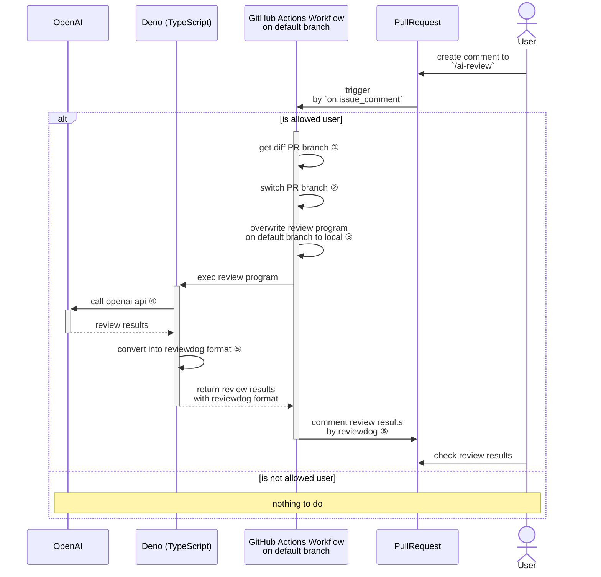

<!-- textlint-disable -->

:::message
この記事は、[CYBOZU SUMMER BLOG FES '24](https://cybozu.github.io/summer-blog-fes-2024/) (生産性向上 セイサンシャインビーチ Stage) DAY 2 の記事です。
:::

<!-- textlint-enable -->

こんにちは。サイボウズ株式会社、生産性向上チームの平木場です。今回は、LLM を使ったブログのレビューを GitHub 上で行う方法について紹介します。

# モチベーション

僕たちのチームでは、毎週開発者の生産性を高めるネタをワイワイ話す会（Productivity Weekly）を社内で開催しており、そこで出たネタをほぼ毎週ブログとして社外発信しています。記事はチームメンバーの有志で共同執筆していますが、歴史的経緯から僕がリポジトリの管理と他者執筆部分のレビューをしています。

レビュー自体は基本的に誤字や明らかに間違っていることを書いてないかを中心に見ていますが、やはり人間が読む以上、どうしても日本語的におかしい記述や誤字脱字を見逃してしまうことがあります。

そんな中、NTT コミュニケーションズさんが自社ブログに LLM 校正 CI を組み込む記事を出しているのを発見しました。

https://engineers.ntt.com/entry/2024/04/17/084103

上記記事では、ブログ記事のプルリクエスト(PR)に対して、GitHub Actions と Azure OpenAI API を用いて誤字や文法誤りを発見させ、PR にコメントする仕組みを説明しています。プロンプトも載っており、完成する前の試行錯誤の様子も載せてくれています。

上記記事を読み、思ったより簡単に自分たちのブログ（Productivity Weekly）に導入できそうだと思ったため、実際に導入してみました。

# できたもの
https://github.com/korosuke613/zenn-articles/pull/784 より。


*PR 上で `/ai-review` とコメントすると*


*レビュー結果が複数個返ってくる。採用(`Commit Suggestion`)するかどうかはあなた次第。*


*さらに何ドル使ったか教えてくれる。レビューログへのリンクも*

:::details レビューログ
https://github.com/korosuke613/zenn-articles/actions/runs/10281126089#summary-28449969363 より。

```log
[2024-08-07T08:47:02.653Z DEBUG] Log file path is /home/runner/work/zenn-articles/zenn-articles/tools/dist/ai-review.log
[2024-08-07T08:47:03.042Z INFO] Reviewing markdown...
[2024-08-07T08:47:03.042Z DEBUG] OpenAI request
{
  "model": "gpt-4o",
  "messages": [
    {
      "role": "system",
      "content": "\nあなたは日本語文章を校正するアシスタントです。\n与えられたマークダウン形式の文章で、誤字・脱字、および、文法誤りのある行を抜き出し、修正した行を出力してください。\nその際、確実に修正すべき誤りのみを出力してください。\nまた、以下のルールに従って修正を行ってください。\n- 句読点の追加や削除はしない\n- 英単語のキャピタライゼーションはしない\n- 半角・全角の違いは修正しない\n- 見出しの誤字脱字は修正しない\n- 伸ばし棒の有無は修正しない\n- スペースの有無は修正しない\n- リストのインデントは修正しない\n- セルフホストランナーは修正しない\n- 箇条書きの場合、文の終わりに句読点は不要\n- 文体の統一は指摘しないで良い\n- 読点の修正はしない\n\n出力は、5個以下とし、より優先的に修正すべきものを出力してください。\nまた、markdown形式ではなく、以下のようなJSON形式で出力してください。reason には修正の理由を記述してください。\n\n{\n  review: [ {\"error_line\": \"...\", \"revised_line\": \"...\", \"reason\": \"...\"} ]\n}\n"
    },
    {
      "role": "user",
      "content": "# know-how 🎓\n## 自分が管理する全 OSS の Issue や Pull Request を 1 つの GitHub Project に集約\nhttps://zenn.dev/shunsuke_suzuki/articles/add-github-issue-pr-to-project\n複数 Owner、リポジトリまたがる OSS の Issue や Pull Request を単一の GitHub Projects に集約する方法を紹介した記事です。筆者の suzuki-shunsuke さんは多くの OSS を開発・メンテしており、それぞれの Issue や PR を巡回してハンドリングするのが困難であったため、単一の GitHub Project に集約して管理することにしたようです。\n記事では、GitHub Project に Issue、PR を自動追加する方法、この手法を実現するための認証方法、item 数上限回避のためのワークアラウンド、実際の GitHub Actions ワークフロー例などが載っています。\nまた、自動追加をするための OSS、suzuki-shunsuke/ghproj を新たに作り、公開されています。Issue、PR を取得する GraphQL API を叩くためのクエリを詳細に設定でき、簡単にこの手法を実現できそうで良いですね。\n自動追加する方法、認証方法に関して、複数の方法とそのメリデメを書いてくれているのがとても参考になりました。「この認証方法でもいけるのでは？」と思って試したくなるので、先に書いてくれているのは嬉しいですね。\n> GitHub Project には 異なる GitHub Organizations や User の Issue や PR を追加できないと思いこんでいましたが、実は出来るということに気づきました。\nこれ知りませんでした。Projects 便利ですね。\n僕は別にそんなに外向けの OSS を作っていませんが、自分で使うための OSS はいくつか持っているので、ghproj を使って集約を試してみたいです。\n_本項の執筆者: [@korosuke613](https://zenn.dev/korosuke613)_\nAWS 上での大規模な GitHub Actions セルフホストランナー使用のベストプラクティスが AWS ブログで紹介されています。\nAWS 上で構築している前提となっていますが、大まかな考え方は他の方法にも通じるものがあると思います。\nベストプラクティスとして次の 8 つが紹介されています。気になった方はぜひ記事を読んでください。\n- セキュリティにおける責任を理解する\n- 認証情報は一時的なものを利用する\n- ephemeral ランナー（使い捨て）を使用する\n- セキュリティ要件に基づいてランナーグループでランナーを分離する\n- Amazon EC2 インスタンスをプールしてランナーの起動時間を最適化する\n- 最適化された AMI を使用してランナーの起動時間を最適化する\n- スポットインスタンスを利用してコストを最適化する\n- Amazon CloudWatch を使用してランナーのメトリクスを記録、監視する\n個人的には確かにと思える部分がよくまとまっていて良かったです。僕たち生産性向上チームでも AWS 上で大規模なセルフホストランナー環境を構築している[^kotiku]のですが、割とこのプラクティスを実践できているな[^philips]という話になりました（隙自語）。\n_本項の執筆者: [@korosuke613](https://zenn.dev/korosuke613)_\n[^kotiku]: [philips-labs/terraform-aws-github-runner による GitHub Actions セルフホストランナーの大規模運用 | ドクセル](https://www.docswell.com/s/miyajan/ZW1XJX-large-scale-github-actions-self-hosted-runner-by-philips-terraform-module)\n[^philips]: というのも、どうやら僕たちがベースとして使っている [philips-labs/terraform-aws-github-runner](https://github.com/philips-labs/terraform-aws-github-runner) を参考として記事に載せていたので、まあ実践できているってなるよなという感じ。\n## ShellScriptで自動化を楽にしたい時に知っておいても良いこと | sreake.com | 株式会社スリーシェイク\nhttps://sreake.com/blog/shellscript-good-practices/\nスリーシェイクさんによる ShellScript を使って自動化を行う際に、より効率よく、信頼性高く実行するためのベストプラクティス、パターンを紹介した記事です。\nまずは自動化候補を出すための toil の判別方法からはじまり、その後に次のようなベストプラクティス、パターンが様々な観点から紹介されています。\n- エラーハンドリング：失敗に備える\n  - エラーで即時に停止\n  - トラップを使用したクリーンアップ\n  - 構造化ログの実装\n  - 再実行可能なスクリプトを書く\n- パフォーマンス最適化\n  - ループの最適化\n  - パイプラインを使用\n- セキュリティの考慮事項\n  - 入力のサニタイズ\n  - 変数の適切な引用\n  - 最小権限の原則\n  - 一時ファイルの安全な作成\n- クロスプラットフォームの考慮\n  - 可搬性のある shebang\n  - OS 依存の処理\n- テストとデバッグ\n  - ユニットテストの導入\n  - デバッグモード\n- バージョン管理との統合\n  - Git フックの活用\nShellScript は僕もよく書くため、こういうまとめは嬉しいですね。エラーハンドリング系とセキュリティ系はちゃんとやることが多いですが、パフォーマンス最適化や構造化ログやユニットテストはあまり意識したことがなかったので勉強になりました。\n実践していきたいです。\n_本項の執筆者: [@korosuke613](https://zenn.dev/korosuke613)_\n  - [Google、オープンソースのメンテナの負担をAIなどで軽減する「Project Oscar」を発表 － Publickey](https://www.publickey1.jp/blog/24/googleaiproject_oscar.html)\n    - Google が OSS のメンテなの負担を軽減するためのプロジェクト、Project Oscar を発表しました\n    - まだ発表されただけですが、プロトタイプが golang/go ですでに動いているようです\n    - 気になりますね\n  - [Cloud Run でデフォルト URL を無効化する機能が Preview](https://cloud.google.com/run/docs/securing/ingress?hl=en#disable-url)\n    - Google Cloud において、Cloud Run のデフォルト URL を無効化する機能が生えたようです（プレビュー）\n    - ロードバランサー経由でのみアクセスさせるなどの場合、直接アクセスできる URL は必要ないので無効化できるようになったのは嬉しいですね。まだプレビューですが\n  - [Google Docs、Markdown形式でのドキュメントのエクスポート、インポートなど可能に － Publickey](https://www.publickey1.jp/blog/24/google_docsmarkdow.html)\n    - Google Docs において、Markdown 形式でドキュメントのインポート・エクスポートが可能になったようです\n    - 個人的にはエクスポートがとにかく嬉しいですね。何らかの理由で後から手動で Markdown 形式に書き写したりするので\n  - [Security overview dashboards, secret scanning metrics and enablement trends reports are now generally available - The GitHub Blog](https://github.blog/changelog/2024-07-19-security-overview-dashboards-secret-scanning-metrics-and-enablement-trends-reports-are-now-generally-available/)\n    - GitHub において、security overview dashboards、secret scanning metrics、enablement trends reports が GA になりました\n    - プッシュ保護がどれだけ昨日しているかや GitHub のセキュリティツールがどれだけ有効化されているかなどを把握しやすくなります\n  - [On October 22, 2024, Monitoring Query Language (MQL) will no longer be a recommended query language for Cloud Monitoring.](https://cloud.google.com/stackdriver/docs/deprecations/mql)\n    - Google Cloud の Cloud Monitoring において、2024 年 10 月 22 日から Monitoring Query Language (MQL) が推奨クエリ言語でなくなるようです\n    - 代わりにオープンソースである PromQL を使うのが推奨されています\n    - クラメソさんの記事が詳しいです\n      - [[アップデート] Monitoring Query Language (MQL) が非推奨へ | DevelopersIO](https://dev.classmethod.jp/articles/cloud-monitoring-mql-deprecated/)\n_本項の執筆者: [@korosuke613](https://zenn.dev/korosuke613)_\n"
    }
  ],
  "temperature": 1,
  "max_tokens": 1024,
  "top_p": 1,
  "frequency_penalty": 0,
  "presence_penalty": 0,
  "response_format": {
    "type": "json_object"
  }
}
[2024-08-07T08:47:12.736Z INFO] OpenAI response
{
  "review": [
    {
      "error_line": "複数 Owner、リポジトリまたがる OSS の Issue や Pull Request を単一の GitHub Projects に集約する方法を紹介した記事です。",
      "revised_line": "複数 Owner、リポジトリにまたがる OSS の Issue や Pull Request を単一の GitHub Projects に集約する方法を紹介した記事です。",
      "reason": "助詞の誤りを修正。"
    },
    {
      "error_line": "また、自動追加をするための OSS、suzuki-shunsuke/ghproj を新たに作り、公開されています。Issue、PR を取得する GraphQL API を叩くためのクエリを詳細に設定でき、簡単にこの手法を実現できそうで良いですね。",
      "revised_line": "また、自動追加をするための OSS、suzuki-shunsuke/ghproj が新たに作られ、公開されています。Issue、PR を取得する GraphQL API を叩くためのクエリを詳細に設定でき、簡単にこの手法を実現できそうで良いですね。",
      "reason": "主語と述語の不一致を修正。"
    },
    {
      "error_line": "AWS 上での大規模な GitHub Actions セルフホストランナー使用のベストプラクティスが AWS ブログで紹介されています。",
      "revised_line": "AWS 上での大規模な GitHub Actions セルフホストランナー使用のベストプラクティスが、AWS ブログで紹介されています。",
      "reason": "読点を追加して文の区切りを明確化。"
    },
    {
      "error_line": "というのも、どうやら僕たちがベースとして使っている [philips-labs/terraform-aws-github-runner](https://github.com/philips-labs/terraform-aws-github-runner) を参考として記事に載せていたので、まあ実践できているってなるよなという感じ。",
      "revised_line": "というのも、どうやら僕たちがベースとして使っている [philips-labs/terraform-aws-github-runner](https://github.com/philips-labs/terraform-aws-github-runner) が参考として記事に載せていたので、まあ実践できているってなるよなという感じ。",
      "reason": "助詞の誤りを修正。"
    }
  ]
}
[2024-08-07T08:47:12.736Z INFO] OpenAI usage
{
  "tokens": {
    "prompt_tokens": 2547,
    "completion_tokens": 579,
    "total_tokens": 3126
  },
  "pricing": {
    "input": "0.013 USD",
    "output": "0.009 USD",
    "total": "0.021 USD"
  }
}
[2024-08-07T08:47:12.737Z DEBUG] ReviewDog Json
{
  "diagnostics": [
    {
      "message": "助詞の誤りを修正。\n※AI による自動修正提案です。修正を受け入れるかどうかはご自身で判断ください。",
      "location": {
        "path": "articles/productivity-weekly-20240724.md",
        "range": {
          "start": {
            "line": 50
          },
          "end": {
            "line": 50
          }
        }
      },
      "suggestions": [
        {
          "range": {
            "start": {
              "line": 50
            },
            "end": {
              "line": 50
            }
          },
          "text": "複数 Owner、リポジトリにまたがる OSS の Issue や Pull Request を単一の GitHub Projects に集約する方法を紹介した記事です。筆者の suzuki-shunsuke さんは多くの OSS を開発・メンテしており、それぞれの Issue や PR を巡回してハンドリングするのが困難であったため、単一の GitHub Project に集約して管理することにしたようです。"
        }
      ]
    },
    {
      "message": "主語と述語の不一致を修正。\n※AI による自動修正提案です。修正を受け入れるかどうかはご自身で判断ください。",
      "location": {
        "path": "articles/productivity-weekly-20240724.md",
        "range": {
          "start": {
            "line": 54
          },
          "end": {
            "line": 54
          }
        }
      },
      "suggestions": [
        {
          "range": {
            "start": {
              "line": 54
            },
            "end": {
              "line": 54
            }
          },
          "text": "また、自動追加をするための OSS、suzuki-shunsuke/ghproj が新たに作られ、公開されています。Issue、PR を取得する GraphQL API を叩くためのクエリを詳細に設定でき、簡単にこの手法を実現できそうで良いですね。"
        }
      ]
    },
    {
      "message": "読点を追加して文の区切りを明確化。\n※AI による自動修正提案です。修正を受け入れるかどうかはご自身で判断ください。",
      "location": {
        "path": "articles/productivity-weekly-20240724.md",
        "range": {
          "start": {
            "line": 69
          },
          "end": {
            "line": 69
          }
        }
      },
      "suggestions": [
        {
          "range": {
            "start": {
              "line": 69
            },
            "end": {
              "line": 69
            }
          },
          "text": "AWS 上での大規模な GitHub Actions セルフホストランナー使用のベストプラクティスが、AWS ブログで紹介されています。"
        }
      ]
    },
    {
      "message": "助詞の誤りを修正。\n※AI による自動修正提案です。修正を受け入れるかどうかはご自身で判断ください。",
      "location": {
        "path": "articles/productivity-weekly-20240724.md",
        "range": {
          "start": {
            "line": 89
          },
          "end": {
            "line": 89
          }
        }
      },
      "suggestions": [
        {
          "range": {
            "start": {
              "line": 89
            },
            "end": {
              "line": 89
            }
          },
          "text": "[^philips]: というのも、どうやら僕たちがベースとして使っている [philips-labs/terraform-aws-github-runner](https://github.com/philips-labs/terraform-aws-github-runner) が参考として記事に載せていたので、まあ実践できているってなるよなという感じ。"
        }
      ]
    }
  ]
}
[2024-08-07T08:47:12.737Z INFO] Converted to ReviewDog Json
```

:::

# 要件

Productivity Weekly に導入するにあたり、どんな機能や制約が求められるかを考えます。

Productivity Weekly の特徴は次の通りです。
- 記事は Markdown で書かれ、GitHub リポジトリで管理されている
- リポジトリの可視性はパブリックである
- リポジトリオーナーは平木場（korosuke613）である
- 単一の記事を複数人で執筆する
- 平木場以外の執筆者はリポジトリをフォークし、記事のベースとなる PR に対して PR を出す形で執筆する
- レビューは平木場が行う

ざっくり特徴を書きました。特徴を踏まえて、今回の追加する機能の要件をざっくり整理します。

- **共同執筆者の任意のタイミングのコメントで LLM レビュー機能をキックする**
  - LLM によるレビューの精度は常に高いとは限らない、かつ、人によってレビューへの好みは分かれるため、あくまでオプショナルな機能として提供したい
  - プルリクエストの「完成」がいつであるかを機械的に判断するのは難しく、執筆者が使いたいタイミングで使えるようにしたい
- **レビュー内容は [suggested changes](https://docs.github.com/en/pull-requests/collaborating-with-pull-requests/reviewing-changes-in-pull-requests/incorporating-feedback-in-your-pull-request#applying-suggested-changes) としてコメントする**
  - 修正を楽にしたい
  - 提案を受け入れるかどうかを執筆者が判断できるようにしたい
- **フォーク先からの PR に対応させる**
- **オーナーが許可した人物のみ LLM レビュー機能をキックできる**
  - パブリックリポジトリであるため、世界中の誰でもコメントできるため、LLM レビュー機能を実行できてしまう。オーナーが許可した人物のみ実行できるようにしたい
- **オーナーのみがシステムプロンプトおよびソースコードを変更できる**
  - 共同執筆者がいたずらで LLM を悪用することを防ぎたい[^change_workflow]
- **LLM は文法誤り、誤字脱字のみを対象にレビューする**
  - 妥当性の判断についてはまだ LLM を信用できてないので人間がレビューするようにしたい

<!-- textlint-disable -->
[^change_workflow]: 常にデフォルトブランチのワークフロー、ソースコードを使うようにできますが、共同執筆者が GitHub Actions のワークフローを実行できる以上、OpenAI API キーの奪取は阻止できません（Environments で承認を必須にすると奪取を阻止できるが、今回は共同執筆者が任意のタイミングで LLM レビュー機能を実行できるようにしたいため難しい）。[Push rules](https://github.blog/changelog/2024-04-18-push-rules-public-beta/) 機能が使えたら `.github/workflows/*.yaml` を書き換えられないようにして奪取を防げますが、残念ながら GitHub Enterprise Cloud プランでのみ利用可能です。Productivity Weekly は平木場の個人リポジトリなので使えないのです...
<!-- textlint-enable -->

# 構成

[冒頭で触れた NTT コミュニケーションズさんの記事](https://engineers.ntt.com/entry/2024/04/17/084103)を参考に構成を考えます。

### シンプルな流れ


1. ユーザが PR にコメントを書く
2. GitHub Actions が `on.issue_comment` イベントをトリガーにレビューワークフローを開始する
3. レビューワークフローが OpenAI に API リクエストを送信する
4. OpenAI がレビュー結果を返す
5. レビューワークフローがレビュー結果をコメントする

### 詳細の流れ



全ての処理を GitHub Actions のステップ（シェルスクリプト）で行うのは大変なので、一部の処理は TypeScript で行います。分け方としては、シェルで簡単にできる処理はシェルスクリプト、それ以外の処理は TypeScript という感じです。

- GitHub Actions (シェルスクリプト)
  - Git/GitHub 操作
    - プルリクエスト差分の取得 ①
    - プルリクエストのブランチへの切り替え ②
    - レビュープログラムの上書き ③
    - ReviewDog でコメント ⑥
- Deno (TypeScript)
  - OpenAI API へのリクエスト ④
  - レビュー結果の変換 ⑤

※ ① 〜 ⑥ はシーケンス図内の番号に対応しています。

# 実装: レビュープログラム

今回レビュープログラムは TypeScript で作成しました。TypeScript を採用した理由は自分が慣れている言語だからです。ランタイムについては Deno を採用しています。こちらの理由は TypeScript をネイティブでサポートしており、TypeScript 利用の準備が簡単だからです[^bun]。

全てのコードを説明するのは非常に大変なので、要所要所を抜粋して説明します。
フルのコードは、以下を参照ください。

- [tools/reviewDiffWithAi.ts](https://github.com/korosuke613/zenn-articles/blob/b7544193c7440fc7ad81b739f6d571289c6e9ca9/tools/reviewDiffWithAi.ts)
- [tools/libs/AiReviewer.ts](https://github.com/korosuke613/zenn-articles/blob/b7544193c7440fc7ad81b739f6d571289c6e9ca9/tools/libs/AiReviewer.ts)

[^bun]: 最近は似たようなものとして Bun も有名ですが、Bun は使ったことがないため今回は見送りました。

**入出力**

レビュープログラムの前提条件、入出力は次のように決めました。

- 前提条件
  - プルリクエストの差分ファイルが存在する
  - プルリクエストの対象のマークダウンファイルが存在する、かつ、プルリクエストの内容となっている
- 入力
  - プルリクエストの差分ファイルへのパス
    - レビュー材料とするため
  - プルリクエストの対象のマークダウンファイルへのパス[^only_md]
    - レビュー結果を PR へコメントするために行番号を取得するため
- 出力
  - ReviewDog の [rdjson](https://github.com/reviewdog/reviewdog/tree/4dbee9759427a13d3258a5571ca672f765a91224/proto/rdf#rdjson) 形式のレビュー結果ファイル

[^only_md]: Productivity Weekly で共同執筆者から送られる PR は、原則 1 つの PR につき 1 つのマークダウンの変更しか含みません。

<!-- textlint-disable -->

:::details 入力例

<!-- textlint-enable -->

次の PR の場合の入力例を示します。

- [feat: Productivity Weekly(2024/07/24) @Kesin11 by Kesin11 · Pull Request #777 · korosuke613/zenn-articles](https://github.com/korosuke613/zenn-articles/pull/777)

**PR のマークダウンの差分**

`gh pr diff 777` で取得した差分ファイルの例です。

```diff markdown
diff --git a/articles/productivity-weekly-20240724.md b/articles/productivity-weekly-20240724.md
index 18599cec..82b8df1e 100644
--- a/articles/productivity-weekly-20240724.md
+++ b/articles/productivity-weekly-20240724.md
@@ -36,7 +36,7 @@ user_defined:
 今週の共同著者は次の方です。
 - [@korosuke613](https://zenn.dev/korosuke613)
 <!-- - [@defaultcf](https://zenn.dev/defaultcf) -->
-<!-- - [@Kesin11](https://zenn.dev/kesin11) -->
+- [@Kesin11](https://zenn.dev/kesin11)
 <!-- - [@r4mimu](https://zenn.dev/r4mimu) -->
 <!-- - [@uta8a](https://zenn.dev/uta8a) -->

@@ -73,6 +73,26 @@ https://sreake.com/blog/shellscript-good-practices/
 ## 完全ペアプロは「やりすぎ」だった。失敗を経て辿り着いた、ペアプロ×開発組織の最適解【Tebiki渋谷】 - レバテックラボ（レバテックLAB）
 https://levtech.jp/media/article/interview/detail_485/

+Tebiki 社のペアプロ導入の経緯からその後の方針転換と、ペアプロ導入を成功させるためのポイントが紹介されている記事です。
+
+レビュー作業に時間がかかっているという課題を解決するため、全てのコーディングをペアプロに切り替えてから１年間は順調に進んでいたようです。しかし、一部のメンバーからペアプロでの作業が合わないという声が上がってきたことで、現在ではペアプロか従来のソロプロか好きな方を自由に選ぶという方向に転換されたようです。
+
+記事の後半ではペアプロ導入を成功させるための 4 つのポイントが紹介されているので、チーム開発においてペアプロ導入を考えている方は参考になると思います。
+
+----
+
+実は自分たち生産性向上チームでは基本的に毎日 13:30 - 17:00 の間はモブプロ[^mob_programming]で作業しているため、この記事は非常に共感できる内容でした。生産性向上チームのモブプロは数年前から続いており、その間にチームから離れたり、逆に中途や新卒入社で新しく加わる人など、メンバーは常に入れ替わってきました。現在では昔よりもメンバーが増えたことで、さすがに全員でのモブプロは効率が悪すぎるため最大でも 4 人のチームごとにモブプロを行うスタイルに変更されているものの、モブプロのスタイル自体は現在でも継続されています。
+
+こちらの記事を読んだ後に自分たちのモブプロの方法を振り返ってみると、紹介されていた 4 つのポイントのうち特に「休憩のルールを作ること」と「開発中の意思決定をペアの中に閉じること」の 2 点をかなり意識したモブプロを行っていると気が付きました。
+自分たちのモブプロは 25 分作業・5 分休憩のポモドーロテクニックをベースにしているので、休憩時間が自然と確保されています。また、5 分の休憩明けにモブ外のメンバーに相談するための時間を設けていることで、非同期の質問に対して回答を待つという無駄な時間が発生しにくいと感じています。
+
+ペアプロ・モブプロが上手くいくかどうかはチームの体制やメンバーの状況にもよるので一概には言えませんが、自分たちのチームのモブプロがこの記事で紹介されているポイントと一致していることを確認できたのは興味深かったです。
+
+[^mob_programming]: 2 人のペアプロに対して、3 人以上でプログラミングを行う場合は一般的にモブプロと呼ばれる
+
+
+_本項の執筆者: [@Kesin11](https://zenn.dev/kesin11)_
+
 ## 開発生産性を上げる"改善"は儲かるのか？──その問いに答えられるようにするには
 https://codezine.jp/article/detail/19739
```

**PR のマークダウン**
https://github.com/Kesin11/korosuke613-zenn-articles/blob/631649c8f41237367dcbef6348d95296c3ed110c/articles/productivity-weekly-20240724.md
:::

## OpenAI API へのリクエスト ④

:::message
今回、利用する LLM には OpenAI の GPT-4o を採用しています。これは以前 OpenAI API を使ったことがあるため、かつ、GPT-4o が当時最新のモデルだったためですが、LLM のモデルは他のものも使えるようにして比較とかしたいっすね（願望）。
:::


### プロンプト構成

プロンプトは次のようにしています。

**システムプロンプト**
```
あなたは日本語文章を校正するアシスタントです。
与えられたマークダウン形式の文章で、誤字・脱字、および、文法誤りのある行を抜き出し、修正した行を出力してください。
その際、確実に修正すべき誤りのみを出力してください。
また、以下のルールに従って修正を行ってください。
- 句読点の追加や削除はしない
- 英単語のキャピタライゼーションはしない
- 半角・全角の違いは修正しない
- 見出しの誤字脱字は修正しない
- 伸ばし棒の有無は修正しない
- スペースの有無は修正しない
- リストのインデントは修正しない
- 箇条書きの場合、文の終わりに句読点は不要
- 文体の統一は指摘しないで良い
- 読点の修正はしない

出力は、5個以下とし、より優先的に修正すべきものを出力してください。
また、markdown形式ではなく、以下のようなJSON形式で出力してください。reason には修正の理由を記述してください。

{
  review: [ {"error_line": "...", "revised_line": "...", "reason": "..."} ]
}
```

:::message
システムプロンプトは適宜改良を加えてますが、まだまだ改善の余地があると思います。ここで決めたルールに従わない修正を提案することもあり、正解はわかりません。
:::

**ユーザープロンプト**

ユーザープロンプトには、プルリクエストの差分を渡すのですが、追加した行のみを渡すようにしています。削除された行に対する文法誤り・誤字脱字修正は必要ないという考えからです。

次のような処理で、追加行のみの diff を作成し、ユーザープロンプトとして渡します。

```ts
// git diff のヘッダー(先頭 5 行)を削除
const removedHeader = diff.split("\n").slice(5);

// git diff の追加行のみを抽出
const filteredAddedLines = removedHeader.filter((line) =>
  line.startsWith("+")
);

// git diff の追加行に含まれる先頭の + を削除
const removedPlus = filteredAddedLines.map((line) => line.slice(1)).join(
  "\n",
);

// 空行を削除
const removedSpaceLines = removedPlus.split("\n").filter((line) => line !== "").join(
  "\n"
);
```

### API リクエスト

API リクエストは OpenAI 公式 SDK である [openai/openai-node](https://github.com/openai/openai-node) を利用します。

```ts
const input: ChatCompletionCreateParamsNonStreaming = {
  model: "gpt-4o",
  messages: [
    {
      "role": "system",
      "content": AiReviewer.SYSTEM_PROMPT, // 上記システムプロンプト
    },
    {
      "role": "user",
      "content": markdown, // 上記ユーザープロンプト
    },
  ],
  response_format: { type: "json_object" }, // レスポンス形式を JSON に強制できる。これをやらないと JSON にならない場合がある
  max_tokens: 1024, // 最大トークン数はお好みで良いが、自分は 1024 としている
  // 残りの設定はお好みで
};

const openai = new OpenAI({ apiKey: "<APIキー>" });

// 次のプロンプトで指定した形式の JSON が得られる
// {review: [ {"error_line": "...", "revised_line": "...", "reason": "..."} ]}
const response = await openai.chat.completions.create(
  input,
).choices[0].message.content;
```
<!-- textlint-disable -->

:::details レビュー結果の JSON 例

<!-- textlint-enable -->

```json
{
  "review": [
    {
      "error_line": "実は自分たち生産性向上チームでは基本的に毎日 13:30 - 17:00 の間はモブプロ[^mob_programming]で作業しているため、この記事は非常に共感できる内容でした。",
      "revised_line": "実は自分たち生産性向上チームでは基本的に毎日 13:30 - 17:00 の間はモブプロ[^mob_programming]で作業しているため、この記事に非常に共感できる内容でした。",
      "reason": "「この記事は非常に共感できる内容でした」を「この記事に非常に共感できる内容でした」に修正することで意味が通りやすくなります。"
    },
    {
      "error_line": "生産性向上チームのモブプロは数年前から続いており、その間にチームから離れたり、逆に中途や新卒入社で新しく加わる人などでメンバーは常に入れ替わってきました。",
      "revised_line": "生産性向上チームのモブプロは数年前から続いており、その間にチームから離れたり、逆に中途や新卒入社で新しく加わる人など、メンバーは常に入れ替わってきました。",
      "reason": "「その間にチームから離れたり、逆に中途や新卒入社で新しく加わる人などでメンバーは常に入れ替わってきました。」を「その間にチームから離れたり、逆に中途や新卒入社で新しく加わる人など、メンバーは常に入れ替わってきました。」に修正し、読点を加えて文を滑らかにします。"
    },
    {
      "error_line": "自分たちのモブプロは 25 分作業・5 分休憩のポモドーロテクニックをベースにしているので休憩時間が自然と確保されています。",
      "revised_line": "自分たちのモブプロは 25 分作業・5 分休憩のポモドーロテクニックをベースにしているので、休憩時間が自然と確保されています。",
      "reason": "「なので、」の後に読点を加えて文を滑らかにします。"
    }
  ]
}
```

:::

## レビュー結果の変換 ⑤

レビュー結果を GitHub の PR にコメントするために、今回は OSS である ReviewDog を利用します。理由としては [suggested changes](https://docs.github.com/en/pull-requests/collaborating-with-pull-requests/reviewing-changes-in-pull-requests/incorporating-feedback-in-your-pull-request#applying-suggested-changes) コメントを作りやすいからですが、コメントについてはそこまで方法を考えてなかったのでもっといい方法があったかもしれません。

ReviewDog を使った suggested changes コメントを作るために、レビュー結果を [rdjson](https://github.com/reviewdog/reviewdog/tree/4dbee9759427a13d3258a5571ca672f765a91224/proto/rdf#rdjson) 形式に変換します。

rdjson 形式では、ざっくり次の内容を持っています。

- コメントに書くメッセージ
- suggest するファイルパスと行番号
- suggest の内容

これらを LLM から得られたレビュー結果より作成します。

https://github.com/korosuke613/zenn-articles/blob/b7544193c7440fc7ad81b739f6d571289c6e9ca9/tools/libs/AiReviewer.ts#L304-L356

<!-- textlint-disable -->

:::details rdjson 形式のレビュー結果例

<!-- textlint-enable -->

```json
{
  "diagnostics": [
    {
      "message": "「この記事は非常に共感できる内容でした」を「この記事に非常に共感できる内容でした」に修正することで意味が通りやすくなります。\n※AI による自動修正提案です。修正を受け入れるかどうかはご自身で判断ください。",
      "location": {
        "path": "articles/productivity-weekly-20240724.md",
        "range": {
          "start": {
            "line": 84
          },
          "end": {
            "line": 84
          }
        }
      },
      "suggestions": [
        {
          "range": {
            "start": {
              "line": 84
            },
            "end": {
              "line": 84
            }
          },
          "text": "実は自分たち生産性向上チームでは基本的に毎日 13:30 - 17:00 の間はモブプロ[^mob_programming]で作業しているため、この記事に非常に共感できる内容でした。生産性向上チームのモブプロは数年前から続いており、その間にチームから離れたり、逆に中途や新卒入社で新しく加わる人などでメンバーは常に入れ替わってきました。現在では昔よりもメンバーが増えたことで、さすがに全員でのモブプロは効率が悪すぎるため最大でも 4 人のチームごとにモブプロを行うスタイルに変更されているものの、モブプロのスタイル自体は現在でも継続されています。"
        }
      ]
    },
    {
      "message": "「その間にチームから離れたり、逆に中途や新卒入社で新しく加わる人などでメンバーは常に入れ替わってきました。」を「その間にチームから離れたり、逆に中途や新卒入社で新しく加わる人など、メンバーは常に入れ替わってきました。」に修正し、読点を加えて文を滑らかにします。\n※AI による自動修正提案です。修正を受け入れるかどうかはご自身で判断ください。",
      "location": {
        "path": "articles/productivity-weekly-20240724.md",
        "range": {
          "start": {
            "line": 84
          },
          "end": {
            "line": 84
          }
        }
      },
      "suggestions": [
        {
          "range": {
            "start": {
              "line": 84
            },
            "end": {
              "line": 84
            }
          },
          "text": "実は自分たち生産性向上チームでは基本的に毎日 13:30 - 17:00 の間はモブプロ[^mob_programming]で作業しているため、この記事は非常に共感できる内容でした。生産性向上チームのモブプロは数年前から続いており、その間にチームから離れたり、逆に中途や新卒入社で新しく加わる人など、メンバーは常に入れ替わってきました。現在では昔よりもメンバーが増えたことで、さすがに全員でのモブプロは効率が悪すぎるため最大でも 4 人のチームごとにモブプロを行うスタイルに変更されているものの、モブプロのスタイル自体は現在でも継続されています。"
        }
      ]
    },
    {
      "message": "「なので、」の後に読点を加えて文を滑らかにします。\n※AI による自動修正提案です。修正を受け入れるかどうかはご自身で判断ください。",
      "location": {
        "path": "articles/productivity-weekly-20240724.md",
        "range": {
          "start": {
            "line": 87
          },
          "end": {
            "line": 87
          }
        }
      },
      "suggestions": [
        {
          "range": {
            "start": {
              "line": 87
            },
            "end": {
              "line": 87
            }
          },
          "text": "自分たちのモブプロは 25 分作業・5 分休憩のポモドーロテクニックをベースにしているので、休憩時間が自然と確保されています。また、5 分の休憩明けにモブ外のメンバーに相談するための時間を設けていることで、非同期の質問に対して回答を待つという無駄な時間が発生しにくいと感じています。"
        }
      ]
    }
  ]
}
```

:::

最終的に変換されたレビュー結果をファイルに保存し、プログラムは終了します。
保存されたファイルはワークフローの残りのステップで利用します。

# 実装: ワークフロー

ワークフローについても全てのコードを説明するのは非常に大変なので、要所要所を抜粋して説明します。
フルのコードは以下を参照ください。

- [.github/workflows/ai-review.yaml](https://github.com/korosuke613/zenn-articles/blob/b7544193c7440fc7ad81b739f6d571289c6e9ca9/.github/workflows/ai-review.yaml)
- [.github/workflows/reusable-ai-review.yaml](https://github.com/korosuke613/zenn-articles/blob/b7544193c7440fc7ad81b739f6d571289c6e9ca9/.github/workflows/reusable-ai-review.yaml)

## 特定のコメントで GitHub Actions のワークフローを実行させる

コメントの操作でワークフローを実行させるためには、`on.issue_comment` を設定します。これにより `issue_comment` イベントがトリガーとなり、ワークフローが実行されます。
さらに、`types: [created]` を設定することで、コメントの作成時のみをトリガーにできます。

```yaml
on:
  # コメントでトリガーする
  issue_comment:
    types: [created]
```

ただ、これだけでは PR だけでなく Issue へのコメントに対してもワークフローが実行されてしまうだけでなく、どのコメントでも誰のコメントでも関わらずワークフローが実行されてしまいます。これらを防ぐために、コメントの内容やコメントを書いたユーザをチェックする必要があります。

```yaml
jobs:
  review:
    if: github.event.issue.pull_request && github.event.comment.body == '/ai-review' && contains(fromJson('["korosuke613", "allowed_user1", "allowed_user2", ...]'), github.event.comment.user.login)
```

上記コードは次の全ての条件を満たした場合にジョブを実行します。

- PR に対するコメントである
- コメントの内容が `/ai-review` である
- コメントを書いた GitHub ユーザが `korosuke613` または `allowed_user1` または `allowed_user2` のいずれかである

## プルリクエスト差分の取得 ①

レビュープログラムで利用するために、プルリクエストの差分を取得、ファイルへ書き込みます。

Git の差分の取り方はいろいろありますが、今回は個人的に簡単な方法である GitHub CLI を使った方法を採用します。

```
gh pr diff <PR番号> > ${{ runner.temp }}/pr.diff
```

また、対象のマークダウンファイルパスも必要であるため、同じく GitHub CLI を使って取得、`GITHUB_OUTPUT` に保存します。

```
echo "diff_markdown_path=$(gh pr diff ${{ github.event.issue.number }} --name-only | grep 'productivity-weekly-' | head -1)" >> "$GITHUB_OUTPUT"
```

## プルリクエストのブランチへの切り替え ②
プルリクエスト上の対象のマークダウンを保持する必要があるため、プルリクエストのブランチに切り替えます。
これも GitHub CLI を使って楽に行えます。また、後程必要になる最新のコミット SHA を `GITHUB_OUTPUT` に保存します。

:::message
Productivity Weekly の場合、フォークされたリポジトリからのプルリクエストであることが前提なため、git コマンドを使ったブランチ差分の取得やブランチ切り替えが面倒です。GitHub CLI を使っている理由はこれらの作業を簡単に行えるためです。
:::


```
gh pr checkout --branch <任意のブランチ名> ${{ github.event.issue.number }}
echo "latest_git_sha=$(git rev-parse HEAD)" >> "$GITHUB_OUTPUT" # reviewdog によるコメントで必要
```

## レビュープログラムの上書き ③
デフォルトブランチのレビュープログラムをローカルに上書きします。
これはプルリクエスト作成者がレビュープログラムを変更して任意の LLM 利用を防ぐためです。
（なお、`on.issue_comment` による実行のため、ワークフロー自体はデフォルトブランチのものが使われます。よってワークフローファイルの変更は気にしなくて大丈夫です）

先の説明では省略しましたが、必ずデフォルトブランチのレビュープログラムを利用するために、ブランチ切り替え前に一時的にコピーを作成し、ブランチ切り替え後にコピーを元の場所に戻すようにします。

```sh
# 常に main ブランチの tools を利用するために一時的に tools をコピー
mkdir -p ${{ runner.temp }}/ai-review
cp -r ./tools ./deno.lock ${{ runner.temp }}/ai-review

# PR のブランチに切り替える
<省略>

# PR のブランチに tools をコピー
cp -f ${{ runner.temp }}/ai-review/deno.lock .
cp -rf ${{ runner.temp }}/ai-review/tools .
```

## レビュープログラムの実行
先で説明したレビュープログラムを実行し、レビュー結果をファイルに保存します。

https://github.com/korosuke613/zenn-articles/blob/b7544193c7440fc7ad81b739f6d571289c6e9ca9/.github/workflows/reusable-ai-review.yaml#L63-L77

## ReviewDog でコメント ⑥

ReviewDog を使ってレビュー結果を PR にコメントします。

ReviewDog を GitHub Actions 上で実行する場合、自動で PR 番号や最新のコミットからコメント先を特定してくれて便利ですが、`on.issue_comment` や `on.workflow_dispatch` で実行する場合はコメント先を自動で特定してくれずエラーで落ちてしまいます。
そのため、コメント先に必要な情報を環境変数（`CI_COMMIT` など）として渡し、かつ、`GITHUB_ACTIONS` 環境変数を空にしておく必要があります（[参考](https://github.com/reviewdog/reviewdog/blob/4dbee9759427a13d3258a5571ca672f765a91224/cienv/cienv.go#L38-L40)）。


```yaml
- name: Comment on PR with ReviewDog
  env:
    REVIEWDOG_GITHUB_API_TOKEN: ${{ secrets.GITHUB_TOKEN }} # PR にコメントするために `pull-requests: write` 権限のある GITHUB_TOKEN を渡す
    CI_REPO_OWNER: ${{ github.repository_owner }}
    CI_REPO_NAME: ${{ github.event.repository.name }}
    CI_PULL_REQUEST: ${{ github.event.issue.number }}
    CI_COMMIT: ${{ steps.setup_branches.outputs.latest_git_sha }}
  run: |
    GITHUB_ACTIONS='' reviewdog -f=rdjson -reporter=github-pr-review -name=kiba-ai <./tools/dist/rdjson.json
```

# 工夫

## LLM レビューを試行錯誤・デバッグしやすくする
常にデフォルトブランチのワークフロー、レビュープログラムを使うようになっているため、今回の仕組みを変更したい際の動作確認が難しくなってしまっています。
したがって、オーナー（平木場）のみデフォルトブランチ以外のワークフロー、レビュープログラムを利用できるようにしました。

具体的には、`on.issue_comment` によるワークフロー実行と `on.workflow_dispatch` によるワークフロー実行を分け、`on.workflow_dispatch` によるワークフロー実行の際にはデフォルトブランチ以外のワークフロー、レビュープログラムを利用できるようにしました。
そのために LLM レビューの処理を reusable なワークフローとして切り出し、2 つのワークフローから呼び出せるようにしています。

https://github.com/korosuke613/zenn-articles/blob/main/.github/workflows/test-ai-review.yaml


*使いたいコードのあるブランチを指定して、コメントしたいプルリクエストを指定する感じ*

## レビューにかかった料金を計算してコメントする

*冒頭より再掲*

LLM を使うのにはお金がかかるのです。共同執筆者の皆様にいくらお金がかかったのか実感してほしいため、レビューにかかった料金を計算し、PR にコメントするようにしました。
ついでにワークフローのログへのリンクも載せています（正直こっちの方が嬉しい）。

単価は OpenAI の[料金表](https://openai.com/api/pricing/)から持ってきています。最新の料金への追従は人力で行わないといけないのがつらいところですね。

https://github.com/korosuke613/zenn-articles/blob/b7544193c7440fc7ad81b739f6d571289c6e9ca9/tools/libs/AiReviewer.ts#L57-L63

料金計算については、ChatCompletion API のレスポンスの中にある [CompletionUsage](https://github.com/openai/openai-node/blob/925a93062924f11759339b5f9318175c6c68e4cf/src/resources/chat/completions.ts#L83-L86) から得られる情報を使って利用トークン数から料金を計算しています。

https://github.com/korosuke613/zenn-articles/blob/b7544193c7440fc7ad81b739f6d571289c6e9ca9/tools/libs/AiReviewer.ts#L186-L205

# やってみて

## 自分が見つけられない文法間違い・誤字脱字を見つけてくれる

これまでほとんどの記事を僕一人でレビューしていましたが、僕が見つけられなかった誤りを LLM が見つけてくれるようになってレビューで考えることが減りました。

また、共同執筆者からも毎回 `/ai-review` してくれる人がいて、使いたい人が使ってくれています。

提案は受け入れられたり受け入れられなかったりという感じなので、満足度向上のために受け入れ率を上げたいところです。

## プロンプトの組み立てがむずい

文法間違いや誤字脱字はちょくちょく見つけてくれますが、必要ない修正の提案も決して少なくありません。

例えば、textlint でチェックしているルールと相反する提案（textlint では半角文字と全角文字の間にスペースを入れるようにしているが、それらのスペースを消す提案をするなど）や、箇条書きの文末に句点を入れる提案などです。そういった変更は提案しないルールをプロンプトに加えても提案してくることがあり、なかなか難しいです。

もっと上手くプロンプトを組み立てたいですね。

## OpenAI API、クラウド破産への防衛策が標準搭載されていて嬉しい。あと安い

OpenAI API は無料ではありません。今回 API 利用のためにクレカ登録をしましたが、クラウドサービスを使う上で怖いのがクラウド破産です。

例えば某クラウドサービスでは、毎月設定した額を超えそうになったり超えたりした場合にメールでお知らせしてくれる機能がありますが、メールでお知らせしてくれるだけで API 利用を自動で止める機能はありません。
こういったソフトリミットを設ける機能は嬉しい反面、ユーザーの対処が必須でちょっと不安です。

OpenAI API の場合、上記ソフトリミットに加え、上限を超えると API 呼び出しを制限するハードリミットを設ける機能が標準で搭載されています[^production]。

また、先払い方式であるためチャージした分の額を超えても API 呼び出しが制限されることとなります（もちろんオートチャージ可能です）。二重に安心ですね。

僕は月のハードリミットを $5 に設定しており、かつ、オートチャージを無効にしています。

これらの防衛策によってバカすか僕のトークンで API を叩かれてもクラウド破産せずに済んでますが、実はまだハードリミットに到達したことがない上、最初にチャージした $10 の残高がまだまだ残っています。

5 月ごろよりこの仕組みを取り入れたのですが、月当たりにかかる料金は平均 $0.15 ほどであり、これまで $1 弱しか使っていません。さばいてるトークン量は I/O 合計で月 20000 トークン前後で、全く使っていないということでもないです。
もちろん大規模になると話は変わりますが、週 1 の記事レビュー程度の規模だと大変安いですね。

最近登場した GPT-4o mini はもっと安いのでさらなる安さを求められるかもしれませんが、今の所 GPT-4o の速度・料金に十分満足しています。

[^production]: 商用製品に組み込む場合などはハードリミットを設けるのは怖いですが、個人利用の場合はいきなり止まっても問題ないので安心感があります。

# 偉大なる先行研究

僕が見つけた先行研究一覧です。この記事を読んでいる方は下記も参考にすると良いと思います。

- [LLM校正CIを自社のブログに導入してみた - NTT Communications Engineers' Blog](https://engineers.ntt.com/entry/2024/04/17/084103)
  - この記事を見て同じことやるかとなりました
  - やってること自体はほぼこの記事のパクリです。僕のこのクソ長くなってしまった記事より断然読みやすいです
- [ChatGPTを活用したブログレビューシステム | QualiArtsエンジニアブログ](https://technote.qualiarts.jp/article/79/)
  - この記事を書き始める直前に見つけました
  - 似たようなことを行なっていますが、さらに LLM の選定理由や適していないケースなどのノウハウが書かれています
- [LLMによる技術ブログレビューを導入した話 - Speaker Deck](https://speakerdeck.com/cloudace/llmniyoruji-shu-burogurebiyuwodao-ru-sitahua)
  - このセクションを書いているときに見つけました
  - AI によるダブルチェックをさせていて面白いです

# さいごに
LLM によるブログレビュー、いざ作ってみると思ってたより考えることは多かったですが、楽に実装できてそれなりに効果もあって満足しています。

どうしても僕のリポジトリに最適化されているためせっかくなので汎用化して OSS なんかにできると面白そうですね。すでにありそうという感じもする。

さて、実はこの記事は [CYBOZU SUMMER BLOG FES '24](https://cybozu.github.io/summer-blog-fes-2024/) (生産性向上セイサンシャインビーチ Stage) DAY 2 の記事でした。明日は [@naotama](https://zenn.dev/naotama) さんの記事が飛び出ることでしょう。お楽しみに！
