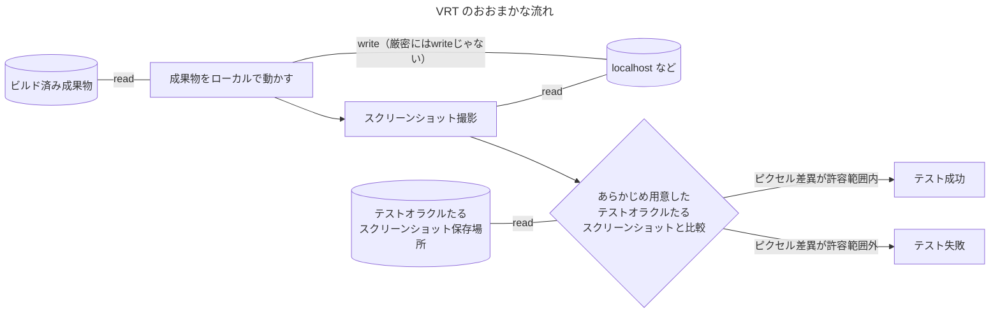
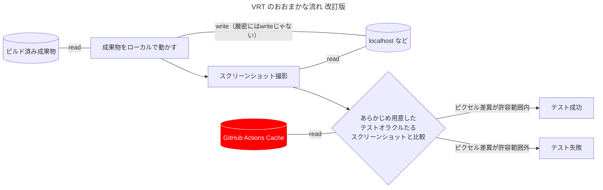
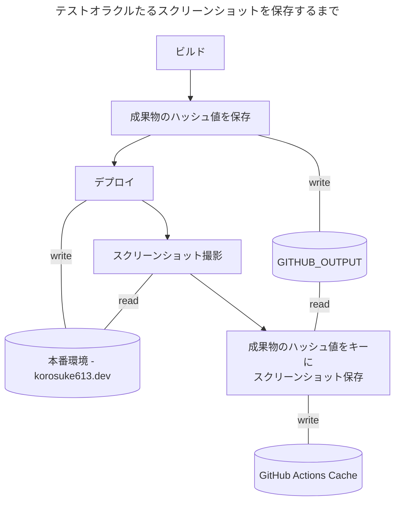
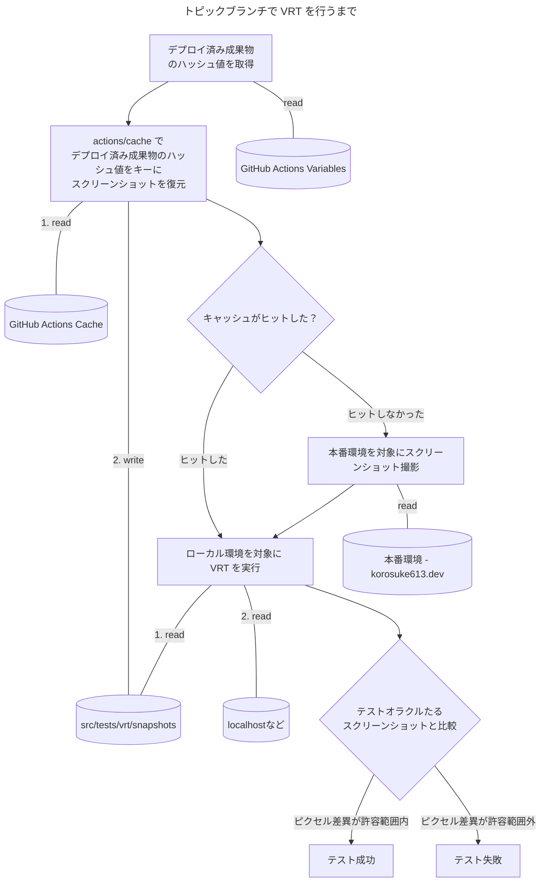

GitHub Actions のキャッシュを使った Visual Regression Testing (VRT) をやっていく方法を記します。案外簡単にできる割にあまり説明している記事がなかったので、今回書きました。
GitHub Actions 内で完結して VRT を行うため、比較的軽量に導入できると考えます。

:::message
この記事は **[Cybozu Frontend Advent Calendar 2023](https://adventar.org/calendars/9255)** の 12 日目の記事です🎄
みなさん興味深いフロントエンド関連の記事をいろいろ書かれていて面白いのでぜひ読んでください[^frontend]。
明日は [kofuk](https://www.kofuk.org/) さんの予定です。楽しみ！🎅
:::

[^frontend]: 周りの人の記事がガチすぎて震えています。

:::message alert
なんと、12/02 付けで @tacrew さんが投稿された記事とネタ被りしてしまいました 😭
記事をほぼ書いた後に気づいたのですが、ある程度書いていたためこのまま投稿します。
内容は結構近いです。ぜひご参考ください。

- [GitHubだけでVRTする仕組みを作ってみた #GitHub - Qiita](https://qiita.com/tacrew/items/f816c3690c0b5bc7bcb5)
:::


# TL;DR
- **対象**
  - ビルド・デプロイを GitHub Actions で行っている
  - **VRT を導入したい**
  - **しかし Amazon S3 などの外部サービスに依存したくない。**
  - VRT の細かい方法がある程度わかっている（VRT の細かい方法については割愛しています）
- **GitHub Actions のキャッシュにスクリーンショット（スナップショット）を保存することで、外部サービスに依存せずシンプルに VRT を導入する**
  - デフォルトブランチの CI において、本番環境のスクリーンショットを撮影し、GitHub Actions のキャッシュに保存する
  - トピックブランチの CI において、GitHub Actions のキャッシュに保存されたスクリーンショットを復元し、ローカル環境のスクリーンショットと比較する
  - キャッシュが存在しなかった場合の回避策は考える必要がある

# 背景

## VRT 導入したい

僕は自分のホームページ(https://korosuke613.dev)を GitHub Actions でビルドし、GitHub Pages にデプロイしています。この度、依存関係更新などに伴う見た目上のデグレーションを防ぐために、Visual Regression Testing (VRT) を導入したいと思いました。

VRT 自体は詳しく説明しません（ググってください）が、簡単に言うと、ビルド後の成果物ページのスクリーンショットと、テストオラクルたるスクリーンショット（スナップショットと呼ばれる）をピクセル単位で比較して、見た目上のデグレーションを検知するテストです。



VRT が通らなかった場合は、ピクセル単位での差異が許容範囲とならなかったことを表します。
CI としてチェックすることでマージ前に見た目の変化があることを確認できます。しかも人間が目視するより正確です。

Renovate などで依存関係更新を自動化したい場合、見た目の確認を人間が行うとマージまで自動化するのが難しいです。VRT による機械化された見た目の確認を取り入れることで、安心してマージまで自動化できるようになります。

## VRT 導入の課題 〜テストオラクルたるスクリーンショットをどこに保管する？〜

VRT を導入する上で、テストオラクルたるスクリーンショットをどこにどう保管するか考えなければいけません。既知の選択肢はいくつかありますが、メリデメがそれぞれあるため、ユースケースによってどれを選択するか変わってきます。

そもそもテストオラクルたるスクリーンショットと勝手に言ってますが、これはテストの正解となるスクリーンショットのことです。トピックブランチにおいて何を持ってデグレが発生してないかを判断するために、正解となるスクリーンショットが必要になります。

VRT は流行っているのか、昨今様々な記事が出ています。スクリーンショットの保管場所についてもいくつか方法があったので適当に分類しました。
（縦に長くなってしまったので折り畳んでいます。）

:::details 保存先: Amazon S3 や Google Cloud Storage などのクラウドストレージ

安定した外部クラウドストレージに保存する方法です。[reg-viz/reg-suit](https://github.com/reg-viz/reg-suit) などの著名ツールで簡単にスクリーンショットをクラウドストレージに保存できます。

参考: [Playwright + reg-suitでVisual Regression Testing(VRT)を導入](https://zenn.dev/koheii/articles/8214467454a46c)

**Pros 👍**
- 安定した保存先

**Cons 👎**
- 認証がめんどい
- クラウドサービス上での設定が必要
- ライフサイクルを適切に管理しないとクラウド破産する

:::

:::details 保存先: git に含める

スクリーンショットを `git commit` して git に含めるという方法です。

参考: [PlaywrightとGithub Actionsでビジュアルリグレッションテストをやってみた](https://seyyyy.com/blog/vrt)

**Pros 👍**
- GitHub 上でスクリーンショットの差分を確認できる
- GitHub 内で完結する

**Cons 👎**
- git の容量が肥大化する[^git_size]

[^git_size]: 別リポジトリに push するとかならアリかもしれないけど、ワークフローや権限周りはそれなりに複雑になる。

:::

:::details 保存先: GitHub Actions の Artifacts

GitHub Actions の Artifacts に保存する方法です。個人的に一番理想に近いです。

参考: [S3のバケットを作る気力すら起きない人でもできるplaywrightでのvisual regression testのやりかた}](https://u-yas.dev/posts/5yql4dzin)

**Pros 👍**
- GitHub Actions 内で完結する
- Actions 外の設定要らずで導入が簡単

**Cons 👎**
- ワークフローが異なる場合に @actions/artifact が使えないため、どうしても複雑な処理を自前で行う必要がある
- アーティファクトの保持期間は最大 90 日[^private]しかないため、アーティファクトが存在しなかった場合を想定する必要がある

[^private]: 実はプライベートリポジトリの場合は最大 400 日まで行ける。https://docs.github.com/en/actions/learn-github-actions/usage-limits-billing-and-administration#artifact-and-log-retention-policy

:::

:::details 保存先: そもそも保存しない
テストごとにデプロイ先のページのスクリーンショットを取得し、テストオラクルとして扱う方法です。

参考: [Playwright & Vite ではじめる脱レガシー向け軽量 Visual Regression Test - Cybozu Inside Out | サイボウズエンジニアのブログ](https://blog.cybozu.io/entry/2022/03/18/100000)

**Pros 👍**
- 保存先を気にしなくて良い

**Cons 👎**
- テストごとにデプロイ先のページのスクリーンショットを取得する必要があり、テストの実行時間が長くなる
- 二重にスクリーンショットを撮るため、テストコードの不安定性が高い場合、テストが失敗しやすくなる

:::

## 理想

僕の要望は次のとおりです。

- テスト実行時間短縮のために、テストオラクルたるスクリーンショットは保存するようにしたい
- スクリーンショット保存先について、外部サービスに依存したくない
- スクリーンショットは git で管理したくない
- なるべくシンプルな処理で実現したい

いろいろな方法があることがわかりましたが、僕の要望を完全に叶える方法は見つかりませんでした。
一番近い方法は GitHub Actions の Artifacts に保存する方法ですが、もう少しシンプルにしたいです。

# アプローチ

というわけで思いついたのが GitHub Actions のキャッシュにテストオラクルたるスクリーンショットを保存するという方法です。GitHub Actions の Artifacts に保存する方法をキャッシュに置き換える感じになりますが、Artifacts に保存する方法と比べてもう少しシンプルなワークフローにできます。



### 保存先: GitHub Actions の Cache

GitHub Actions のキャッシュに保存する方法です。

**Pros 👍**
- GitHub Actions 内で完結する
- Actions 外の設定要らずで導入が簡単
- actions/cache を使うことでシンプルに実装できる

**Cons 👎**
- キャッシュの保持期間が 7 日しかないため、キャッシュが存在しなかった場合を想定する必要がある
  - **対策**：キャッシュが存在しなかった場合は、トピックブランチの CI 上で本番環境を対象にスクリーンショットを撮影し、テストオラクルとして扱う
- キャッシュのキーをどのように設定するかは考える必要がある
  - **対策**：成果物のハッシュ値をキーにする

# テストオラクルたるスクリーンショットを保存する

僕のホームページは main ブランチにマージされた後、成果物に変更があればデプロイ処理が走るようになっています。
デプロイ処理の後に実際のページを対象にスクリーンショットを保存するようにします。もちろん保存先は GitHub Actions のキャッシュです。



*デプロイワークフロー*
https://github.com/korosuke613/homepage-2nd/blob/dcf81729456fc1f0a33c520fdfe9e53bf5ec7d2c/.github/workflows/pages.yml

*デプロイワークフローから呼び出されるスクリーンショット撮影＆保存ワークフロー*
https://github.com/korosuke613/homepage-2nd/blob/dcf81729456fc1f0a33c520fdfe9e53bf5ec7d2c/.github/workflows/vrt-init.yaml

## Playwright でスクリーンショットを撮る
:::message
細かい実装の部分になるので、興味がない方は飛ばしてください。

なお、本記事で使っている Playwright のバージョンは 1.40.1 です。
:::

僕は VRT に [Playwright](https://playwright.dev/) を利用しています。
スクリーンショットを**取得**するには `page.screenshot()` を使いますが、デフォルトではスクリーンショットはディスクに保存されないので、オプションで `path` を指定する必要があります。

実際にスクリーンショットを保存しているコードが以下です。

```ts:src/tests/vrt/utils.ts の init()
await page.screenshot({
  fullPage: true,
  path: path.join(testInfo.project.snapshotDir, "snapshots", fileName),
});
```
*[src/tests/vrt/utils.ts の init()](https://github.com/korosuke613/homepage-2nd/blob/dcf81729456fc1f0a33c520fdfe9e53bf5ec7d2c/src/tests/vrt/utils.ts#L31-L54) より抜粋。*

`testInfo.project.snapshotDir` は Playwright の設定で指定している `testDir` を指します[^snapshotDir]。

[^snapshotDir]: The base directory, relative to the config file, for snapshot files created with `toMatchSnapshot`. Defaults to `testProject.testDir`. The directory for each test can be accessed by `testInfo.snapshotDir` and `testInfo.snapshotPath`. This path will serve as the base directory for each test file snapshot directory. Setting `snapshotDir` to `'snapshots'`, the `testInfo.snapshotDir` would resolve to `snapshots/a.spec.js-snapshots`. https://github.com/microsoft/playwright/blob/dd9028cfe24a45de47ab1dfd5aa212537c2629e7/packages/playwright/types/test.d.ts#L231-L243 より


```ts:playwright-vrt.config.ts
const config: PlaywrightTestConfig = {
...
  testDir: "src/tests/vrt",
...
```

*[playwright-vrt.config.ts](https://github.com/korosuke613/homepage-2nd/blob/dcf81729456fc1f0a33c520fdfe9e53bf5ec7d2c/playwright-vrt.config.ts) より抜粋。*


上記のようにパスを定義し、`page.screenshot()` をすることで、最終的には `src/tests/vrt/snapshots/<ページ名>.png` という風にスクリーンショットが保存されるようにしています。

## キャッシュに保存する

そして、GitHub Actions において、actions/cache の `path` に `src/tests/vrt/snapshots` を指定することで、スクリーンショットを GitHub Actions のキャッシュへ保存できます。

```yaml:.github/workflows/vrt-init.yaml
- name: Cache VRT snapshots
  uses: actions/cache/save@v3
  id: vrt-cache
  with:
    path: src/tests/vrt/snapshots
    key: vrt-${{ inputs.sha || vars.RECENT_ARTIFACTS_SHA256 }}
```

[.github/workflows/vrt-init.yaml](https://github.com/korosuke613/homepage-2nd/blob/dcf81729456fc1f0a33c520fdfe9e53bf5ec7d2c/.github/workflows/vrt-init.yaml) より抜粋。

成果物のハッシュ値が変わるごとにデプロイが行われるようにしているため、キャッシュのキーには成果物のハッシュ値を加えています。

また、スクリーンショット撮影時はキャッシュを復元する必要がないため、`actions/cache/save@v3` を使っています。

成果物のハッシュ値を計算する方法については、先日投稿した [成果物のハッシュ値を保存・比較して余計なデプロイを行わないようにする for GitHub Actions](https://zenn.dev/cybozu_ept/articles/skip-deploy-by-artifact-sha-for-github-actions) を参照ください。

もし、成果物のハッシュ値を計算せずにキーを決定したい場合は、例えばコミットハッシュ値である [`${{ github.sha }}`](https://docs.github.com/en/actions/learn-github-actions/contexts#github-context) をキーにすることでも代用できます。

# トピックブランチで VRT を実行する

トピックブランチで VRT を実行するワークフローを作成します。このワークフローでは、トピックブランチの成果物ページのスクリーンショットを撮影し、キャッシュから取得したテストオラクルたるスクリーンショットと比較します。



GitHub Actions のキャッシュは参照されなくなってから 7 日経つと消えてしまうため、場合によってはテストオラクルたるスクリーンショットが存在しない場合があります。そのため、キャッシュがヒットしなかった場合は、トピックブランチ上で本番環境を対象にスクリーンショットを撮影し、テストオラクルたるスクリーンショットとして扱うようにしています。


*トピックブランチで VRT を行うワークフロー*
https://github.com/korosuke613/homepage-2nd/blob/dcf81729456fc1f0a33c520fdfe9e53bf5ec7d2c/.github/workflows/vrt-regression.yaml

## テストオラクルたるスクリーンショットを復元する

actions/cache を使ってキャッシュからテストオラクルたるスクリーンショットを復元します。

```yaml:.github/workflows/vrt-regression.yaml
- name: Cache VRT snapshots
  uses: actions/cache@v3
  id: vrt-cache
  with:
    path: src/tests/vrt/snapshots
    key: vrt-${{ vars.RECENT_ARTIFACTS_SHA256 }}
    
- name: Check snapshot exists
  run: |
    if [[ -z "$(ls -A src/tests/vrt/snapshots)" ]]; then
      echo "### ⚠️ No snapshot exists" >> $GITHUB_STEP_SUMMARY
      npm run vrt:init
    else
      echo "### ✅ Snapshot exists" >> $GITHUB_STEP_SUMMARY
    fi
```
*[.github/workflows/vrt-regression.yaml](https://github.com/korosuke613/homepage-2nd/blob/dcf81729456fc1f0a33c520fdfe9e53bf5ec7d2c/.github/workflows/vrt-regression.yaml#L81-L99) より抜粋。*

`Cache VRT snapshots` ステップでキャッシュからスクリーンショットを復元します。キャッシュのキーは `vrt-<最新のデプロイされている成果物のハッシュ値>` としています。あえて `restore-keys: vrt-` は設定していません[^restore-keys]。最新のデプロイされている成果物をテストオラクルとするためです。

`Check snapshot exists` ステップでテストオラクルたるスクリーンショットが復元できたかをチェックし、復元できていなかった場合には `npm run vrt:init` を実行して、本番環境を対象にスクリーンショットを撮影し、テストオラクルとして扱うようにしています。

[^restore-keys]: 設定することで、キャッシュのキーがヒットしなかった場合に `vrt-` から始まるキャッシュであればなんでも復元できる。

## Playwright で VRT を行う
:::message
細かい実装の部分になるので、興味がない方は飛ばしてください。
:::

キャッシュから復元したスクリーンショットをテストオラクルとして扱い、VRT を実行します。[Playwright でスクリーンショットを撮り、キャッシュに保存する](playwright-%E3%81%A7%E3%82%B9%E3%82%AF%E3%83%AA%E3%83%BC%E3%83%B3%E3%82%B7%E3%83%A7%E3%83%83%E3%83%88%E3%82%92%E6%92%AE%E3%82%8A%E3%80%81%E3%82%AD%E3%83%A3%E3%83%83%E3%82%B7%E3%83%A5%E3%81%AB%E4%BF%9D%E5%AD%98%E3%81%99%E3%82%8B) で設定したとおり、スクリーンショットは `src/tests/vrt/snapshots/<ページ名>.png` として保存されています。

```ts:src/tests/vrt/utils.ts の compare()
expect(await page.screenshot({ fullPage: true })).toMatchSnapshot(fileName, {
  maxDiffPixelRatio: 0.02,
  ...option?.matchSnapshot,
});
```
*[src/tests/vrt/utils.ts の compare()](https://github.com/korosuke613/homepage-2nd/blob/dcf81729456fc1f0a33c520fdfe9e53bf5ec7d2c/src/tests/vrt/utils.ts#L56-L84) より抜粋。*

VRT を行うには `page.screenshot().matchSnapshot()` を実行しますが、デフォルトでは `{snapshotDir}/{testFileDir}/{testFileName}-snapshots/{arg}{-projectName}{-snapshotSuffix}{ext}` のパスのスクリーンショットの有無を確認します。

各パラメータの意味は https://github.com/microsoft/playwright/blob/dd9028cfe24a45de47ab1dfd5aa212537c2629e7/packages/playwright/types/test.d.ts#L1157-L1253 を参照ください。

例えば、筆者の環境で `matchSnapshot()` すると、 `src/tests/vrt/regression.spec.ts-snapshots/<ページ名>-chromium-darwin.png` というパスでスクリーンショットが無ければいけません。スクリーンショットは `src/tests/vrt/snapshots/<ページ名>.png` として保存されているため、このままではエラーで落ちます。そのため、`matchSnapshot()` 際はスクリーンショット保存先のパスを教えてあげる必要があります。

残念ながら、`matchSnapshot()` にはオプションでスクリーンショット保存先のパスを指定する方法がありません（`{arg}` 部分のみ指定可能）。これを変更するには、Playwright コンフィグで `snapshotPathTemplate` を指定する必要があります。

```ts:playwright-vrt.config.ts
const config: PlaywrightTestConfig = {
...
  snapshotPathTemplate: "{snapshotDir}/{testFileDir}/snapshots/{arg}{ext}",
...
```

この設定により、`matchSnapshot()` において、`src/tests/vrt/snapshots/<ページ名>.png` というパスのスクリーンショットを探すようになるため、キャッシュから復元したスクリーンショットをテストオラクルとして扱うことができます。

## もし VRT が失敗した場合
Playwright で VRT が失敗した場合、スクリーンショットの差分がディスクに保存されます。Playwright の場合は `test-results` ディレクトリに保存されるため、VRT 失敗時は `test-results` ディレクトリを Artifacts へアップロードします。


```yaml:.github/workflows/vrt-regression.yaml
- name: Upload failed screenshots
  if: failure()
  uses: actions/upload-artifact@v3
  with:
    name: vrt-failed-screenshots-${{ github.sha }}
    path: test-results
```


*ワークフロー画面にアーティファクトとして保存される*

ワークフロー画面からダウンロードすることで、どのような差分があったかを確認できます。
（正直ちょっと面倒ではあります。）


*test-results ディレクトリの構造例*


*左から、テストオラクルたるスクリーンショット、ローカル環境でのスクリーンショット、それらの差分*

# キャッシュのサイズや保存・復元に時間など
現時点だと 9 ページのスクリーンショットをキャッシュするようにしています。
サイズ、保存・復元にかかる時間は以下のとおりです。

- サイズ: 7MB 程度（9 ページの場合）
- 保存: 2 秒程度（7MB の場合）
- 復元(7MB): 1 秒程度（7MB の場合）
- スクリーンショットを保存するジョブ: 1 分程度


*`vrt-` から始まるキャッシュ一覧例*


*キャッシュの保存例*


*キャッシュの復元例*

# おわりに
やってみた結果、思ったよりシンプルに実装できました。**保存・リストアの処理を actions/cache に任せられるのが楽でいい**ですね。
VRT 自体も見た目のデグレを検知できるのでめちゃくちゃ頼もしいです。不安定さを取り除く工夫[^flaky]は必要ですが...

今回はシンプルにするために GitHub Actions のキャッシュを利用しましたが、将来的に差分を PR ごとに確認できるようにするなど、高機能なことをしたくなったら reg-suit などのツールを使うことになっていくと思います。その場合はツールに任せて Amazon S3 などに保存するようにした方がおそらくシンプルになると思います。僕の場合は現時点でそこまで高機能なツールを使う必要性がなかったです。

シンプルに〜と何度も書いてますが、Playwright でスクリーンショットを保存・復元する部分に関してはパスを揃える必要があるなどちょっと面倒な処理が入っちゃいましたね。Playwright でスクリーンショットを保存・復元する部分ももう少しシンプルにしていきたいです。

**[Cybozu Frontend Advent Calendar 2023](https://adventar.org/calendars/9255)** の 12 日目の記事でした。

**みなさんも VRT を導入して良きフロントエンドライフを送りましょう！！**

[^flaky]: 工夫例として、VRT 時にロードを待っても画像が全て読み込まれない問題が発生したので、全ての img 要素にフォーカスして読み込まれるのを待つっていうハッキーなことをしたりしてました。https://github.com/korosuke613/homepage-2nd/blob/3a6e7fc4a6e19f3ba9f5b2c05ade88cdb4189eda/src/tests/vrt/utils.ts#L5-L16

:::message alert
（冒頭にも書きましたが...）

なんと、12/02 付けで @tacrew さんが投稿された記事とネタ被りしてしまいました 😭
記事をほぼ書いた後に気づいたのですが、ある程度書いていたためこのまま投稿します。
内容は結構近いです。ぜひご参考ください。

- [GitHubだけでVRTする仕組みを作ってみた #GitHub - Qiita](https://qiita.com/tacrew/items/f816c3690c0b5bc7bcb5)
:::

