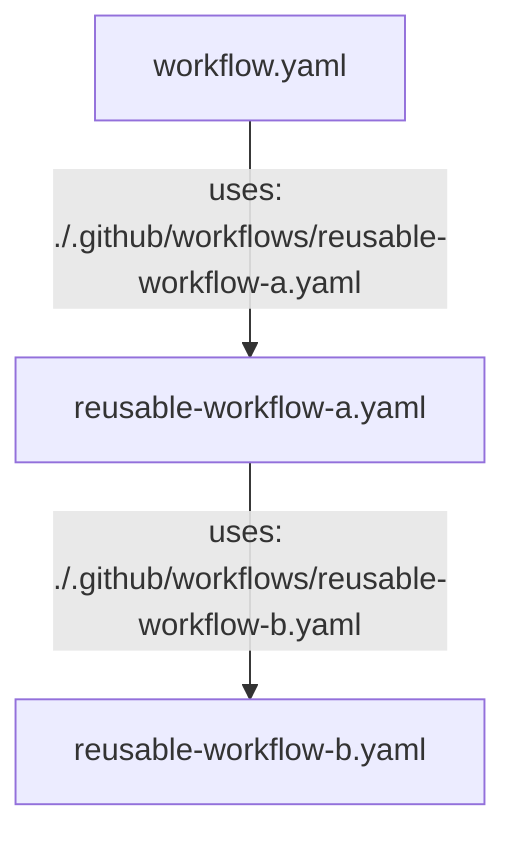

こんにちは。サイボウズ株式会社 [生産性向上チーム](https://note.com/cybozu_dev/n/n1c1b44bf72f6)の平木場です。

僕たち生産性向上チームは毎週水曜日に Productivity Weekly という「1 週間の間に発見された開発者の生産性向上に関するネタを共有する会」を社内で開催しています。
本記事はその時のネタをまとめたものです。

今回が第 88 回目です。過去の記事は[こちら](https://zenn.dev/topics/productivityweekly?order=latest)。

# news 📺

## GitHub Actions: Improvements to reusable workflows | GitHub Changelog
https://github.blog/changelog/2022-08-22-github-actions-improvements-to-reusable-workflows-2/

GitHub Actions において、reusable workflow をマトリックスビルドから呼び出せるようになりました。また、reusable workflow から reusable workflow を呼び出せるようになりました（最大 4 レベル）。これまでは両方ともできませんでした。

:::message
めちゃざっくり書くとこんな感じ。

:::

最大 4 レベルではありますが、reusable-workflow をネストできるようになったのは嬉しいですね。ワークフローの再利用が捗りそうです。

## New options for controlling the default commit message when merging a pull request | GitHub Changelog
https://github.blog/changelog/2022-08-23-new-options-for-controlling-the-default-commit-message-when-merging-a-pull-request/

GitHub において、マージ時のデフォルトコミットメッセージをいくつかのパターンから選択できるようになりました。

リポジトリ設定で、merge コミット、squash コミットごとに設定できます。例えば merge コミットの場合、PR のナンバー、title を埋め込む「Pull request title」や PR のナンバー、title、description を埋め込む「Pull request title and description」を追加で選択できるようになっています。

プルリクエストの description をマージコミットに埋め込みたい場合、これまでは手動でコピーする必要があったのでデフォルトで埋め込めるようになったのは嬉しいですね。使っていきたいです。

## SSH commit verification now supported | GitHub Changelog
https://github.blog/changelog/2022-08-23-ssh-commit-verification-now-supported/

GitHub が SSH 鍵によるコミット署名を検証してくれるようになりました。信頼できる署名であればコミットに対して `Verified` と記述されます。

コミットの署名といえば GPG によるものが有名ですが（多分）、実は Git は SSH 鍵による署名もサポートしています。

実際に試してみました。

https://zenn.dev/korosuke613/scraps/062ed98c904eca

僕は 1Password の SSH Agent を有効にしているためひと工夫必要でしたが、GitHub のドキュメント通りに進めるだけで署名と検証ができるようになるのは簡単でよかったです。

Git のコミットは容易に commiter と author のなりすましができてしまうので、普段から署名をしておくことでなりすましの発見がしやすくなると思います。
単純に `Verified` と表示されるのがかっこいい感じもあるので、これを機にコミットの署名を始めても良いかもしれませんね。

https://twitter.com/Shitimi_613/status/1565998159771316224?conversation=none

# know-how 🎓
## ESLintのconfigがどのように変わり得るか（flat configとは何か）
https://zenn.dev/makotot/articles/0d9184f3dde858

ESLint の新しい config、flat config についての説明記事です。既存の ESLint の config はさまざまな書き方ができたり上書き可能だったりで複雑でしたが、それをシンプルにするのが flat config と呼ばれるものです。まだ実験段階です。

この記事では、これまでの config と flat config の比較、flat config の特長、誕生の経緯などが書かれています。特にこれまでの config と flat config を比較した表がとてもわかりやすいです。

トップレベルが配列となったことで実際にシンプルになるのかは軽く調べただけだとなんともわからないのですが、いつか flat config が正式にリリースされた時に備えてどんなものか知っておきたいですね。

# tool 🔨

## エンジニア組織支援SaaS「Findy Teams」が、”Four Keys”を可視化・分析する「DevOps分析」機能の提供を開始｜ファインディのプレスリリース
https://prtimes.jp/main/html/rd/p/000000042.000045379.html

Findy が提供している組織の開発リードタイムを可視化するサービス Findy Teams に Four Keys を可視化・分析する機能が追加されました。Four Keys を可視化・分析するツールとしては他には [GoogleCloudPlatform/fourkeys](https://github.com/GoogleCloudPlatform/fourkeys) などがあります。

Four Keys の指標であるデプロイ頻度はリポジトリの情報から計測はできそうですが、その他 3 つの指標はリポジトリの情報だけだと計測が難しそうなので、デプロイごとや障害発生ごとに API を叩くとかそういう仕組みになるのでしょうか？Findy Teams の詳細は公開されておらず、資料請求が必要になるのでここら辺をどうするのかが気になるところです。

なんにせよ、Four Keys を可視化・分析するマネージドなサービスは僕の知る限りでは他にありません。自分達で仕組みを作ると大変そうなのでこういったマネージドサービスがあると嬉しいですね。使ってみた記事とかが出るのを待ちたいです。

## google/yamlfmt: An extensible command line tool or library to format yaml files.
https://github.com/google/yamlfmt

Google が yaml フォーマットツール（もしくはライブラリ）の yamlfmt を公開しました。まだ v1 へは達していません。

yaml をフォーマットする場合、例えば [yq](https://github.com/mikefarah/yq) などを使う場合[^prettier]がありますが、yq は決してフォーマッターではないため、フォーマットがかかっているかなどのチェックをしたい場合は一手間必要でした。
yamlfmt にはフォーマット済みかどうかを確認する `-lint` オプションやフォーマット後の差分を表示する `-dry` オプションなどがあり、フォーマッターとして特化されています。

早速使ってみた記事が出てました。

- [Google 製 yaml フォーマッター「yamlfmt」を試してみる](https://zenn.dev/kou_pg_0131/articles/yamlfmt-usage)

ちなみに、試しに引数なしで実行したところ、`**/*.{yaml,yml}` がフォーマットされるので注意が必要です。何も考えずに実行したら非常に大量の YAML が整形されてしまいました。
まだまだ生まれたばっかのソフトウェアな感じがありますが、今後に期待したいですね。

[^prettier]: 実は JS などのフォーマッターである Prettier も yaml のフォーマットに対応しています([Prettier 1.14: YAML Support · Prettier](https://prettier.io/blog/2018/07/29/1.14.0.html))。ただ、yaml をフォーマットするためだけに Prettier を入れるのは重い気がしますね。

# koneta 🍘
Productivity Weekly で出たネタを全て紹介したいけど紹介する体力が持たなかったネタを一言程度で書くコーナーです。

- **news 📺**
  - [Introducing the CircleCI visual config editor | CircleCI](https://circleci.com/blog/visual-config-editor/)
    - CircleCI が CircleCI の config.yml 向けのビジュアルコンフィグエディタを OSS で公開しました
    - この手のツールはコードに慣れてる層からはなかなかメインでは使わなさそうですが、下書きなどの使い道はありそうです
    - また、config.yml の書き方に慣れてない人には嬉しいかもしれません
  - [パブリケーション機能をクローズドβでリリースします | What's New in Zenn](https://info.zenn.dev/about-publication)
    - この記事もお世話になっている Zenn がパブリケーション機能をリリース予定らしいです
    - Qiita で言う Organization に近いけど、それらと比べて記事自体は著者本人のものにしやすいなどの特徴があるっぽいです
    - クローズドベータの申し込みは既に終わっており、9 月からクローズドベータ参加チームの利用が始まる予定とのことです
    - 僕はサイボウズ生産性向上チームで申し込みました。通るかな〜
- **tool 🔨**
  - [Zed – A lightning fast, collaborative code editor](https://zed.dev/)
    - Rust 製エディターです
    - 速さとリアルタイムコラボレーションを売りにしているとのこと
    - クローズドβなので気になる人は登録してみてください

# あとがき
大変遅くなりましたが今週号です。来週からまたインターンが始まるので大忙しです🥲

サイボウズの生産性向上チームでは社内エンジニアの開発生産性を上げるための活動を行なっています。そんな生産性向上チームが気になる方は下のリンクをクリック！
https://note.com/cybozu_dev/n/n1c1b44bf72f6

:::message 
すみません、今週もおまけはお休みです...
:::
