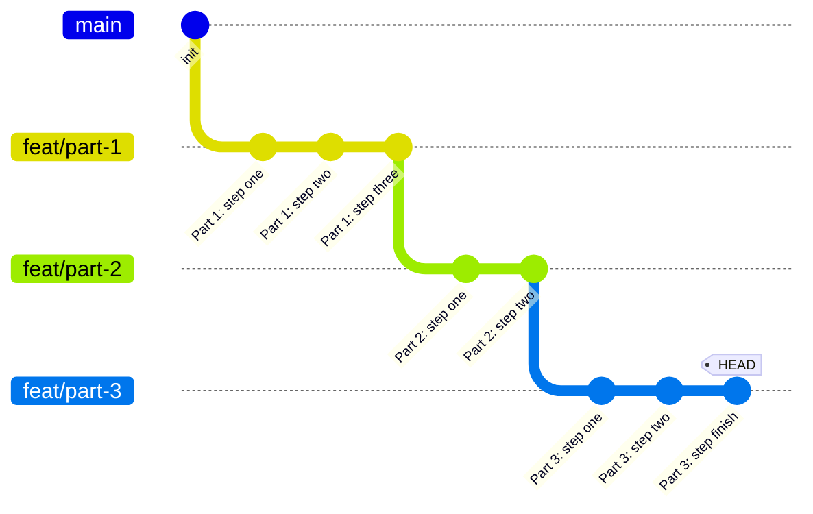
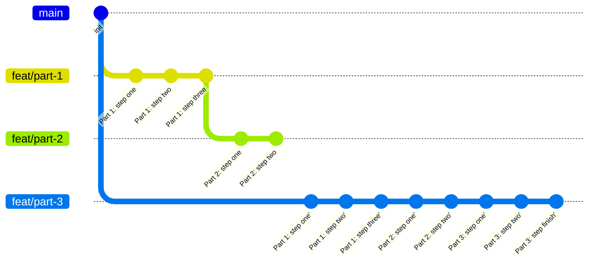

こんにちは。サイボウズ株式会社 [生産性向上チーム](https://note.com/cybozu_dev/n/n1c1b44bf72f6)の平木場です。

僕たち生産性向上チームは毎週水曜日に Productivity Weekly という「1 週間の間に発見された開発者の生産性向上に関するネタを共有する会」を社内で開催しています。
本記事はその時のネタをまとめたものです。

今回が第 94 回目です。過去の記事は[こちら](https://zenn.dev/topics/productivityweekly?order=latest)。

# news 📺

## Highlights from Git 2.38 | The GitHub Blog
https://github.blog/2022-10-03-highlights-from-git-2-38/

Git 2.38 がリリースされ、いくつかの新機能が追加されました。

1 つが、大規模リポジトリ用の機能を設定してくれる scalar コマンドの同梱されたことです。
リポジトリで scalar を設定すると、ファイルのモニタリングや partial clone、sparse-checkout などの大規模リポジトリでの git 操作効率を上げるための機能が有効にされます。
scalar 自体はもっと以前から Microsoft が開発していたのですが、git 2.38 から同梱されるようになった感じです。そこらへんの開発秘話は [The Story of Scalar | The GitHub Blog](https://github.blog/2022-10-13-the-story-of-scalar/) にあります。
大規模リポジトリでの git 操作がとても楽になりそうですが、個人的に思ったのが、何を持って大規模だと判断すれば良いのかという部分でした。とりあえずなんか git 遅いなーと思ったら有効にすれば良いかも？

もう 1 つの新機能が rebase 時に現ブランチの元になったブランチも更新してくれる `--update-refs` オプションの追加です。

どういうものか雑に説明します。
トピックブランチで開発する際に、プルリクエストの肥大化を防ぐためにトピックブランチを細かく分けるという開発方法があります。

例えばログで見るとこういう状態です。

```
❯ git log --oneline main..HEAD
033335c (HEAD -> feat/part-3) Part 3: step finish
07dc7a0 Part 3: step two
d4b9a18 Part 3: step one
4398810 (feat/part-2) Part 2: step two
31eb9a4 Part 2: step one
7ef9167 (feat/part-1) Part 1: step three
ee98b52 Part 1: step two
2bb2534 Part 1: step one
```

グラフで表すとこんな感じですね[^gitGraph]。

[^gitGraph]: グラフの描画には Zenn の mermaid.js 出力機能を使っているのですが、なんか gitGraph が表示されなかったので Issue を投げたらすぐに対応していただきました。早い！→ [mermaid.js の gitGraph が表示されない · Issue #446 · zenn-dev/zenn-community](https://github.com/zenn-dev/zenn-community/issues/446)



この時(HEAD が `033335c` を指す)、例えば `feat/part-3` の元になっている `feat/part-1` ブランチの `2bb2534 Part 1: step one` コミットを修正したいという場合があります。

その場合、`2bb2534 Part 1: step one` を修正することになるので、`feat/part-3` ブランチ上でそれを行うと、`feat/part-1`、`feat/part-2` ブランチとコミットヒストリーが切り離されてしまいます。



なので、これまでは大元のブランチで修正＆各ブランチでリベースを行う必要があり、面倒でした。

しかし、今回登場した `--update-refs` を使うことで、`2bb2534 Part 1: step one` の修正が `feat/part-1`、`feat/part-2` ブランチにも反映され、コミットヒストリーが途切れないようになります。

```text:git rebase main -i --autosquash --update-refs で開かれるエディタの内容
  1 pick 2bb2534 Part 1: step one # empty
  2 fixup d892093 fixup! Part 1: step one # empty
  3 pick ee98b52 Part 1: step two # empty
  4 pick 7ef9167 Part 1: step three # empty
  5 update-ref refs/heads/feat/part-1
  6
  7 pick 31eb9a4 Part 2: step one # empty
  8 pick 4398810 Part 2: step two # empty
  9 update-ref refs/heads/feat/part-2
 10
 11 pick d4b9a18 Part 3: step one # empty
 12 pick 07dc7a0 Part 3: step two # empty
 13 pick 033335c Part 3: step finish # empty
```

`update-ref refs/heads/my-feature/part-one` という文字が見えますね。元のブランチも更新されることがわかります。


:::details 検証時の git 操作

git リポジトリの用意。

```
❯ git init
Initialized empty Git repository in /private/tmp/hoge/.git/

❯ git commit --allow-empty -m "init"
[main (root-commit) e2b2264] init
```

my-feature/part-one ブランチを作成。
```
❯ git switch -c my-feature/part-one
Switched to a new branch 'my-feature/part-one'

❯ git commit --allow-empty -m "Part 1: step one"
[my-feature/part-one 2bb2534] Part 1: step one

❯ git commit --allow-empty -m "Part 1: step two"
[my-feature/part-one ee98b52] Part 1: step two

❯ git commit --allow-empty -m "Part 1: step three"
[my-feature/part-one 7ef9167] Part 1: step three
```

my-feature/part-one から派生した my-feature/part-two ブランチを作成。
```
❯ git switch -c my-feature/part-two
Switched to a new branch 'my-feature/part-two'

❯ git commit --allow-empty -m "Part 2: step one"
[my-feature/part-two 31eb9a4] Part 2: step one

❯ git commit --allow-empty -m "Part 2: step two"
[my-feature/part-two 4398810] Part 2: step two
```
my-feature/part-two から派生した my-feature/part-three ブランチを作成。
```
❯ git switch -c my-feature/part-three
Switched to a new branch 'my-feature/part-three'

❯ git commit --allow-empty -m "Part 3: step one"
[my-feature/part-three d4b9a18] Part 3: step one

❯ git commit --allow-empty -m "Part 3: step two"
[my-feature/part-three 07dc7a0] Part 3: step two

❯ git commit --allow-empty -m "Part 3: step finish"
[my-feature/part-three 033335c] Part 3: step finish
```

現在のコミットログ。
```
❯ git log --oneline main..HEAD
033335c (HEAD -> my-feature/part-three) Part 3: step finish
07dc7a0 Part 3: step two
d4b9a18 Part 3: step one
4398810 (my-feature/part-two) Part 2: step two
31eb9a4 Part 2: step one
7ef9167 (my-feature/part-one) Part 1: step three
ee98b52 Part 1: step two
2bb2534 Part 1: step one
```

my-feature/part-one ブランチの「Part 1: step one」コミット（2bb2534）に修正を入れたくなったので修正コミットを作成。

```
❯ git commit --allow-empty --fixup 2bb2534
[my-feature/part-three d892093] fixup! Part 1: step one

❯ git log --oneline main..HEAD
d892093 (HEAD -> my-feature/part-three) fixup! Part 1: step one
033335c Part 3: step finish
07dc7a0 Part 3: step two
d4b9a18 Part 3: step one
4398810 (my-feature/part-two) Part 2: step two
31eb9a4 Part 2: step one
7ef9167 (my-feature/part-one) Part 1: step three
ee98b52 Part 1: step two
2bb2534 Part 1: step one
```

`git rebase -i main --autosquash` に `--update-refs` を付与。
fixup コミット（d892093）は自動で 2bb2534 の下に移動し、fixup となる。
この時ブランチは my-feature/part-three であるため、my-feature/part-one、my-feature/part-two も更新しなければいけないが、`--update-refs` を付けたため、これら全てのブランチが適切に更新される。

rebase 中のエディタ。

```
  1 pick 2bb2534 Part 1: step one # empty
  2 fixup d892093 fixup! Part 1: step one # empty
  3 pick ee98b52 Part 1: step two # empty
  4 pick 7ef9167 Part 1: step three # empty
  5 update-ref refs/heads/my-feature/part-one
  6
  7 pick 31eb9a4 Part 2: step one # empty
  8 pick 4398810 Part 2: step two # empty
  9 update-ref refs/heads/my-feature/part-two
 10
 11 pick d4b9a18 Part 3: step one # empty
 12 pick 07dc7a0 Part 3: step two # empty
 13 pick 033335c Part 3: step finish # empty
```

rebase 後のメッセージにも my-feature/part-one と my-feature/part-two が更新された旨が記されている。
```
❯ git rebase -i main --autosquash --update-refs
Successfully rebased and updated refs/heads/my-feature/part-three.
Updated the following refs with --update-refs:
	refs/heads/my-feature/part-one
	refs/heads/my-feature/part-two
```

しっかりと全てのブランチがログに存在する。
```
❯ git log --oneline main..HEAD
10317f4 (HEAD -> my-feature/part-three) Part 3: step finish
9c509fa Part 3: step two
38c877b Part 3: step one
b69cfbe (my-feature/part-two) Part 2: step two
4cfc7d2 Part 2: step one
e8e0869 (my-feature/part-one) Part 1: step three
3d4e6a9 Part 1: step two
4a54039 Part 1: step one
```

もしも、`--update-refs` しなかったらどうなるか？

```
❯ git commit --allow-empty --fixup 4a54039
[my-feature/part-three 11c8fee] fixup! Part 1: step one

❯ git rebase -i main --autosquash
Successfully rebased and updated refs/heads/my-feature/part-three.
```

my-feature/part-one、my-feature/part-two ブランチは my-feature/part-three ブランチの歴史から切り離され、ログから消える。
```
❯ git log --oneline main..HEAD
f6c0c2c (HEAD -> my-feature/part-three) Part 3: step finish
c4aec9c Part 3: step two
3c57003 Part 3: step one
94285dc Part 2: step two
b721b5f Part 2: step one
96034c4 Part 1: step three
0ea013f Part 1: step two
c50b017 Part 1: step one
```

:::

ちなみに、毎回オプションをつけるのがめんどいという人はグローバルに設定することもできます。`git config --global rebase.updateRefs true`

scalar も `--update-refs` もどちらもなかなか便利そうな新機能ですね。
活用していきたいです。


## Introducing Actions on GitHub Mobile | GitHub Changelog
https://github.blog/changelog/2022-10-04-introducing-actions-on-github-mobile/

GitHub Mobile で GitHub Actions の実行結果が見られるようになりました（public beta）。

モバイルではプルリクエストの画面から Actions の詳細に遷移できます。ワークフロー、ジョブ、ステップのログの表示が可能です。さらにジョブの再実行も可能です。

これまではプルリクエストなどの Checks から Actions のワークフローへ遷移すると、アプリ内ブラウザが立ち上がり、Actions の実行結果が見られるという感じでした（iOS の場合）。
見られなくはないのですが、アプリ内ブラウザだと使い勝手が悪かったのでこれは嬉しいですね。たまに外出先から見たい場合があるので活用していきたいです。


## Org admins can disable integration requests from outside collaborators | GitHub Changelog
https://github.blog/changelog/2022-09-30-org-admins-can-disable-integration-requests-from-outside-collaborators/

GitHub の Organization において、Outside collaborator が Organization に対して GitHub Apps、OAuth Apps のインストール要求を行えなくさせる設定ができるようになりました。

僕はむしろ今まで Outside collaborator にはこれらのことができないと思っていました。特段理由がない限りは原則行えなくするように設定しててもいいかもしれませんね。

## Release v1.0.0 · axios/axios
https://github.com/axios/axios/releases/tag/v1.0.0

ブラウザ、Node.js 向け HTTP クライアントライブラリで有名な axios が満を辞して v1 に到達しました。今日時点では [v1.1.2](https://github.com/axios/axios/releases/tag/v1.1.2) となっています。

記念すべき v1 の登場なのですが、リリースを見ればわかる通り、変更内容が多すぎてそれの確認が大変です。
ちなみに、Deprecated に関しては次のように、どういう影響を与えるかはリリースノートを読んで確認してねみたいなことが書かれています。

> There are multiple deprecations, refactors and fixes provided in this release. Please read through the full release notes to see how this may impact your project and use case.

そんな axios ですが、v1.0.0 でどう変わるのかを分かりやすくまとめた方がいました。

- [axios は v1.0.0 でどう変わるのか](https://zenn.dev/sa2knight/articles/axios-major-version)

主な変更点やマイグレーションガイドの存在についてが載っており、axios をバージョンアップする上で非常に参考になります。
ですが、マイグレーションガイドを用意する予定のようなので、それを待ちたいですね。


# know-how 🎓

## Software engineering practices
https://simonwillison.net/2022/Oct/1/software-engineering-practices/

ソフトウェア開発をより良くするためのプラクティス集です。著者は「ベスト」という言葉は誤解を招くとし、あえて「ベストプラクティス」という表現をしておりません。

記事では 7 つのプラクティスが紹介されています。

- ドキュメントはコードと同じリポジトリ内に置く
- テストデータを自動生成する仕組みを用意する
- 確実にデータベースのマイグレーションする[^db]
- 新規プロジェクトや新規コンポーネントのためのテンプレートを用意する
- コードフォーマットを自動で行う
- 開発環境立ち上げを自動化する
- プレビュー環境作成を自動化する

全てちゃんとやるのは大変そうですが、確かに実践しておきたい内容が多いですね。
個人的にはプレビュー環境作成の自動化が一番開発効率向上に効果的でかつ仕組みを作るのが難しいトピックだと思います。

ちなみに最後の最後にこれらのプラクティスを実践しやすいプラットフォームがいくつか紹介されています。昔と比べると便利な PaaS がたくさんありますね。

[^db]: この部分だけよくわからなかった。たぶんセクションにある 4 つのプロセスが大事ってことだと思う。

## レガシーシステムをDockerコンテナ化する場合に直面した4つの壁
https://tech-blog.rakus.co.jp/entry/20221004/gisui

20 年以上運用されているレガシーな Web アプリを Docker コンテナ化するときに直面した 4 つの壁とどう対処したかを載せた記事です。

記事では、方針、コンテナ化するときの 4 つの壁（OS コマンドを利用している、ミドルウェアと密結合している、バッチ処理が密結合している、ログが複数の場所に出力される）の紹介と対処などについてが書かれています。

確かにレガシーなモノリスなシステムをコンテナ化するときに直面しそうな壁であるあると思いました。

Docker コンテナ移行を進めるにあたり、CI での利用を最優先することで、本番運用向けの設計は無理に行わないという方針は良いなーと思いました。本番と CI での運用を両方想定してなかなか沼にハマることが多いので...（個人の感想）

似たようにレガシーシステムのコンテナ化をやっていこうと考えている方は参考になると思います。

# koneta 🍘
Productivity Weekly で出たネタを全て紹介したいけど紹介する体力が持たなかったネタを一言程度で書くコーナーです。

- **news 📺**
  - [GitHub Actions: Jobs running on macos-latest are now running on macOS 12 | GitHub Changelog](https://github.blog/changelog/2022-10-03-github-actions-jobs-running-on-macos-latest-are-now-running-on-macos-12/)
    - GitHub Actions において `runs-on` で指定する `macos-latest` ラベルが macOS 12 を指すようになりました
  - [Organization follower count is now available | GitHub Changelog](https://github.blog/changelog/2022-09-28-organization-follower-count-is-now-available/)
    - GitHub において、Organization のフォロワー数が表示されるようになりました
    - 記事内の [GitHub](https://github.com/github) は 2.1M followers となっているが、実際に開くと 11.1k followers と表示される。謎い
- **know-how 🎓**
  - [Docker HubのOpenJDKイメージの利用を更新するためのアドバイス - 赤帽エンジニアブログ](https://rheb.hatenablog.com/entry/updating-docker-hubs-openjdk-image)
    - RedHat の人による、Docker Hub で OpenJDK の公式イメージが非推奨となったため、どうすればよいのかのアドバイスです
    - 記事内では別の JDK である Eclipse Temurin イメージへの移行がおすすめされています
      - 正直数ある JDK の中でどれがどう違うのかよくわかってない
  - [curlでKeyless Signingする (1) - OpenID Connect編](https://knqyf263.hatenablog.com/entry/2022/09/30/184900)
    - curl で OIDC を使って Keyless Signing しようという記事です
    - curl を使って OIDC による認証を手動で行うため、OIDC への理解が深まりそうです

# あとがき
ちょっとネタ少なめでした。

そういえば今年のインターンシップに参加してくれたインターン生が記事を書いてくれました（前紹介したのとは別の人）。今回も文量がハンパないです😇。ありがたいですね〜
https://twitter.com/ajfAfg/status/1579861636210655233

サイボウズの生産性向上チームでは社内エンジニアの開発生産性を上げるための活動を行なっています。そんな生産性向上チームが気になる方は下のリンクをクリック！
https://note.com/cybozu_dev/n/n1c1b44bf72f6

:::message
すみません、今週もおまけはお休みです...
:::
