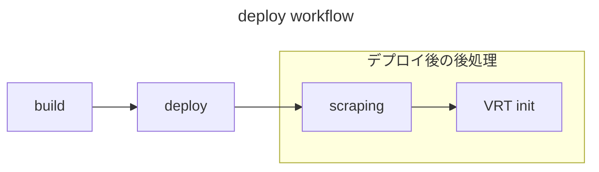
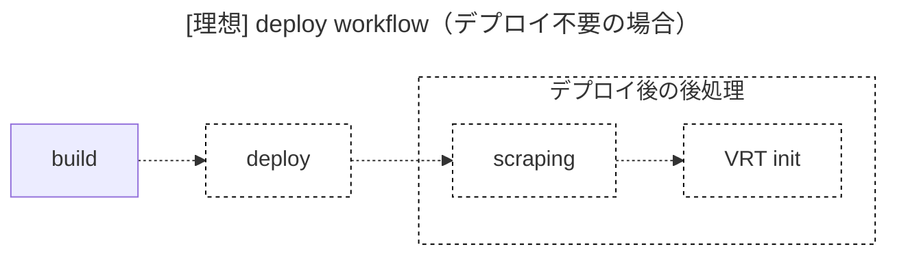
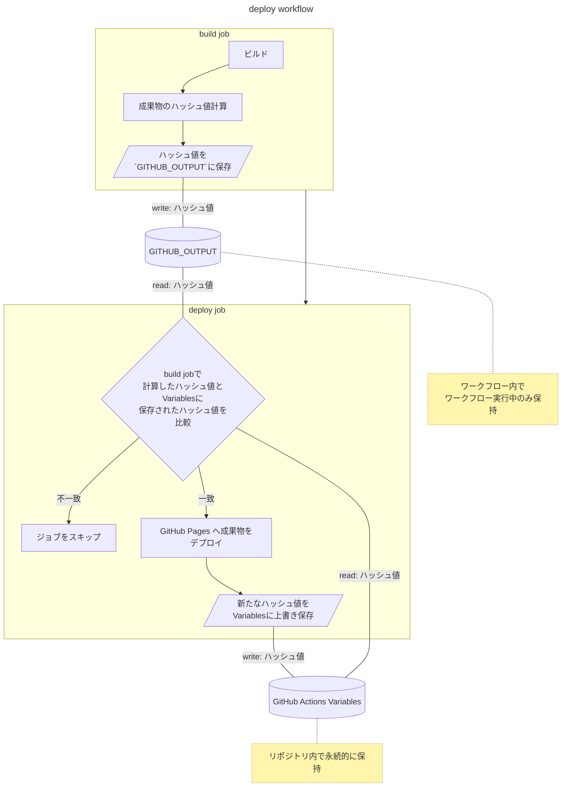

タイトル通りです。GitHub Actions において、成果物のハッシュ値を保存・比較して余計なデプロイを行わないようにする方法を記します。

:::message
この記事は [GitHub Actions Advent Calendar 2023](https://qiita.com/advent-calendar/2023/github-actions) の 1 日目の記事です🎄
明日は [Kyome](https://twitter.com/Kyomesuke) さんによる「GitHub Actions の Workflow Dispatch 実行時に自動テストの実行有無を指定する」が予定されています。楽しみ！🤶
:::


# TL;DR
- 対象
  - ビルド・デプロイを GitHub Actions で行っている
  - 余計なデプロイはしたくない
- 静的サイトのビルド時に成果物のハッシュ値(sha256)を計算して、前回のデプロイ時と同じであればデプロイをスキップする
- ファイル 1 つ 1 つのハッシュ値を計算し、全ハッシュ値からさらにハッシュ値を計算する
  - コマンド `find <成果物のあるディレクトリパス> -type f -print0 | sort --zero-terminated | xargs -0 sha256sum | cut -d ' ' -f 1 | sha256sum | cut -d ' ' -f 1`
- デプロイ時に計算したハッシュ値は GitHub Actions の Variables に保存する
  - GitHub CLI で Variables を取得・更新する
- 同じソースコードで同じ成果物にならない場合はさらに一工夫がいると思う

# 背景

僕は自分のホームページ(https://korosuke613.dev)を GitHub Actions でビルドし、GitHub Pages にデプロイしています。

デフォルトブランチ(main) にマージ後、次の流れでデプロイされます。





*デプロイワークフローの実行例[^togire]*

[^togire]: 途切れた線の先には失敗時の通知ジョブとかがありますが、デプロイとほぼ関係ないので今回は省略します

それぞれのジョブの説明と大体かかる時間は次の通りです。

1. build（約 90 秒）: 静的サイトのビルド
2. deploy（約 20 秒）: GitHub Pages へのデプロイ
3. scraping（約 70 秒）: 全文検索用のインデックス生成[^scraping]（デプロイの後処理）
4. VRT init（約 50 秒）: Visual Regression Testing 用のスクリーンショットを撮影[^vrt_init]（デプロイの後処理）

[^scraping]: Argolia のツール使ってます https://github.com/korosuke613/homepage-2nd/blob/116cfe6a44b0356934c2718868b05efcadb4c291/.github/workflows/scraping.yaml
[^vrt_init]: マジでスクショ撮って保存してるだけ https://github.com/korosuke613/homepage-2nd/blob/116cfe6a44b0356934c2718868b05efcadb4c291/.github/workflows/vrt-init.yaml

**現状、ソースコードにコメントを追加するなどの成果物に影響のない変更を入れただけでもデプロイが走ってしまいます。**

**個人的には無駄にコンピュートリソースは使いたくありません（料金的にも、GitHub への負荷的にも）。**

上記の実行例の場合、81 + 11 + 66 + 47 = 205 秒（3 分 25 秒）は不要なデプロイのためにコンピュートリソースを使っています。
また、GitHub Actions は分単位の課金となっており、ジョブごとに秒が切り上げられた分が課金の対象になります。

> GitHub rounds the minutes and partial minutes each job uses up to the nearest whole minute.
> https://docs.github.com/en/billing/managing-billing-for-github-actions/about-billing-for-github-actions

そのため、上記の実行例の場合、2 + 1 + 2 + 1 = 6 分と、見た目の 2 倍の時間が課金対象となってしまいます[^public_repo]。
ここら辺の切り上げの話は [GitHub Actionsで並列処理を作っていてヒヤッとした話 - ゆるりと](https://khasegawa.hatenablog.com/entry/2022/11/14/100000) を読むとヒヤッとします。

成果物に影響のない変更に対しては、デプロイをスキップして Actions の実行時間を節約したいです。

[^public_repo]: とは言え僕のホームページは public リポジトリなので、料金面はあまり考えなくても良いのですが。

# 理想

理想は、成果物が最新のデプロイに使われた成果物と一致していた場合にデプロイをスキップすることです。
成果物が一致しているかを確認するために、build ジョブは必ず行う必要があります。




# アプローチ
成果物が最新のデプロイのものと一致してるかどうかを確認する必要があります。

成果物一個一個のファイルが一致しているかを確認するのはいろんな意味で大変なので、今回は成果物全体のハッシュ値を計算することにしました。
**最新のデプロイ時のハッシュ値と、新たに計算したハッシュ値が一致していれば、デプロイ済みの成果物と同等であると判断できます。**

最新のデプロイ時のハッシュ値は GitHub Actions の Variables に保存しておきます。

デプロイの全体の流れは次のとおりです。



実際のソースコードは https://github.com/korosuke613/homepage-2nd/blob/2bda9f3d6b1c73d4fedccb464f3d6e2e750270a5/.github/workflows/pages.yml にあります。

# Build job

https://github.com/korosuke613/homepage-2nd/blob/2bda9f3d6b1c73d4fedccb464f3d6e2e750270a5/.github/workflows/pages.yml#L26-L61

## 成果物生成

単純に成果物を生成します。
僕のホームページでは Astro を使っています。`astro build` で成果物が `./dist` ディレクトリに生成されます。最終的にデプロイする際も `./dist` ディレクトリの中身が GitHub Pages にデプロイされるようにしています。

## 成果物のハッシュ値計算

成果物のハッシュ値を計算します。
先のステップで `./dist` に成果物ができたので、`./dist` ディレクトリ内のファイルのハッシュ値を計算します。

```sh:ハッシュ値計算部分のコード
set -x  # 後のパイプの処理がどこまで進んだかわかりやすくするために -x する
SHA256_OUTPUT=$(find ./dist -type f -print0 | \  # 実際にハッシュ値を計算する部分
  sort --zero-terminated | \
  xargs -0 sha256sum | \
  cut -d ' ' -f 1 | \
  sha256sum | \
  cut -d ' ' -f 1)
set +x  # -x を解除
echo "artifacts=$SHA256_OUTPUT" >> $GITHUB_OUTPUT  # GITHUB_OUTPUT にハッシュ値を登録
```

`SHA256_OUTPUT=$(...` から複数行にわたってコマンドを組み合わせてハッシュ値を計算しています。
一行ずつ見ていきましょう。

### 各ファイルパスを抽出
`find ./dist -type f -print0` で `./dist` 内のファイルを再帰的に探索して、ファイルパスを空文字（`NUL`）で区切って出力します。
`-print0` オプションによって、ファイルパスが空文字で区切られます。

そのあと、`find` 結果を間違いなく同じ順番とするために `sort --zero-terminated` でソートします。
空文字区切りとしているため、`-z` オプションを付与しています。

> -z, --zero-terminated
Use NUL as record separator.  By default, records in the files are supposed to be separated by the newline characters.  With this option, NUL (´\0´) is used as a record separator character.
*`man sort` より*

```sh:実行例
❯ find ./dist -type f -print0 | sort --zero-terminated
./dist/.well-known/nostr.json./dist/_astro/MyIcon.1653682e.js./dist/_astro/_page_.d3b1192e.css./dist/_astro/bath.16c9f48c_3Aprr.png./dist/_astro/bath.16c9f48c_Z13clWU.avif./dist/_astro/bath.16c9f48c_Z2jCfaR.webp./dist/_astro/client.2dae202b.js./dist/_astro/danwa.dbf56b02_Z12PHtK.avif./dist/_astro/danwa.dbf56b02_Z2brCk7.png./dist/_astro/danwa.dbf56b02_hzStf.w＜省略＞
```

[^find_sort_order]: 基本的に一意に定まるっぽいけど、心配なら sort 噛ませみたいなこと書いてる。https://serverfault.com/a/181815

### 各ファイルのハッシュ値を計算

`xargs -0 sha256sum` で、ファイルパスごとにハッシュ値を計算します。
ファイルパスが空文字で区切られているため、`xargs` に `-0` オプションを付与しています。

```sh:実行例
❯ find ./dist -type f -print0 | sort --zero-terminated | xargs -0 sha256sum
71e1abcbd9ba1c14fff4621341d4f7dbffb35f95e87f52577a32a0176bf29386  ./dist/.well-known/nostr.json
63d5b634d1caa1006c5d4223e5e42bc4fbc1cf0b50de3a15ce6f0df248bc51cf  ./dist/_astro/MyIcon.1653682e.js
d3b1192ec86fad2d7d8932abf026906c6c3b7c9fb590bfd65e6b1315f234345d  ./dist/_astro/_page_.d3b1192e.css
fbb86afd1c27ffb2e287c122ab9edb4fbf0bcdfa120b1b5cd4f309a0d7024b84  ./dist/_astro/bath.16c9f48c_3Aprr.png
f3a4c88e7b130a000ad982a88293d32f21236a22c101c34df87017449c56b346  ./dist/_astro/bath.16c9f48c_Z13clWU.avif
5d314feab50b0ea74defa8e2616cc7cd24775a504270ed0bd0f38ded30783cca  ./dist/_astro/bath.16c9f48c_Z2jCfaR.webp
71da924d07a988742faf7e6f967c77b1a4a7d144e8a441294e10dce950da761a  ./dist/_astro/client.2dae202b.js
b06f2644fa3bd3738feb94ea00cb39132c3a452e6e5f04a311da714b7be4f912  ./dist/_astro/danwa.dbf56b02_Z12PHtK.avif
＜省略＞
```

また、`sha256sum` の結果は `ハッシュ値 ファイルパス` という形式で出力されるため、ハッシュ値のみを取り出します。
`cut` コマンドで各ファイルのハッシュ値のみを取り出します。

```sh:実行例
❯ find ./dist -type f -print0 | sort --zero-terminated | xargs -0 sha256sum | cut -d ' ' -f 1
71e1abcbd9ba1c14fff4621341d4f7dbffb35f95e87f52577a32a0176bf29386
63d5b634d1caa1006c5d4223e5e42bc4fbc1cf0b50de3a15ce6f0df248bc51cf
d3b1192ec86fad2d7d8932abf026906c6c3b7c9fb590bfd65e6b1315f234345d
fbb86afd1c27ffb2e287c122ab9edb4fbf0bcdfa120b1b5cd4f309a0d7024b84
f3a4c88e7b130a000ad982a88293d32f21236a22c101c34df87017449c56b346
5d314feab50b0ea74defa8e2616cc7cd24775a504270ed0bd0f38ded30783cca
71da924d07a988742faf7e6f967c77b1a4a7d144e8a441294e10dce950da761a
b06f2644fa3bd3738feb94ea00cb39132c3a452e6e5f04a311da714b7be4f912
＜省略＞
```

### 最終的なハッシュ値を計算

`sha256sum | cut -d ' ' -f 1` で各ハッシュ値からさらにハッシュ値を計算します。

```sh:実行例
❯ find ./dist -type f -print0 | sort --zero-terminated | xargs -0 sha256sum | cut -d ' ' -f 1 | sha256sum | cut -d ' ' -f 1
fb768233afcd6c4a9c625bc4828252ad787f3b661c0194b5a9586ca59ef23786
```

計算したハッシュ値は最終的に `echo "artifacts=<ハッシュ値>" >> $GITHUB_OUTPUT` で `GITHUB_OUTPUT` に保存します。
`GITHUB_OUTPUT` に保存することで、後続ジョブから計算したハッシュ値を参照できるようになります。


# Deploy job

https://github.com/korosuke613/homepage-2nd/blob/2bda9f3d6b1c73d4fedccb464f3d6e2e750270a5/.github/workflows/pages.yml#L63-L96

## デプロイ済みのハッシュ値との比較

デプロイを行う前に、デプロイ済み成果物のハッシュ値と、build ジョブで計算したハッシュ値を比較し、デプロイをスキップするかどうか決定します。

```yaml:deploy ジョブの if
deploy:
    if: vars.RECENT_ARTIFACTS_SHA256 != needs.build.outputs.artifacts_sha256
```

[`jobs.<job_id>.if`](https://docs.github.com/en/actions/using-workflows/workflow-syntax-for-github-actions#jobsjob_idif) でジョブの実行条件を指定できます。条件式が `true` であればジョブを実行し、`false` であればジョブをスキップします。

`vars.RECENT_ARTIFACTS_SHA256` で GitHub Actions の Variables から最新の成果物のハッシュ値を取得します（Variables への保存は後述）。`needs.build.outputs.artifacts_sha256` で、build ジョブで `GITHUB_OUTPUTS` へ保存した成果物のハッシュ値を取得しています。

ハッシュ値が一致した場合(≒デプロイ**不要**)はデプロイをスキップし、ハッシュ値が不一致だった場合(≒デプロイ**必要**)は、デプロイします。

## (ハッシュ値が一致した場合) ジョブをスキップして終了する

特に何もせずにジョブを正常終了し、後続ジョブもスキップします。

## (ハッシュ値が不一致だった場合) GitHub Pages へ成果物をデプロイする

GitHub Pages へ成果物をデプロイします。

## (ハッシュ値が不一致だった場合) ハッシュ値を Variables に保存する

GitHub Actions の Variables に、最新の成果物のハッシュ値（build ジョブで計算したハッシュ値）を保存します。次回のデプロイ時に最新のハッシュ値を参照できるようにです。

保存には GitHub CLI を使うのが比較的楽です。`gh variable set` コマンドで Variables を追加・更新できます。

```terminal:GitHub CLI で Variables を更新するコマンド
gh variable set RECENT_ARTIFACTS_SHA256 --body ${{ needs.build.outputs.artifacts_sha256 }}
```

:::message
なお、Variables の更新は `GITHUB_TOKEN` の権限ではできません。
要望は discussion に上がっていますが、残念ながら反応されていません（[Write permissions for repo variables for GITHUB_TOKEN · community · Discussion #53250](https://github.com/orgs/community/discussions/53250)）。

GitHub Apps や Personal Access Token を用意する必要があります。
僕の場合は自前の GitHub Apps で Repository permissions -> Variables に Read and Write を付与しています。
:::

保存後は、GitHub Actions のワークフロー画面でハッシュ値がどう変化したかを確認できるように、[`GITHUB_STEP_SUMMARY`](https://docs.github.com/en/actions/using-workflows/workflow-commands-for-github-actions#adding-a-job-summary) に新旧ハッシュ値を追記しています。

```sh:保存後の処理
echo "### Now changed SHA256" >> $GITHUB_STEP_SUMMARY
echo "||SHA256|" >> $GITHUB_STEP_SUMMARY
echo "|---|---|" >> $GITHUB_STEP_SUMMARY          
echo "|Old|\`${{ vars.RECENT_ARTIFACTS_SHA256 }}\`|" >> $GITHUB_STEP_SUMMARY
echo "|New|\`${{ needs.build.outputs.artifacts_sha256 }}\`|" >> $GITHUB_STEP_SUMMARY
```


*ワークフローの Summary にこんな風に表示されます*

# 副産物

ちなみに、思いついたのでさらに、トピックブランチでの CI でもハッシュ値を計算し、プルリクエストに成果物に影響があるかをプルリクエストにラベリングするのもやってみました。

https://github.com/korosuke613/homepage-2nd/blob/116cfe6a44b0356934c2718868b05efcadb4c291/.github/workflows/ci.yaml#L46-L90

僕はトピックブランチをマージするための条件として、ビルド可能かどうかを確認しています。
今回、ビルド後に以下のことをするようにしました。

- 成果物のハッシュ値を計算、デプロイ時のハッシュ値と比較
- 成果物に変更があるかをプルリクエストにラベル付け
- 成果物に変更があるかをプルリクエストにコメント


*成果物に変更が**なかった**場合は `No changes to the artifacts` とコメント*


*成果物に変更が**あった**場合は `Changes to the artifacts` とコメント*


*成果物に変更がなかった場合は `no changes ✅` とラベリング*
*成果物に変更があった場合は `changes 🚨` とラベリング*

成果物に変更があるかどうかわかりやすくなり、プルリクエストのトリアージやレビューが大変しやすくなりました。
今回はやっていませんが、今後はオートマージの条件にも使えそうです。

# おわりに

やってみた結果、同じ成果物の場合はちゃんとデプロイ以降のジョブをスキップするようになりました。
**チリも積もればなんとやら。これで多くのコンピュートリソースを節約できますね！**


*build ジョブ以外がスキップされた*

1 つ注意したいのが、今回の方法では、成果物が同じであることを保証できるのは、**同じソースコードで同じ成果物が生成される場合**に限られます。
もし同じソースコードでもビルドするたびに異なる成果物が生成されるような作りだと、今回の方法は使えません。実際僕はビルド時にランダムに値を変える部分が元々あったので、そうならないような対策を事前に行いました。

今回は静的サイトを対象に説明しましたが、同じ結果になるかを確認して処理をスキップするという手法は静的サイトに限らず色々な場面で役立つと思います。みなさんも余計なジョブ実行を減らしてコンピュータにやさしい（？）開発ライフを送ってください！
