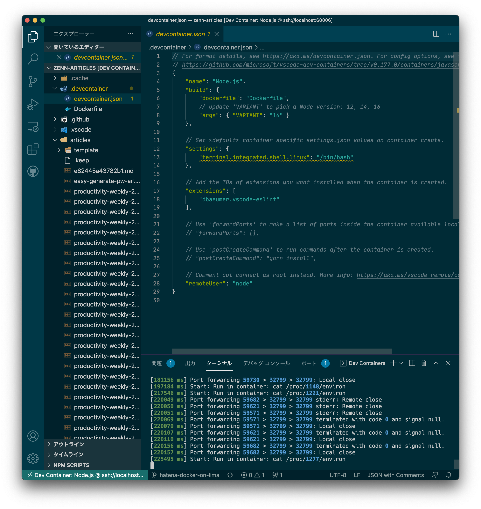
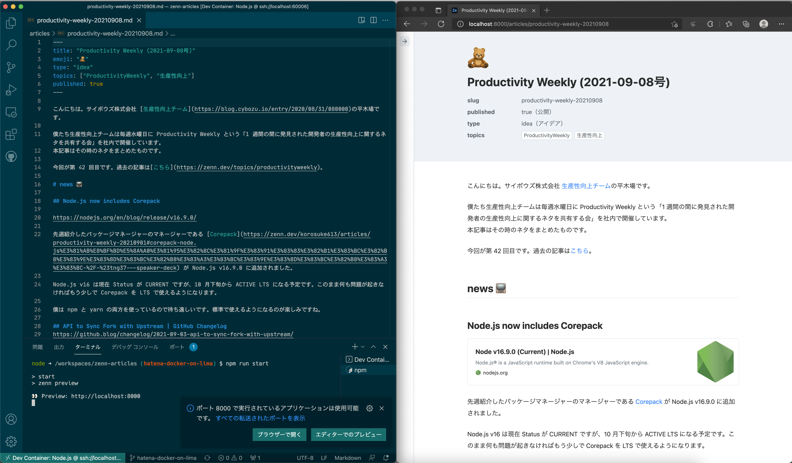
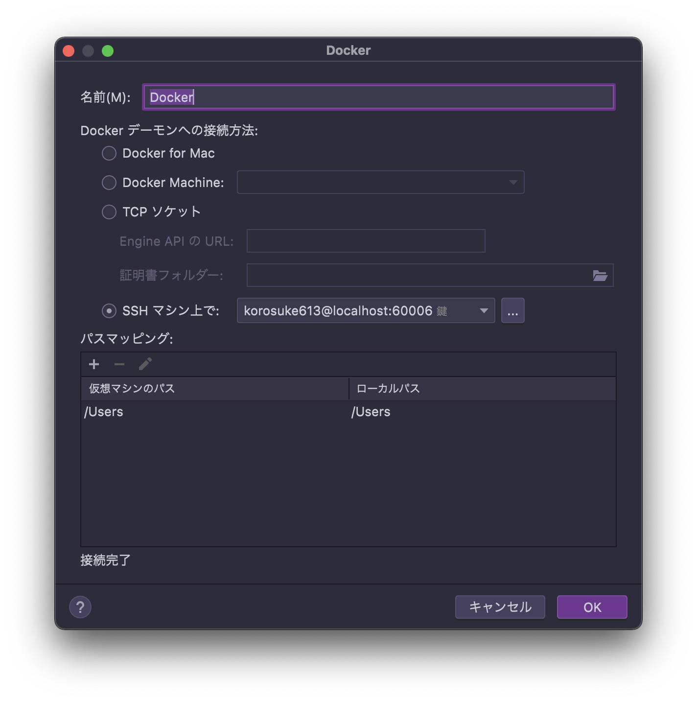
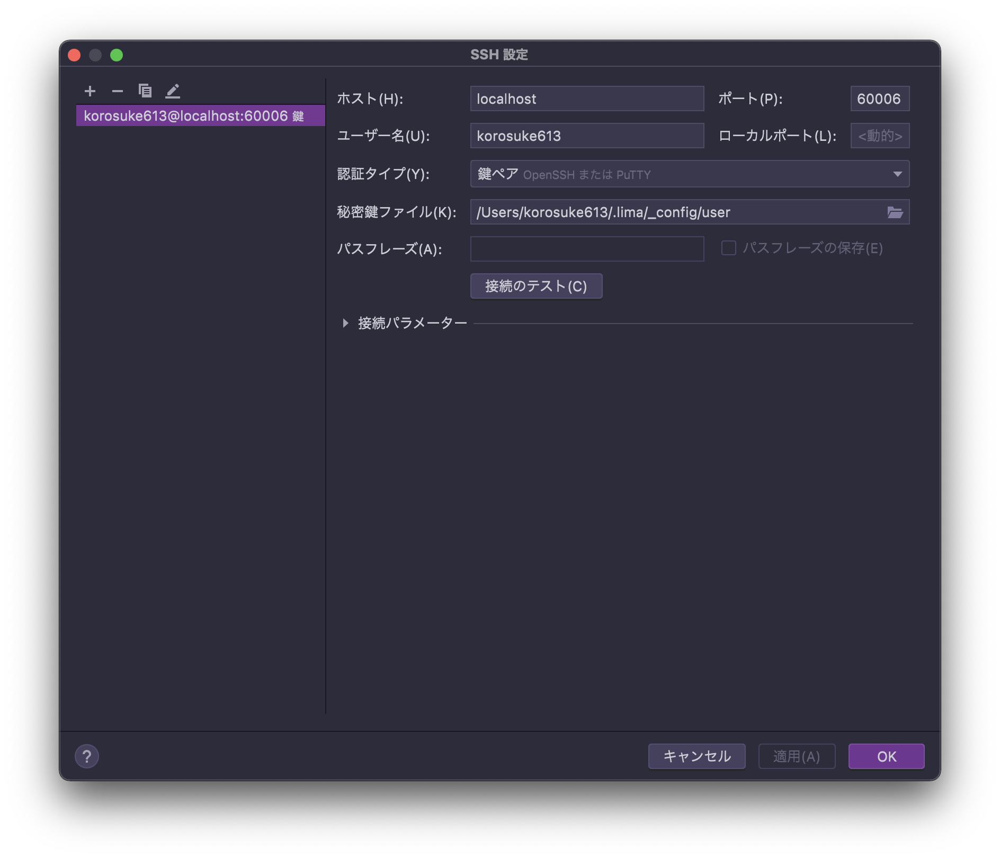
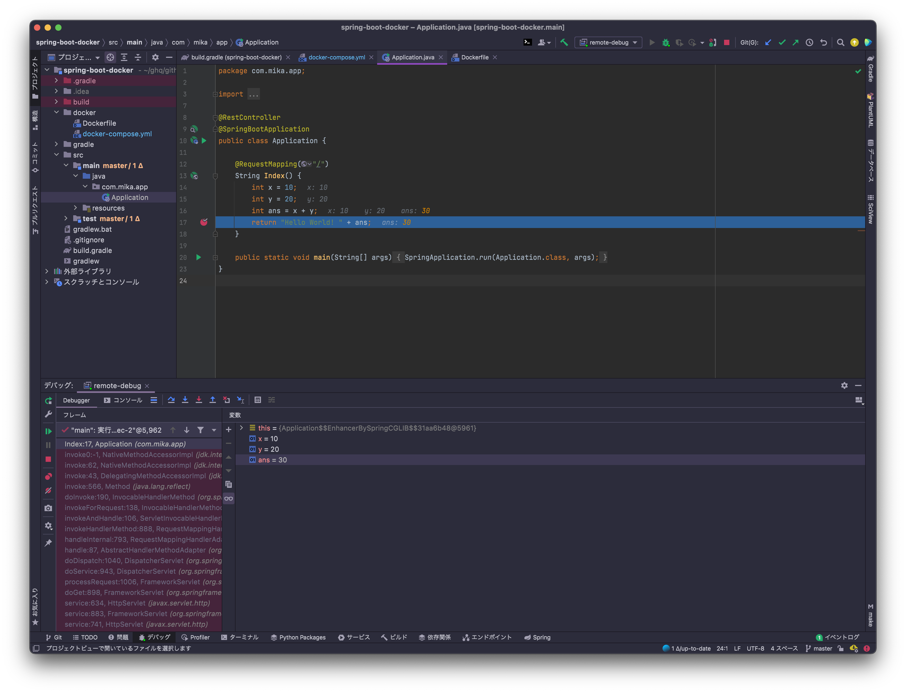

<!-- ここに導入を書く -->

[先日 Docker Desktop が条件付きで有料になりましたね](https://www.docker.com/blog/updating-product-subscriptions/)。Docker 社に金を払うのが間違いないとはわかりつつ、最近は Docker Desktop の代替となるものを色々と探していました。ちょっと前に見つけた lima という OSS が Docker 環境を構築するのになかなか良さげだったので、色々検証した記録をここに残します。

<!-- 続きを読むのやつ -->
<!-- more -->

---

**目次**

[:contents]

<!-- ここに広告が入る -->
---

# TL;DR
- 対象
  - Mac において Docker Desktop を使わずに Docker を使いたい人
    - ARM プロセッサでもできるかは未確認
- 3 行まとめ
  - lima を使えば Docker Desktop っぽい環境を作れる
  - 最初にちょっと設定が必要
  - Docker Compose v2 を使うのはちょっと面倒
  - [VSCode Remote Container](#VSCode-Remote-Container) や [IntelliJ IDEA](#IntelliJ-IDEA) のリモートデバッグも動く

**注意事項**

今回の検証は以下の環境で行なっています。今後 lima のアップデートなどによりこの記事の内容が動かなくなる可能性があります。

# lima とは
[https://github.com/lima-vm/lima:embed:cite]

lima は macOS 向けの Linux 仮想マシンの構築・管理ツールです。ファイル共有、ポートフォワーディングの設定を自動でしてくれて、containerd、nerdctl を標準搭載した Linux 仮想マシンを構築してくれます。

[containerd](https://containerd.io/) と、containerd を扱うための Docker 互換の CLI である [nerdctl](https://github.com/containerd/nerdctl) を内包しているため、仮想マシン構築後すぐにコンテナ開発を始めることができます。ライセンスは [Apache License 2.0](https://github.com/lima-vm/lima/blob/15aba00bbb85e64c3e17ea3611b39b6503727064/LICENSE) です。

手軽に環境構築できて素晴らしいのですが、それでも自分は Docker を使いたいという人もいるでしょう。Docker Desktop をインストールしていた環境と極力変わらず Docker を使えるようにしたいです。そのため、Docker Daemon + Docker CLI + Docker Compose + ...を簡単に構築できるようにしたいです。

# lima 上に Docker 環境を構築する

lima には[ユーザ定義ファイルから仮想マシンを構築する機能](https://github.com/lima-vm/lima/tree/15aba00bbb85e64c3e17ea3611b39b6503727064#can-i-run-non-ubuntu-guests)があり、プロビジョニングスクリプトを設定できます（イメージに cloud-init が含まれていることが要件になっている）。これを利用することで lima で仮想マシンを構築する際に Docker 環境を構築できます。

そして、なんとすでに [Docker 環境を構築するための example](https://github.com/lima-vm/lima/blob/15aba00bbb85e64c3e17ea3611b39b6503727064/examples/docker.yaml) を公式で提供されています。こちらを使っていきましょう[^colima]。

[^colima]: ちなみに、[colima](https://github.com/abiosoft/colima) という lima で Docker 環境、Kubernetes 環境を構築するためのラッパースクリプトもあります(開発者は別)。こちらも面白そうですが、まだまだ開発途中であることと、インストールが手間なのがあるため、今回は検証しません。

## lima のインストール
[Homebrew](https://formulae.brew.sh/formula/lima) でインストールできます。

## 設定ファイルの用意
公式で提供されている [`example/docker.yaml`](https://github.com/lima-vm/lima/blob/15aba00bbb85e64c3e17ea3611b39b6503727064/examples/docker.yaml) を手元に用意します。今回の例では `docker.yaml` というファイル名で保存することにします。

（こちらの yaml は [example/docker.yaml の 63a7dcd](https://github.com/lima-vm/lima/blob/15aba00bbb85e64c3e17ea3611b39b6503727064/examples/docker.yaml) と同じ内容になります。）

なお、[デフォルトだとディスクサイズが 100GiB となっている](https://github.com/lima-vm/lima/blob/15aba00bbb85e64c3e17ea3611b39b6503727064/pkg/limayaml/default.yaml#L34-L36)ので、気になる方は `disk` を任意の値に変えて yaml に追加しましょう（僕は `10GiB` にしています）。

## 仮想マシンを構築
先ほど用意した設定ファイル(`docker.yaml`)を基に lima で仮想マシンを構築します。なお、仮想マシンの管理には `limactl` コマンドを使用します。

以下のコマンドで仮想マシンを構築＆立ち上げます。

▶︎ 実行結果はこちら

これで Docker 環境を含んだ Linux 仮想マシンができました。

実際に仮想マシンに入って確認してみましょう。`limactl shell docker` で仮想マシン内に入ることができます。仮想マシン内で `hello-world` イメージを動かしてみます。

お〜動きましたね。

# ホストマシンから lima 上の Docker daemon を利用する
無事動きましたが、このままだとわざわざ仮想マシン内で作業しなければなりません。ホストマシン上の Docker CLI から lima 上の Docker daemon を利用できるようにします。

## Docker CLI のインストール
Docker Desktop をアンインストールした方は Docker CLI が手元にないかもしれません。まずは Docker CLI をインストールします（まだ Docker Desktop 入ってるよ！という方はスキップして大丈夫です）。

Docker CLI は [Homebrew](https://formulae.brew.sh/formula/docker) でインストールできます。

もちろんホストマシン上に Docker daemon は存在しないので `Cannot connect to the Docker daemon...` というエラーが出ます。

### (Optional) Docker Compose v2 のインストール
[Docker Compose v2](https://docs.docker.com/compose/cli-command/) は Docker Desktop にバンドルされていますが、`brew install docker` ではインストールされません。

[docker/compose の README.md](https://github.com/docker/compose/tree/1a73d1412d562e32effbe7b322f17e8d77ad7755#linux) に書いてあるようにバイナリを落としてきて、適切な場所に配置しなければいけません。

正式リリースされたらもしかしたら Docker CLI にバンドルされるかもしれません。

## `DOCKER_HOST` 環境変数を設定する && `~/ssh/config` を設定する（2021/10/22 追記）
Docker CLI はデフォルトでは `unix:///var/run/docker.sock` を見に行きますが、`DOCKER_HOST` 環境変数を設定することでソケットの読み先を変えることができます。

どう設定すればいいかのヒントは `example/docker.yaml` に書かれています。

仮想マシン `docker` は `60006` ポートを開いているため、`ssh://localhost:60006` を `DOCKER_HOST` に設定します。

設定した上で `docker version` しますが、このままでは弾かれます。

そのため、上記ヒントに書かれているように `NoHostAuthenticationForLocalhost yes` を `~/ssh/config` に追加する必要があります。例を以下に示します（`User` は任意のユーザ名に書き換えてください）。

`~/ssh/config` の一部

**2021/10/22 追記**

[lima v0.7.2](https://github.com/lima-vm/lima/releases/tag/v0.7.2) にて、`limactl show-ssh` コマンドが追加されました。このコマンドを使うことで、以下のような `~/.ssh/config` の設定を生成できます。`~/.ssh` 下にある IdentityFile が追加されるので、不必要であれば調整してください。

**2021/10/22 追記終わり**

もう一度 `docker version` してみます。

`Server: Docker Engine` が表示され、ちゃんと `OS/Arch` が `linux/amd64` になっていますね！

`export DOCKER_HOST=ssh://localhost:60006` を毎回実行するのは面倒なので、`~/.zshrc` などに記述してターミナル起動時に実行されるようにすると楽です。

# マウントしたボリュームを writable にする

`example/docker.yaml` にはいくつかのディレクトリをマウントする設定が書かれているため、仮想マシン内でホームディレクトリ下のファイルにアクセスできます。

[`example/docker.yaml` の 21-25 行目](https://github.com/lima-vm/lima/blob/15aba00bbb85e64c3e17ea3611b39b6503727064/examples/docker.yaml#L21-L25)

- `location` にホストマシンのパスを指定すると仮想マシン内で同じパスにホストマシンのファイルがマウントされます。
  - `location: "~"` の場合、仮想マシンの `/Users/<ユーザ名>/` にホストマシンの `/Users/<ユーザ名>/` がマウントされます。
- `writable` で書き込み可能にするか設定できます。
  - `writable: false` で読み込みのみ許可されてマウントされます。
  - `writable: true` で読み込み/書き込みが許可されてマウントされます。

なので、このままだと `/tmp/lima` でしかホストマシンのファイルを書き換えることができません。

したがって、必要に応じて `mounts` を修正しましょう。

<!-- 例えば僕の場合、[ghq](https://github.com/x-motemen/ghq) を利用しているため、`~/ghq` 下で作業をすることが多いです。なので、`~/ghq` を writable で追加します（`/tmp/lima` は今のところ使わないので削除しました）。これにより、ホームディレクトリ下を `Read-only` でマウントしつつ、`~/ghq` 下のみ `Read/Write` でマウントできます。 -->

例えば僕の場合、[ghq](https://github.com/x-motemen/ghq) を利用しているため、`~/ghq` 下で作業をすることが多いです。なので、`~/ghq` を writable で設定します。

なお、設定ファイルを修正しても構築済みの仮想マシンに反映されるわけではありません。**設定ファイルを変更したら仮想マシンを再作成する必要があります**。

`limactl stop docker` で仮想マシンを停止し、`limactl rm docker` で仮想マシンを削除します。

▶︎ 実行結果はこちら

削除できたら `limactl start ./docker.yaml` で再度設定ファイルを指定して仮想マシンを構築＆起動します。

再度 `limactl shell docker` で仮想マシンに入りファイルを作成すると、ちゃんとホストマシンにも反映されました。

# 最終的な設定ファイル
最終的に僕が使っている設定ファイルを示します。`mounts` 以外にも、`cpus`、`memory`、`disk` をカスタムしています。

# 色々試してみる
この記事で用意した Docker 環境を使ってどこまで何ができるか試してみます。とりあえず思いついたのだけやってみました。

## ボリュームマウント
`docker run` 時に `-v` でマウントします。読み込み書き込み両方できました。

**読み込み**

**書き込み**

[検証に使ったコード](https://github.com/korosuke613/playground/tree/fb01fdb9f6f72096fdfeeec42b22887063ee24b5/go/helloworld)

## ポートフォワーディング
`docker run` 時に `-p` でポートフォワーディングできました。

ターミナル 1

ターミナル 2

ターミナル 1

## Buildkit
Buildkit を利用できました。

[検証に使ったコード](https://github.com/korosuke613/playground/tree/fb01fdb9f6f72096fdfeeec42b22887063ee24b5/docker/here-docment)

## Docker Compose v2

Docker Compose v2 を利用できました。ただし[別途インストールが必要](#Optional-Docker-Compose-v2-%E3%81%AE%E3%82%A4%E3%83%B3%E3%82%B9%E3%83%88%E3%83%BC%E3%83%AB)。

[検証に使ったコード](https://github.com/korosuke613/playground/tree/fb01fdb9f6f72096fdfeeec42b22887063ee24b5/docker/distroless)

ターミナル 1

ターミナル 2

ターミナル 1

## VSCode Remote Container

VSCode Remote Container での開発も可能でした。ただし、`~/.zshrc` に `export DOCKER_HOST=ssh://localhost:60006` を設定する必要があります。

[korosuke613/zenn-articles](https://github.com/korosuke613/zenn-articles) を使用しています。

<!--  -->

<figure class="figure-image figure-image-fotolife" title="devcontainerが立ち上がった様子"><figcaption>devcontainerが立ち上がった様子</figcaption></figure>

ポートフォワーディングもできました。

<!--  -->

<figure class="figure-image figure-image-fotolife" title="ホストマシンにポートフォワーディングしている様子"><figcaption>ホストマシンにポートフォワーディングしている様子</figcaption></figure>

## IntelliJ IDEA
Docker daemon との接続、および、（Spring Framework の）リモートデバッグも可能でした。

**Docker との接続**

以下のような設定で lima 上の Docker と接続できます。

<!--  -->

<figure class="figure-image figure-image-fotolife" title="設定1"><figcaption>設定1</figcaption></figure>

<!--  -->

<figure class="figure-image figure-image-fotolife" title="設定2"><figcaption>設定2</figcaption></figure>

<!--  -->

<figure class="figure-image figure-image-fotolife" title="サービスタブ"><figcaption>サービスタブ</figcaption></figure>

**リモートデバッグ**

以下の記事を参考に Docker コンテナ内で動作する Spring Framework をリモートデバッグしました。

[https://qiita.com/Tomoyuki_Mikami/items/92f63e4e2b2241959f1e:embed:cite]

<figure class="figure-image figure-image-fotolife" title="リモートデバッグ"><figcaption>リモートデバッグ</figcaption></figure>

<!--  -->

# lima 以外の選択肢
今回は lima を使って Docker 環境を構築しましたが、lima 以外にも選択肢はあります。それぞれがどこまでできるか僕もあまり検証できていないので、参考としていくつかリンクを貼っときます。

- [podman](https://podman.io/)
  - [【podman machine】macOS 上で Podman を実行する新コマンドの紹介 - 赤帽エンジニアブログ](https://rheb.hatenablog.com/entry/podman-machine)
  - [Docker Desktop から podman に変えた - HsbtDiary(2021-09-01)](https://www.hsbt.org/diary/20210901.html)
- [minikube](https://github.com/kubernetes/minikube)
  - [Replacing Docker Desktop with hyperkit + minikube - Cirrus Minor](https://arnon.me/2021/09/replace-docker-with-minikube/)
  - [Minikube で無料で商用利用できる Docker 開発環境をつくる](https://zenn.dev/sasasin/articles/43a1b79a4cfdc1)
- [docker-machine](https://github.com/docker/machine)
  - [macOS で Docker Desktop をアンインストールして docker-cli + docker-machine で動かすようにする - その手の平は尻もつかめるさ](https://moznion.hatenadiary.com/entry/2021/09/01/112601)

# おわりに
ちょっと工夫を凝らせば lima を使って Docker Desktop 代替な環境を構築できました（compose のインストールだけ面倒だった）。僕も全ての機能やユースケースを検証できたわけではないので、完全に Docker Desktop を置き換えられるとは言えません。しかし、凝ったことをしなければある程度使用していけるかなと思いました。lima、素晴らしいですね。

もしもこういうことやったら動かなかったというのを見つけた人はコメントしてください。

<!-- 記事終わり線 -->

<!-- ここに脚注が来る -->