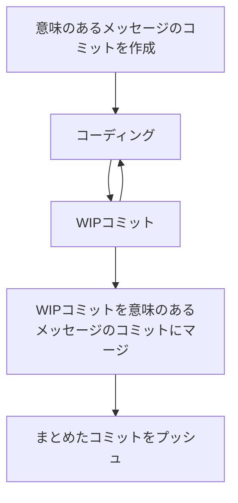

---
# try also 'default' to start simple
theme: default
# random image from a curated Unsplash collection by Anthony
# like them? see https://unsplash.com/collections/94734566/slidev
# background: https://source.unsplash.com/collection/94734566/1920x1080
# apply any windi css classes to the current slide
class: 'text-center'
# https://sli.dev/custom/highlighters.html
highlighter: shiki
colorSchema: 'dark'
lineNumbers: false
info: |
  https://github.com/korosuke613/playground
drawings:
  persist: false
hideInToc: true
title: 'がんばれ fixup と autosquash おまえがナンバー1だ！！（WIP コミットにおいて）'
fonts:
  # basically the text
  sans: 'Zen Maru Gothic'
  # use with `font-serif` css class from windicss
  serif: 'Noto Serif Japanese'
  # for code blocks, inline code, etc.
  mono: 'JetBrains Mono'
layout: cover
---
<!-- # いちおう最後に聞いておこう...<br> どうかな `--autosquash` と `--fixup` を使ってみる気はないか？ -->
<!-- textlint-disable -->
# がんばれ`fixup`と`autosquash`<br>おまえがナンバー1だ！！<br><h4>（WIP コミットにおいて）</h4>

<br>

##### 2022/08/04 (木) <br>ぼくのかんがえたさいきょうの開発環境 天下一武道会 🥊

平木場 風太 \<Futa Hirakoba\>

<!-- textlint-enable -->

<style>

.slidev-layout.cover h1, .slidev-layout.intro h1  {
  font-size: 3.0em;
}

</style>

---
hideInToc: true
---

# 平木場 風太 - Futa Hirakoba

<div class="grid grid-cols-[6.9fr,2.1fr] gap-0">
<div>

<br>

- 🌋 **出身** - 鹿児島
- 🏢 **勤め先** - サイボウズ株式会社 / 開発本部 / 生産性向上チーム
- 🧑‍💻 **役割** - Engineering Productivity
- 🍣 **好きな食べ物** - チキン南蛮、辛麺[^masumoto]
- 💪 AWS や CI、Terraform を触ることが多い

<br>

- <mdi-github-face /> <a href="https://github.com/korosuke613">@korosuke613</a> 
- <mdi-twitter /> <a href="https://twitter.com/shitimi_613">@shitimi_613</a>

<br>

</div>
  <div>
    
    <br>
    
  </div>
</div>

<br>

[^masumoto]: 写真は桝元の辛麺（トマト 5 辛中華麺チーズトッピング）。毎日食べたい。

<!-- # 目次

<Toc /> -->

---
layout: default
---

# 今日話すこと

<br>
<br>

### `git commit --fixup` と `git rebase --autosquash` をうまく使って<br>WIP コミットの作成とマージを高速にやっていくよ


<!-- # TL;DR

<br> 

- `git commit --fixup $(git log -1 --pretty=format:"%H" --grep="^fixup\!" --invert-grep)` でコミットを積む
- `git rebase --interactive --autosquash` でまとめる -->

---

# WIP コミットとは？

- トピックブランチで作業中、作業途中の状態を保存目的でコミットを積むこと[^zougo][^amend]
- 個人作業だけでなくモブプログラミングのドライバー交代時に登場することも
- `git commit -m "wip"` というふうにしがち

<br>

<center>

```mermaid {theme: 'default', 'themeVariables': {'git0': '#F5C142', 'gitBranchLabel0': '#000000', 'git1': '#123293', 'gitBranchLabel1': '#FFFFFF'}, scale: 1.3}
gitGraph
    commit id: "feat: ..."
    commit id: "fix: ..."
    branch develop
    checkout develop
    commit id: "feat: hoge"
    commit id: "wip 1"
    commit id: "wip 2"
    commit id: "wip 3"
```

</center>

[^zougo]: 平木場による造語。
[^amend]: `git commit --amend --no-edit` でもいいけどプッシュ時に force push しないといけないため、めんどい＆あんまりやりたくない。

---

# WIP コミットはマージ前にまとめる

- 開発 ＆ WIP コミットを繰り返す
- 完成したら main ブランチへマージ前に WIP コミットはまとめる
  - ヒストリーに WIP コミットを残したくないよね
- まとめるのには `git rebase --interactive` などのコマンドを使いがち

<br>

<center>

```mermaid {theme: 'default', 'themeVariables': {'git0': '#F5C142', 'gitBranchLabel0': '#000000', 'git1': '#123293', 'gitBranchLabel1': '#FFFFFF'}, scale: 1.3}
gitGraph
    commit id: "feat: ..."
    commit id: "fix: ..."
    branch develop
    checkout develop
    commit id: "feat: hoge"
    checkout main
    merge develop
```

</center>

---

# WIP コミットを使った開発の流れ

<div grid="~ cols-2 gap-2" m="-t-2">

<div>
<br>



</div>

<div>

```bash
# 準備
❯ git commit --allow-empty -m "feat: hoge"
[topic b13be29] feat: hoge
❯ git push origin HEAD

# WIPコミットを積んでいく
❯ vim hoge
❯ git add hoge
❯ git commit -m "wip"
[topic 188ff3b] wip
 1 file changed, 123 insertions(+)
 create mode 100644 hoge

❯ vim hoge
❯ git add hoge
❯ git commit -m "wip"
[topic 0a4efa9] fixup! hoge
 1 file changed, 10 insertion(+), 2 deletions(-)

# コミットをまとめてプッシュ
❯ git rebase --interactive main 
❯ git push --force-with-lease
```

</div>

</div>


---
title: git rebase --interactive
---

# `git rebase --interactive` 

- `git rebase --interactive <マージ先ブランチ名>` をするとインタラクティブに rebase できる
- デフォルトエディタ[^default-editor]が立ち上がるので、コミットごとにコマンドを指定する

```git-rebase
pick acea229 feat: hoge
pick fa27bfa wip
pick 2795746 wip

# Rebase 6be49d1..2795746 onto 6be49d1 (3 commands)
#
# Commands:
# p, pick <commit> = use commit
# r, reword <commit> = use commit, but edit the commit message
# e, edit <commit> = use commit, but stop for amending
# s, squash <commit> = use commit, but meld into previous commit
# f, fixup [-C | -c] <commit> = like "squash" but keep only the previous
#                    commit's log message, unless -C is used, in which case
#                    keep only this commit's message; -c is same as -C but
#                    opens the editor
# <省略>
```

[^default-editor]: `$EDITOR` または `$VISUAL` または git config の `core.editor` に設定されているエディタ。どれも設定されてなければ `vi` が使われる。設定の優先順位は知らない。

---
hideInToc: true
---

# `git rebase --interactive`

- 今回はコミットをまとめたいので `pick` の部分を `fixup` に変える[^commands][^fixup_as_f] 
- `fixup` を指定したコミットは 1 つ上のコミットにマージされる。ただし、コミットメッセージは 1 つ上のものが使用される
- エディタが Vim なら `Shift` + `v` -> fixup したいコミットの行を選択 -> `:'<,'>s/pick/fixup/g` で複数の `pick` を `fixup` に置き換えられる

```git-rebase
pick acea229 feat: hoge
fixup fa27bfa wip
fixup 2795746 wip

<省略>
```


[^fixup_as_f]: `fixup` の代わりに `f` でも可。
[^commands]: `fixup` 以外にも便利なコマンドがたくさんある。みんな `git rebase --interactive` を使いこなしてくれよな！コミットの順序を入れ替えることだってできるぞ！


---
hideInToc: true
---

# `git rebase --interactive`

- エディタを保存して終了すると `fixup` で指定したコミットが 1 つ若い（古い）コミットにマージされる
  - before
    ```
    ❯ git log main.. --oneline
    2795746 (HEAD -> topic) wip
    fa27bfa wip
    acea229 feat: foo
    6be49d1 (main) feat: hoge
    ```
  - after
    ```
    ❯ git log main.. --oneline
    dbe67da (HEAD -> topic) feat: foo
    6be49d1 (main) feat: hoge
    ```
- 今回の例では「feat: foo (acea229)」にマージされる
- この後はヒストリーがきれいになったので force push して main ブランチにマージする

<!--
This is a note
-->

---
layout: fact
---

## `pick` を `fixup` に<br>変えていくのめんどいな 🤔

---
layout: fact
---

## というわけで本題に入ります

---
title: git rebase --autosquash
---

# `git rebase --autosquash`

- コミットメッセージが `fixup! <マージ対象コミットのハッシュまたはメッセージ>` となっているコミットのコマンドを自動で `fixup` にしてくれる[^other_commands]
  - マージ対象コミットの真下になるように並び替えもしてくれる
  - `--interactive` も必要[^interactive]


[^other_commands]: 他にも `squash!` や `amend!`、`fixup! -C` などがある。https://git-scm.com/docs/git-rebase#Documentation/git-rebase.txt---autosquash

[^interactive]: `--interactive` をつけなくてもできる方法知っている人いたら教えてください。

---
hideInToc: true
---

# `git rebase --autosquash`

- ```
  ❯ git log main.. --oneline
  e5c1a0f (HEAD -> topic) fixup! feat: hoge
  1ec880d fixup! feat: hoge
  83791fc feat: hoge
  ```
- `git rebase --interactive --autosquash main` 
  ```git-rebase
  pick 83791fc feat: hoge
  fixup 1ec880d fixup! feat: hoge
  fixup e5c1a0f fixup! feat: hoge
  
  <省略>
  ```
- `fixup!` のコミットのコマンドが最初から `fixup` となっている

---
layout: fact
---

## 毎回コミットメッセージを <br> `fixup! 〜` <br> ってするのめんどいな 🫠


---
title: git commit --fixup
---

# `git commit --fixup`

- `git commit --fixup <マージ対象コミットのハッシュ>` を実行すると自動で `fixup!` のコミットメッセージを作成してくれる
- `fixup! <マージ対象コミットのメッセージ>` という形式になる[^auto-fixup]

<br>

```
❯ git commit --fixup c0af36
[fixup 2e719be] fixup! feat: hoge
1 file changed, 0 insertions(+), 0 deletions(-)
create mode 100644 ccaca
```

[^auto-fixup]: なんで `fixup! <マージ対象コミットのハッシュ>` とならないのかは知らない。人間が読むのを想定してるから？rebase 時にコミットハッシュが変わってしまう可能性があるから？

---
layout: fact
hideInToc: true
---

## 毎回マージ対象のコミットハッシュを打ち込むのめんどいな 🫥

---
hideInToc: true
---

# `git commit --fixup` はコミットハッシュを指定しないといけないからめんどい

- `git commit --fixup <マージ対象コミットのハッシュ>` しないといけない
- WIP コミットを作るたびにマージ対象コミットのハッシュを指定するのがめんどい
- `HEAD` を指定するのはどうだい？
  - `git commit --fixup HEAD` にすると HEAD のコミットを指定することになるので、常に HEAD を指定すると `fixup!` の先のコミットへマージされることになる

---
hideInToc: true
---

# `git commit --fixup HEAD` してみる
- 変更を加えるたびに `git commit --fixup HEAD` を実行する
- 現実は非情だった！[^fixup_fixup]
  ```
  1199b2a (HEAD -> topic) fixup! fixup! fixup! feat: hoge
  637a150 fixup! fixup! feat: hoge
  2e719be fixup! feat: hoge
  c0af36a feat: hoge
  ```
- HEAD のコミットメッセージが入るため、永遠に `fixup!` が増えていくことになる
  - 見づらいし、いつかメッセージサイズの限界が来る

[^fixup_fixup]: `--autosquash` したらちゃんと `c0af36a` 以外のコミットのコマンドは `fixup` となる。

---

# じゃあもう自動でマージ対象コミットを取ってくるか
- 要は `fixup!` でないコミットハッシュを取ってくればいい 
- `git log -1 --pretty=format:"%H" --grep="^fixup\!" --invert-grep` で取ってこれる
  - `-1`: 一番新しい 1 コミットだけ表示
  - `--pretty=format:"%H"`: コミットハッシュだけ表示
  - `--grep="^fixup\!"`: `fixup!` で始まるコミットメッセージのコミットを抽出
  - `--invert-grep`: `--grep` の結果を反転させる

<br>

- 例）`fixup!` で始まらない `feat: hoge` のコミットハッシュのみが表示される
  ```
  ❯ git log main.. --oneline
  c801878 (HEAD -> topic) fixup! feat: hoge
  dbae606 fixup! feat: hoge
  c855557 fixup! feat: hoge
  667f80d feat: hoge

  ❯ git log -1 --pretty=format:"%H" --grep="^fixup\!" --invert-grep
  667f80dafbb9449c0d0f1aeff9831afb234af434
  ```

---

# 最終的なコマンド

- `--fixup` の引数にハッシュ取得コマンドを埋め込む 
  ```bash
  git commit --fixup $(git log -1 --pretty=format:"%H" --grep="^fixup\!" --invert-grep)
  ```
- wip みたいな名前で alias 化
  ```bash
  alias wip='git commit --fixup $(git log -1 --pretty=format:"%H" --grep="^fixup\!" --invert-grep)'
  ```

<br>

- 例）
  ```
  ❯ git log main.. --oneline
  c801878 (HEAD -> topic) fixup! feat: hoge
  dbae606 fixup! feat: hoge
  c855557 fixup! feat: hoge
  667f80d feat: hoge

  ❯ wip
  [fixup dbae606] fixup! feat: hoge
  1 file changed, 0 insertions(+), 0 deletions(-)
  create mode 100644 bar
  ```

---

# まとめ

- `git rebase` の `--autosquash` オプションを使うと WIP コミットをまとめるのが楽になる
- `git commit` の `--fixup` オプションを使うと `fixup! ~` コミットメッセージをつけるのが楽になる
- `git commit --fixup $(git log -1 --pretty=format:"%H" --grep="^fixup\!" --invert-grep)` を使うと `--fixup` するのが楽になる
- さらに alias 化すると `--autosquash` のための WIP コミットの作成を 1 コマンドでできて楽

<br>
<br>
<br>
<br>

<v-click> 

## 結論: **開発力が 53 万になる**

</v-click>

---

# 参考情報

- **Fixing commits with git commit --fixup and git rebase --autosquash | Jordan Elver[^fixing_commits]**
  - `--fixup` と `--autosquash` の解説記事
- **tummychow/git-absorb: git commit --fixup, but automatic[^tummy]**
  - `git commit --fixup` 周りをいい感じに行うツール
- **Slidev[^slidev]**
  - このスライドは Slidev というスライド作成ツールで作りました[^slidev_source]
  - マークダウンとか HTML とかで作れるよ

[^fixing_commits]: https://jordanelver.co.uk/blog/2020/06/04/fixing-commits-with-git-commit-fixup-and-git-rebase-autosquash/
[^tummy]: https://github.com/tummychow/git-absorb
[^slidev]: https://sli.dev
[^slidev_source]: https://github.com/korosuke613/zenn-articles/pull/236

