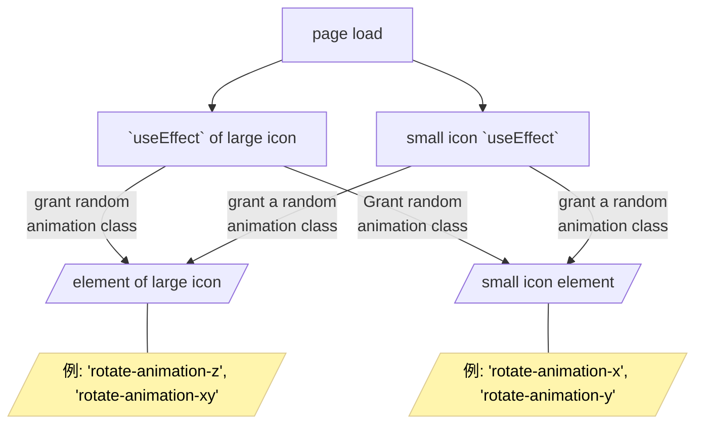

# korosuke613.dev

- Hirakiba website
- I created this as a place to organize my output, links to SNS, and other information.
- Composed of Astro + React (second generation)
  - (aside) The first generation was configured with Nuxt + Vue
  - (Aside) Migration to Nuxt3 was too hard, so we had to rebuild with a newer framework + React, which we use in our work.

<br>

### What is Astro?

> Astro is an all-in-one web framework for building fast, content-focused websites.
>
> https://docs.astro.build/ja/getting-started/ より

- Adopt MPA (Multi Page Application)
- High speed because it is designed to reduce JS execution on the client as much as possible
- Can use React as a UI framework

<!--
Once again, my website is composed of Astro and React, both of which are hot topics these days.

Astro is an "all-in-one web framework for building fast, content-focused websites.
By reducing JS execution on the client as much as possible, pages can be loaded at high speed.
-->

---
layout: center
---

<p style="font-size: xxx-large">
  I've got a website, but it's boring 😑.
</p>

<!--
I thought it would be nice to have a website, but I thought it would be uninteresting as it is.
-->

---
layout: center
---

<p style="font-size: xxx-large">
  Yes, I know. Let's spin ourselves around 🤩.
</p>

<!--
So I decided to rotate it.
-->

---
layout: default
---

# How to rotate

- Do your best with CSS
- And while we're at it, we'll make it zoom in and out (`scale`).
- Rotate only once, because infinite rotation is too much work.
- Add the following CSS class to the icon element

<br>

##### Example: CSS for an animation that rotates around the Z axis

```css
.rotate-animation-z {
  animation: rotate-anime-z 1.5s linear 1 /* animation name time curve iteration count */
}

/* Define an animation that rotates around the Z-axis */
/* Specify between 0% and 100%, respectively */
/* rotate is the rotation angle, scale is the scaling */
@keyframes rotate-anime-z {
  0% {transform: rotate(0deg) scale(1);}
  25% {transform: rotate(90deg) scale(1.5);}
  50% {transform: rotate(180deg) scale(1);}
  75% {transform: rotate(270deg) scale(1.5);}
  100% {transform: rotate(360deg) scale(1);}
}
```

<!--
How do we rotate it, though?
The rotation is done by defining the animation in CSS, defining the class to which the animation is applied, and then assigning it to the icon element.

The code below is an example of rotation around the Z axis.
-->

---
layout: default
---

# I want to rotate when I click.

- As it is, the page ends up rotating one revolution when it loads.
- It makes no sense to the viewer when it suddenly turns (and stops after one rotation).
- Rotate when clicked.
- Add CSS class on click (`click`), remove CSS class when animation ends (`animationend`, `animationcancel`)
  - If you don't remove the CSS class, it will only rotate on the first click.
- Use React's `useEffect` to register event listeners at load time

<!--
As it is, the page ends up rotating once when it loads, so we want it to rotate every time it is clicked.

In this case, we decided to rotate each click by adding a CSS class on click and removing the CSS class when the animation ends.

Since we are using React, we use `useEffect` to register an event listener when the page loads.
-->

---
layout: default
---

# I want to rotate when I click.

<div grid="~ cols-[4fr_5fr] gap-4">
<div>

```mermaid
sequenceDiagram
    actor User
    Browser->Browser: page loading
    Browser->Browser: register event handler
    run
        user->>browser: click my icon<br/>(click event)
        Browser->My icons: add animation class<br/>(handle click event)
        My Icon->>My Icon: Rotate
        My icon->>Browser: animation end<br />(animationend event)
        Browser->My icon: remove animation class<br/>(handle animationend event)
    end
```


</div>

<div>

```tsx
const cssClassName = 'rotate-animation-z';
export const MyIcon = (props: IMyIconProps) => {
  useEffect(() => {
    const thisImg = document.getElementById(props.iconId);
    if (thisImg === null) return;

    // Give animation class on click
    thisImg.addEventListener('click', () => {
      thisImg.classList.add(cssClassName);
    });

    // Delete the animation class when the animation is finished
    const removeClass = () => {
      thisImg.classList.remove(cssClassName);
    };
    thisImg.addEventListener('animationend', removeClass);
    thisImg.addEventListener('animationcancel', removeClass);
  });
  return ();
};
```

</div>

</div>

<!--
It looks roughly like this.

Register an event handler for the element when the page loads,
When the user clicks on the icon, the click event grants the animation class.
Icons with the class assigned rotate.
The animation class is then deleted in the animationend event, which is the animation end event.
-->

---
layout: center
---


<br />

<p style="text-align: center; font-size: x-large">
  Rotated!
</p>

<!--
Yes this has been rotated. You did it.
-->

---
layout: center
---

<p style="font-size: xxx-large">
  Something is missing 😕
</p>

<!--
But it's still not interesting enough!
-->

---
layout: center
---

<p style="font-size: xxx-large">
  Let's randomize the direction of rotation every time 🤣.
</p>

<!--
Therefore, the direction of rotation is randomized each time.
-->

---
layout: default
---

# I want to change the direction of rotation with each click.

<div grid="~ cols-[4fr_5fr] gap-4">
<div>

- At the moment, there is only one rotation on the Z-axis.
- Randomly rotate X, Y, Z, XZ, XY, and YZ axes
- When deleting animations, it is not known which animation class is granted, so delete them all.

```tsx
const cssClassNames = [
  'rotate-animation-x',
  'rotate-animation-y',
  'rotate-animation-z',
  'rotate-animation-xy',
  'rotate-animation-xz',
  'rotate-animation-yz',
];
```

</div>

<div>

```tsx
export const MyIcon = (props: IMyIconProps) => {
  useEffect(() => {
    const thisImg = document.getElementById(props.iconId);
    if (thisImg === null) return;

    // Randomly assign animation class on click
    thisImg.addEventListener('click', () => {
      const randNum = Math.floor(Math.random() * cssClassNames.length);
      const cssClassName = cssClassNames[randNum] || 'rotate-animation-z';
      thisImg.classList.add(cssClassName);
    });

    // Delete the animation class when the animation is finished
    const removeClass = () => {
      cssClassNames.forEach((cssClassName) => {
        // I don't know which classes are granted, so I delete them all.
        thisImg.classList.remove(cssClassName);
      });
    };
    thisImg.addEventListener('animationend', removeClass);
    thisImg.addEventListener('animationcancel', removeClass);
  });
  return ();
};

```

</div>
</div>

<!--
To change the direction of rotation with each click, define a new animation, define a corresponding class, and randomly assign the class.

It is fine to give a class randomly, but the class must be removed when the animation is finished.

Since the class is randomly determined in the handler of the click event, we do not know which class is applied in the handler of the animationend event.
So, within the handler of the animationend event, all animation classes should be removed.
-->

---
layout: center
---

<!-- grid で 6 等分する -->
<div class="grid grid-cols-3 gap-4">
  <div class="panel">
    <p>
      X-axis
    </p>
    
  </div>
  <div class="panel">
    <p>
      Y axis
    </p>
    
  </div>
  <div class="panel">
    <p>
      Z axis
    </p>
    
  </div>
  <div class="panel col-span-3">
    <p style="text-align: center; font-size: x-large">
      Rotated!
    </p>
  </div>
  <div class="panel">
    
    <p>
      X-axis & Y-axis
    </p>
  </div>
  <div class="panel">
    
    <p>
      X-axis & Z-axis
    </p>
  </div>
  <div class="panel">
    
    <p>
      Y-axis & Z-axis
    </p>
  </div>
</div>

<!--
Yes, now it will rotate in various directions.
-->

---
layout: center
---

<div grid="~ cols-[2fr_1fr] gap-4">

  <div class="panel">
    
    <p>
      desktop
    </p>
  </div>

  <div class="panel">
    
    <p>
      smart phone
    </p>
  </div>

</div>

<br />

<p style="text-align: center; font-size: x-large">
  Actually, this website is responsive.
</p>

<!--
But it does not end here.
In fact, this website is responsive.
-->

---
layout: default
---

# The display of the two icons is switched by screen width
- Because the icons are positioned differently on the desktop and on the phone

```tsx {|8-10,16-18}
<Section>
  <div className="flex flex-col items-center md:flex-row md:justify-between md:gap-x-24">
    <div>
      <h1 className="hidden text-3xl font-bold md:block"> {/* あいさつ */} </h1>
      <div className="flex flex-row justify-between md:hidden md:gap-x-24">
        {/* For mobile phone display */}
        <h1 className="text-3xl font-bold"> {/* あいさつ */} </h1>
        <div className="h-20 w-20" id="my-icon-small">
          <MyIcon /> {/* 小さいアイコン */}
        </div>
      </div>
      <p className="mt-6 text-xl leading-9"> {/* 自己紹介 */} </p>
      <div className="mt-3 flex flex-wrap gap-1"> {/* SNS リンク */} </div>
    </div>
    <div className="hidden shrink-0 md:block">
      <div className="h-72 w-72" id="my-icon-large">
        <MyIcon /> {/* 大きいアイコン */}
      </div>
    </div>
  </div>
</Section>
```

<!--
(Go to the next page without saying anything in particular and show the highlights)

Since the icons are positioned differently on desktops and smartphones, two icon components are prepared and the display is switched by screen width.
-->

---
layout: default
---

# Add animation to each icon

<div grid="~ cols-[4fr_5fr] gap-4">
<div>

- Get icon elements by class name instead of Id
- Assign a handler to each element

```tsx
<div className="h-20 w-20 my-icon">
  <MyIcon /> {/* 小さいアイコン */}
</div>

<div className="h-72 w-72 my-icon">
  <MyIcon /> {/* 大きいアイコン */}
</div>
```

</div>
<div>

```tsx
export const MyIcon = (props: IMyIconProps) => {
  useEffect(() => {
    const icons = document.getElementsByClassName(props.iconClass);

    Array.from(icons).forEach((icon) => {
      // Randomly assign animation class on click
      icon.addEventListener('click', () => {
        const randNum = Math.floor(Math.random() * cssClassNames.length);
        const pickedCssClassName =
          cssClassNames[randNum] || 'rotate-animation-z';
        icon.classList.add(pickedCssClassName);
      });

      // Delete the animation class when the animation is finished
      const removeClass = () => {
        cssClassNames.forEach((cssClassName) => {
          // I don't know which classes are granted, so I delete them all.
          icon.classList.remove(cssClassName);
        });
      };
      icon.addEventListener('animationend', removeClass);
      icon.addEventListener('animationcancel', removeClass);
    });
  });

  return ();
};
```

</div>
</div>

<!--
Therefore, each icon must be animated.
Assign a class to the icon element indicating that it is an icon, and register an event handler for the element with that class.
-->

---
layout: center
---


<br>

<p style="text-align: center; font-size: x-large">
  Multiple animation classes are assigned to a single element.
  <br>
  Therefore, the probability of the animation coming out is not uniform.
</p>

<!--
However, this method applies multiple animation classes to a single element, and the probability of the animation coming out is not uniform.
-->

---
layout: center
---



<br>

<p style="text-align: center; font-size: x-large">

  Each of the `MyIcon` components is a <br>
  For elements with `.my-icon`, <br>.
  To randomly assign animation classes.

</p>

<!--
This is because the two `MyIcon` components with `useEffect` will give an animation class to each element.
-->

---
layout: center
---

<p style="font-size: xx-large; line-height: 3.5rem">
  Why not just handle one element in one component 🧐.
  <br>
  → There's a reason it's not easy...
</p>

<!--
One might think that it would be sufficient to handle only one element in one component, but there was a reason why this could not be done easily.
-->

---
layout: default
---

# How to call the current component

- It calls `MyIcon` with the following structure
  - Astro (`index.astro`)

    ├── TSX (`SelfIntroduction.tsx`)

    └── TSX (`MyIcon.tsx`)
- `MyIcon` is called from Astro and passed as a small element to the `SelfIntroduction` component
- The reason for not calling `MyIcon.tsx` from `SelfIntroduction.tsx` has to do with Astro properties

<br>

```tsx
<SelfIntroduction>
  <MyIcon
    client:idle
    iconPath={/* PATH to icon image */}
    iconClass="my-icon"
  />
</SelfIntroduction>
```

<!--
The `MyIcon` component that provides animation is called from Astro for a reason.
The reason for not calling `MyIcon` from the `SelfIntroduction` component responsible for the self-introduction part has to do with Astro's characteristics.
-->

---
layout: default
---

# Astro's philosophy is to minimize JS on the client

- Astro is a framework that does as much server-side rendering as possible, so it is designed to minimize JS execution on the client [^server_first].
- Thus, to get JS to run on the client, you must declare a `client:*` directive
- `client:idle`: load and hydrate the component's JavaScript after the page has initially loaded and the `requestIdleCallback` event has occurred [^client_idle].

<br>

Example (`index.astro`)
```tsx {3}
<SelfIntroduction>
  <MyIcon
    client:idle {/* it won't work without it */}
    iconPath={/* PATH to icon image */}
    iconClass="my-icon"
  />
</SelfIntroduction>
```

[^server_first]: https://docs.astro.build/en/concepts/why-astro/#server-first
[^client_idle]: https://docs.astro.build/en/reference/directives-reference/#clientidle

<!--
As I mentioned at the beginning, Astro is built with the philosophy of minimizing JS on the client.
Therefore, if you want to execute JS on a client, you must declare a `client` directive for that component.

For example, `MyIcon` is given `client:idle`. Without it, it will not rotate.
-->

---
layout: default
---

# You have to apply `client:*` to `MyIcon`.

- `MyIcon` uses gory JS and requires `client:*` configuration
- `client:*` can only be called from `*.astro`.
- The effect of `client:*` extends to child components of the given component.

<br>

**Method**
1. grant `client:idle` per `SelfIntroduction`.

   Astro (`index.astro`)
  
    └── TSX (`SelfIntroduction.tsx`) `client:idle` 付与

            └── TSX (`MyIcon.tsx`)
Give `client:idle` to `MyIcon` only (current method)
   
   Astro (`index.astro`)
  
    ├── TSX (`SelfIntroduction.tsx`)

    └── TSX (`MyIcon.tsx`) `client:idle` 付与。`SelfIntroduction` に渡す

<!--
And since this `client` directive is an Astro feature, it can only be called from a `*.astro` file.

There are two possible ways to give `client`.
One is to give `client:idle` for each `SelfIntroduction`.
The other is to give `client:idle` to `MyIcon` and pass it to `SelfIntroduction`.
So far, we have implemented the latter method.
-->

---
layout: center
---


<br />

<p style="text-align: center; font-size: x-large; line-height: 2rem">
  1. grant `client:idle` per `SelfIntroduction`.
  <br>
  method somehow didn't work.
  <br>
</p>

<p style="text-align: center; font-size: large; line-height: 1.5rem">
  (We have not been able to identify the cause of the problem...)
</p>

<p class="absolute bottom-69 left-120" style="font-size: large;     font-weight: bolder;">
  The introductory section comes up for a moment but disappears quickly... 🫨
</p>

<!--
The first method is easier to implement, but unfortunately it did not work as expected.
I didn't know why...
-->

---
layout: default
---

# Organizing so far

- Currently calling `MyIcon` from Astro and passing it to `SelfIntroduction`.
- This method does not give a uniform probability of animation, so we want to use one component and one element.
- Easier to make it 1 component 1 element by calling `MyIcon` from `SelfIntroduction`.
- but this method makes the drawing look strange.

<br>


# What to do

<div v-click>

- Using React's `useState` to make it manageable for multiple `MyIcon`s to handle multiple elements
- Convert `SelfIntroduction.tsx` containing `MyIcon` calls to `.astro` files.

</div>

<!--
What to do then? Two more methods come to mind.

(Go to next slide)

One is to use React's `useState` to make it manageable for multiple `MyIcon`s to handle multiple elements.
The other is to convert the `SelfIntroduction.tsx` containing the `MyIcon` call into an `.astro` file.
-->

---
layout: default
---

# Use React's `useState` to make it manageable for multiple `MyIcon`s to handle multiple elements.

- I used to use this method. I stopped while I was working on the documents.
- useState` and `useRef` to manage the current animation state of large and small icons respectively
- Only one animation class is now added for each large and small icon
- Complex structure
- (I was trying out some stuff at the time, but I can't remember why I needed `useRef`.)

<!--
As for how to do your best with `useState`, I actually used to work around the problem this way.
It was like using `useState` and `useRef` to manage the current animation of each large and small icon as a state.
It became quite complicated and I came up with another, simpler method, so I stopped while preparing this presentation material.

By the way, I don't remember why `useRef` was needed...
-->

---
layout: default
---

##### `MyIcon.tsx`

```tsx
export const MyIcon = (props: IMyIconProps) => {
  const [largeMode, setLargeMode] = useState('rotate-animation-z');
  const largeModeRef = useRef<string>(null!);
  largeModeRef.current = largeMode;

  const [smallMode, setSmallMode] = useState('rotate-animation-z');
  const smallModeRef = useRef<string>(null!);
  smallModeRef.current = smallMode;

  useEffect(makeEffect('my-icon-large', setLargeMode, largeModeRef));
  useEffect(makeEffect('my-icon-small', setSmallMode, smallModeRef));

  return (
    
  );
};
```

<br>

<div style="text-align: center; font-size: x-large;">

<p>
  Memorial service 🪦.
</p>

</div>

<!--
This is the source code at that time.
We will offer a memorial service.
(quickly moving to next slide)
-->

---
layout: default
---

##### `MyIcon.tsx`

<div grid="~ cols-2 gap-4">
<div>

```tsx {-}
const makeEffect = (
  id: string,
  setMode: React.Dispatch<React.SetStateAction<string>>,
  modeRef: React.MutableRefObject<string>
) => {
  return () => {
    const thisImg = document.getElementById(id);
    if (thisImg === null) return () => {};

    const start = () => {
      cssNames.forEach((c) => {
        thisImg.classList.remove(c);
      });
      const randNum = Math.floor(Math.random() * cssNames.length);
      const cssName = cssNames[randNum] || 'rotate-animation-z';
      setMode(cssName);
      thisImg.classList.add(modeRef.current);
    };

    const end = () => {
      cssNames.forEach((cssName) => {
        thisImg.classList.remove(cssName);
      });
    };
```

</div>
<div>

```tsx {-}
    thisImg.addEventListener('click', start);
    thisImg.addEventListener('animationend', end);
    thisImg.addEventListener('animationcancel', end);

    return () => {
      thisImg.removeEventListener('click', start);
      thisImg.removeEventListener('animationend', end);
      thisImg.removeEventListener('animationcancel', end);
    };
  };
};
```

<br>

<div style="text-align: center; font-size: x-large;">

<p>
  Memorial service 🪦.
</p>

</div>

</div>
</div>

<br>

<!--
This one.
(quickly moving to next slide)
-->

---
layout: default
---

# Convert `SelfIntroduction.tsx` containing `MyIcon` calls to `.astro` files.

- As we were making the materials, we realized that this way was simpler and easier to explain, so we adopted it.
- Fixed `MyIcon` to be one component, one element.
  - Changed to a format where Id is passed from outside (initial contents of large icon looking around)
- Rewrite `SelfIntroduction.tsx` in `.astro` format
- Call `SelfIntroduction.astro` from `index.astro`.
- Call `MyIcon` from the newly created `SelfIntroduction.astro` and give `MyIcon` `client:idle

<!--
Yes, another way is to convert the `SelfIntroduction.tsx` containing the `MyIcon` call into an `.astro` file.
First, modify the `MyIcon` component to handle only one element.
Then rewrite `SelfIntroduction.tsx` in `.astro` format.
In the rewritten `SelfIntroduction.astro`, call `MyIcon` and give `MyIcon` `client:idle`.
Finally, make a call to `SelfIntroduction.astro` from `index.astro`.
-->

---
layout: center
---

##### `SelfIntroduction.astro`

```astro {|14-16,22-24}
---
// <Omit: various imports>.
import { MyIcon } from '@/components/MyIconRandomLargeOnly';
const iconPath = /* icon path */;
// <Omit: Other processing>.
---
<Section>
  <div className="flex flex-col items-center md:flex-row md:justify-between md:gap-x-24">
    <div>
      <h1 className="hidden text-3xl font-bold md:block"> {/* あいさつ */} </h1>
      <div className="flex flex-row justify-between md:hidden md:gap-x-24">
        {/* For mobile phone display */}
        <h1 className="text-3xl font-bold"> {/* あいさつ */} </h1>
        <div class="my-icon h-20 w-20" id="my-icon-small">
          <MyIcon client:idle iconPath={iconPath} iconId="my-icon-small" />  {/* 小さいアイコン */}
        </div>
      </div>
      <p className="mt-6 text-xl leading-9"> {/* 自己紹介 */} </p>
      <div className="mt-3 flex flex-wrap gap-1"> {/* SNS リンク */} </div>
    </div>
    <div className="hidden shrink-0 md:block">
      <div class="my-icon h-72 w-72" id="my-icon-large">
        <MyIcon client:idle iconPath={iconPath} iconId="my-icon-large" /> {/* 大きいアイコン */}
      </div>
    </div>
  </div>
</Section>
```

<!--
This is `SelfIntroduction.astro`.
(Go to next slide)

Change the `{props.children}` to expand the component passed from the caller to a call to `MyIcon`.
-->

---
layout: center
---

##### index.astro

```astro
---
// <Omit: various imports>.
import SelfIntroduction from '@/components/SelfIntroduction.astro';

// <Omit: Other processing>.
---
...
<SelfIntroduction />
...
```

<!--
This is `index.astro`.
(Go to next slide)
-->

---
layout: center
---

<p style="font-size: x-large">
  One icon no longer has multiple animation classes 🥳.
</p>

<!--
This prevents multiple animation classes from being assigned to a single icon.
-->

---
layout: default
---

# Try turning it into a `.astro` file.

- What was good
  - Replacing `.tsx` with `.astro` was easy.
  - The `.astro` makes it simpler to implement if you want to dynamically execute JS.
- What's not so good
  - Cannot call `.astro` from `.tsx`.
    - You may have trouble in the future.
    - It would be good to keep only the parts that you actually want to be dynamic in `.tsx`, and wrap them in `.astro` for placement.

<!--
Try making an Astro file,

The good news is that switching from TSX to Astro was easier than expected, and the implementation was simplified by taking advantage of the Astro mechanism.

The only thing I found not so good is that Astro cannot be called from TSX, which may be a problem when you want to use it again in the future or when testing components.
However, I thought that it would not bother me too much if I kept the part of logic I wanted to test in TSX and wrapped it in Astro when deploying it.
In fact `MyIcon` is still TSX.
-->

---
layout: default
---

# Summary
- Can rotate images using CSS.
- If you want the animation to rotate with each click, you can add rotation CSS on click and remove it when the animation ends.
- If you want to rotate randomly, and for some reason want to place multiple components of the same image, and you are using Astro, you will have to twist your head.
- If you want to execute JS dynamically in Astro, be careful where you write `client:*`.
  - It would be nice to have `.astro` for the part that calls the dynamic component

<div grid="~ cols-[16fr_5fr] gap-4">
<div>

<br>
<br>
<br>

<p style="font-size: x-large; font-weight: bolder">
  If you know of a better way, please let me know!
</p>

</div>

<div>


</div>

</div>

<!--
Summary.

If you want to turn icons like I do, especially if you are using Astro, I hope you can help me with the implementation.

If anyone knows a better way, please let me know.
-->

---
layout: center
---

<p style="font-size: xxx-large; font-weight: bolder">
  Thank you for your attention!
</p>

<br>

<p>

By the way, this slide was created by Slidev[^slidev][^pr].

</p>

[^slidev]: https://sli.dev/
[^pr]: https://github.com/korosuke613/zenn-articles/pull/376

<style>

hr.footnotes-sep {
  bottom: 60px;
  width: 720px;
  position: fixed;
}

.footnotes {
  position: fixed;
  bottom: 0;
}

</style>

<!--
Incidentally, this slide was created with Slidev.
It is very convenient to create slides from Markdown.
Try it.

Thank you for your attention!
-->
