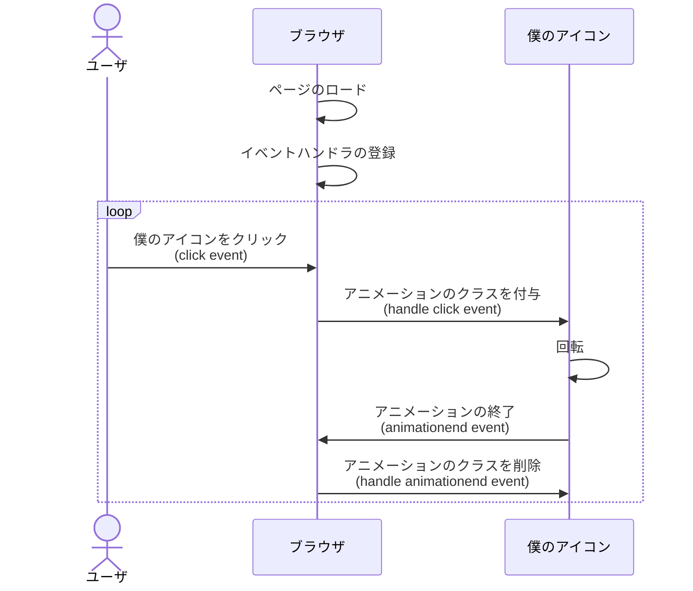
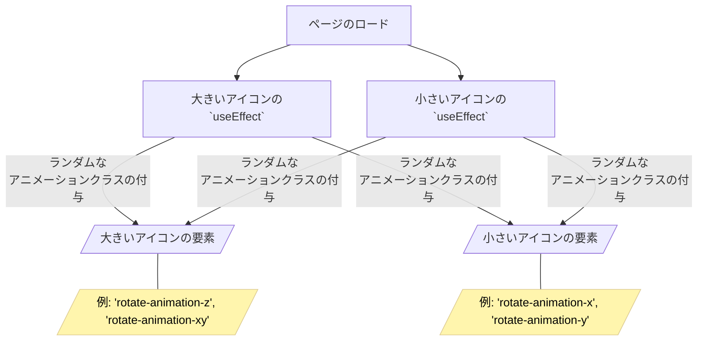

# korosuke613.dev

- 平木場のホームページ
- 自分のアウトプットや SNS へのリンクなどの情報をまとめる場所として作った
- Astro + React で構成 (二代目)
  - (余談) 初代は Nuxt + Vue で構成していた
  - (余談) Nuxt3 移行がつらすぎて新しめのフレームワーク + 業務でも使っている React で作り直すことに

<br>

### Astro とは

> Astroは、コンテンツにフォーカスした高速なWebサイトを構築するためのオールインワンWebフレームワークです。
> 
> https://docs.astro.build/ja/getting-started/ より

- MPA (Multi Page Application) を採用
- 極力クライアントで JS の実行を減らすように作られているため高速
- UI フレームワークとして React を利用できる

<!--
改めて、僕のホームページは最近話題の Astro と React で構成されています。

Astro とは、「コンテンツにフォーカスした高速なWebサイトを構築するためのオールインワンWebフレームワーク」とのことです。
極力クライアントでの JS 実行を減らすことにより、高速にページをロードできるぜというものになります。
-->

---
layout: center
---

<p style="font-size: xxx-large">
  ホームページできたけどつまらんな 😑
</p>

<!--
ホームページ作ったは良いけど、このままじゃおもしろくないなと思いました。
-->

---
layout: center
---

<p style="font-size: xxx-large">
  そうだ。自分を回転させよう 🤩
</p>

<!--
なので回転させることにしました。
-->

---
layout: default
---

# どうやって回転させるか

- CSS でがんばる
- ついでに拡大縮小もさせる(`scale`)
- 無限に回転してもうざったいので、1 回のみ回転させる
- 下記の CSS クラスをアイコンの要素に付与する

<br>

##### 例：Z 軸を中心に回転するアニメーションの CSS

```css
.rotate-animation-z {
  animation: rotate-anime-z 1.5s linear 1  /* アニメーション名 時間 曲線 繰り返し回数 */
}

/* Z軸を中心に回転するアニメーションの定義 */
/* 0% から 100% までの間をそれぞれ指定 */
/* rotate は回転角度、scale は拡大縮小 */
@keyframes rotate-anime-z {
  0%  {transform: rotate(0deg) scale(1);}
  25%  {transform: rotate(90deg) scale(1.5);}
  50%  {transform: rotate(180deg) scale(1);}
  75%  {transform: rotate(270deg) scale(1.5);}
  100%  {transform: rotate(360deg) scale(1);}
}
```

<!--
どうやって回転させるかですが、
CSS でアニメーションを定義、アニメーションを適用するクラスを定義、それをアイコンの要素に付与するという感じで回転させています。

下のコードは Z 軸を中心に回転する例です。
-->

---
layout: default
---

# クリックしたときに回転させたい

- このままだとページがロードされた時に 1 回転して終わる
- いきなり回られる（しかも 1 回転して止まる）と見てる方が意味わからない
- クリックした時に回転させる
- クリック時(`click`)に CSS クラスを付与、アニメーション終了時(`animationend`、`animationcancel`)に CSS クラスを削除する
  - CSS クラスを削除しないと、最初のクリックでしか回転してくれない
- React の `useEffect` を使って、イベントリスナーをロード時に登録する

<!--
このままではページのロード時に 1 回転して終わってしまうので、クリックするたびに回転させたいです。

今回は、クリック時に CSS クラスを付与、アニメーション終了時に CSS クラスを削除することで、クリックするたびに回転させることにしました。

React を使っているので、`useEffect`でページのロード時にイベントリスナーを登録しています。
-->

---
layout: default
---

# クリックしたときに回転させたい

<div grid="~ cols-[4fr_5fr] gap-4">
<div>




</div>

<div>

```tsx
const cssClassName = 'rotate-animation-z';
export const MyIcon = (props: IMyIconProps) => {
  useEffect(() => {
    const thisImg = document.getElementById(props.iconId);
    if (thisImg === null) return;

    // クリック時にアニメーションのクラスを付与する
    thisImg.addEventListener('click', () => {
      thisImg.classList.add(cssClassName);
    });

    // アニメーションが終わったらアニメーションのクラスを削除する
    const removeClass = () => {
      thisImg.classList.remove(cssClassName);
    };
    thisImg.addEventListener('animationend', removeClass);
    thisImg.addEventListener('animationcancel', removeClass);
  });
  return ();
};
```

</div>

</div>

<!--
ざっくりこんな感じです。

ページのロード時にイベントハンドラを要素に対して登録、
ユーザがアイコンをクリックすると、click イベントでアニメーションのクラスを付与します。
クラスが付与されたアイコンは回転します。
そして、アニメーション終了イベントである animationend イベントでアニメーションのクラスを削除します。
-->

---
layout: center
---


<br />

<p style="text-align: center; font-size: x-large">
  回転した！
</p>

<!--
はいこれで回転しました。やったね
-->

---
layout: center
---

<p style="font-size: xxx-large">
  なんか足りないよな〜 😕
</p>

<!--
でもまだ面白みに欠けるんですよねー
-->

---
layout: center
---

<p style="font-size: xxx-large">
  回転方向を毎回ランダムにしよう 🤣
</p>

<!--
というわけで回転方向を毎回ランダムにします。
-->

---
layout: default
---

# クリックするたびに回転する方向を変えたい

<div grid="~ cols-[4fr_5fr] gap-4">
<div>

- 今のところ Z 軸に 1 回転する動きしかない
- X 軸、Y 軸、Z 軸、XZ 軸、XY 軸、YZ 軸をランダムに回転させる
- アニメーション削除時はどのアニメーションクラスが付与されているかわからないので、全部削除する

```tsx
const cssClassNames = [
  'rotate-animation-x',
  'rotate-animation-y',
  'rotate-animation-z',
  'rotate-animation-xy',
  'rotate-animation-xz',
  'rotate-animation-yz',
];
```

</div>

<div>

```tsx
export const MyIcon = (props: IMyIconProps) => {
  useEffect(() => {
    const thisImg = document.getElementById(props.iconId);
    if (thisImg === null) return;

    // クリック時にランダムにアニメーションのクラスを付与する
    thisImg.addEventListener('click', () => {
      const randNum = Math.floor(Math.random() * cssClassNames.length);
      const cssClassName = cssClassNames[randNum] || 'rotate-animation-z';
      thisImg.classList.add(cssClassName);
    });

    // アニメーションが終わったらアニメーションのクラスを削除する
    const removeClass = () => {
      cssClassNames.forEach((cssClassName) => {
        // どのクラスが付与されているかわからないので全部削除する
        thisImg.classList.remove(cssClassName);
      });
    };
    thisImg.addEventListener('animationend', removeClass);
    thisImg.addEventListener('animationcancel', removeClass);
  });
  return ();
};

```

</div>
</div>

<!--
クリックするたびに回転方向を変えるには、新たにアニメーションを定義し、それに対応するクラスを定義し、ランダムにクラスを付与するようにします。

ランダムにクラスを付与するのはいいのですが、アニメーションが終わったらクラスを削除する必要があります。

click イベントのハンドラ内でランダムにクラスを決定しているので、animationend イベントのハンドラ内ではどのクラスが適用されているかわかりません。
なので、animationend イベントのハンドラ内では、すべてのアニメーションクラスを削除するようにします。
-->

---
layout: center
---

<!-- grid で 6 等分する -->
<div class="grid grid-cols-3 gap-4">
  <div class="panel">
    <p>
      X 軸
    </p>
    
  </div>
  <div class="panel">
    <p>
      Y 軸
    </p>
    
  </div>
  <div class="panel">
    <p>
      Z 軸
    </p>
    
  </div>
  <div class="panel col-span-3">
    <p style="text-align: center; font-size: x-large">
      回転した！
    </p>
  </div>
  <div class="panel">
    
    <p>
      X 軸 & Y 軸
    </p>
  </div>
  <div class="panel">
    
    <p>
      X 軸 & Z 軸
    </p>
  </div>
  <div class="panel">
    
    <p>
      Y 軸 & Z 軸
    </p>
  </div>
</div>

<!--
はいこれでいろんな方向に回転するようになりました。
-->

---
layout: center
---

<div grid="~ cols-[2fr_1fr] gap-4">

  <div class="panel">
    
    <p>
      デスクトップ
    </p>
  </div>

  <div class="panel">
    
    <p>
      スマートフォン
    </p>
  </div>

</div>

<br />

<p style="text-align: center; font-size: x-large">
  実はこのホームページ、レスポンシブ対応している
</p>

<!--
しかしここで終わりではありません。
実はこのホームページ、レスポンシブ対応しています。
-->

---
layout: default
---

# 2 つのアイコンの表示を画面幅で切り替えている
- デスクトップとスマホでアイコンの位置が違うため

```tsx {|8-10,16-18}
<Section>
  <div className="flex flex-col items-center md:flex-row md:justify-between md:gap-x-24">
    <div>
      <h1 className="hidden text-3xl font-bold md:block"> {/* あいさつ */} </h1>
      <div className="flex flex-row justify-between md:hidden md:gap-x-24">
        {/* スマホ表示用 */}
        <h1 className="text-3xl font-bold"> {/* あいさつ */} </h1>
        <div className="h-20 w-20" id="my-icon-small">
          <MyIcon /> {/* 小さいアイコン */}
        </div>
      </div>
      <p className="mt-6 text-xl leading-9"> {/* 自己紹介 */} </p>
      <div className="mt-3 flex flex-wrap gap-1"> {/* SNS リンク */} </div>
    </div>
    <div className="hidden shrink-0 md:block">
      <div className="h-72 w-72" id="my-icon-large">
        <MyIcon /> {/* 大きいアイコン */}
      </div>
    </div>
  </div>
</Section>
```

<!--
（特に何も言わず次のページへ行き、ハイライトを表示する）

デスクトップとスマホでアイコンの位置が違うため、二つのアイコンのコンポーネントを用意し、画面幅で表示を切り替えています。
-->

---
layout: default
---

# それぞれのアイコンにアニメーションをつける

<div grid="~ cols-[4fr_5fr] gap-4">
<div>

- Id ではなくクラス名でアイコンの要素を取得するようにする
- ハンドラーの付与をそれぞれの要素に行う

```tsx
<div className="h-20 w-20 my-icon">
  <MyIcon /> {/* 小さいアイコン */}
</div>

<div className="h-72 w-72 my-icon">
  <MyIcon /> {/* 大きいアイコン */}
</div>
```

</div>
<div>

```tsx
export const MyIcon = (props: IMyIconProps) => {
  useEffect(() => {
    const icons = document.getElementsByClassName(props.iconClass);

    Array.from(icons).forEach((icon) => {
      // クリック時にランダムにアニメーションのクラスを付与する
      icon.addEventListener('click', () => {
        const randNum = Math.floor(Math.random() * cssClassNames.length);
        const pickedCssClassName =
          cssClassNames[randNum] || 'rotate-animation-z';
        icon.classList.add(pickedCssClassName);
      });

      // アニメーションが終わったらアニメーションのクラスを削除する
      const removeClass = () => {
        cssClassNames.forEach((cssClassName) => {
          // どのクラスが付与されているかわからないので全部削除する
          icon.classList.remove(cssClassName);
        });
      };
      icon.addEventListener('animationend', removeClass);
      icon.addEventListener('animationcancel', removeClass);
    });
  });

  return ();
};
```

</div>
</div>

<!--
したがって、それぞれのアイコンにアニメーションをつけなければなりません。
アイコンの要素にアイコンであることを示すクラスを付与し、そのクラスがついている要素に対してイベントハンドラを登録するようにします。
-->

---
layout: center
---


<br>

<p style="text-align: center; font-size: x-large">
  ひとつの要素に複数のアニメーションクラスが付与されてしまう。
  <br>
  そのため、出てくるアニメーションの確率が均一にならない。
</p>

<!--
しかし、この方法では一つの要素に対して複数のアニメーションクラスが適用されてしまい、出てくるアニメーションの確率が均一になりません。
-->

---
layout: center
---




<br>

<p style="text-align: center; font-size: x-large">

  `MyIcon` コンポーネントそれぞれが、<br>
  `.my-icon` を持つ要素に対して、<br>
  アニメーションクラスをランダムに付与してしまうため。

</p>

<!--
これは、`useEffect` のある `MyIcon` コンポーネント 2 つが、それぞれの要素に対してアニメーションクラスを付与してしまうためです。
-->

---
layout: center
---

<p style="font-size: xx-large; line-height: 3.5rem">
  1 コンポーネントで 1 要素だけ扱えば良いのでは 🧐
  <br>
  → 簡単にはいかない理由がある...
</p>

<!--
1 コンポーネントで 1 要素だけ扱えば良いのでは、と思いますが、簡単にできない理由がありました。
-->

---
layout: default
---

# 現在のコンポーネントの呼び出し方

- 次のような構造で `MyIcon` を呼び出している
  - Astro (`index.astro`)

    ├── TSX (`SelfIntroduction.tsx`)

    └── TSX (`MyIcon.tsx`) 
- `MyIcon` は Astro から呼び出し、`SelfIntroduction` コンポーネントへ小要素として渡している
- `SelfIntroduction.tsx` から `MyIcon.tsx` を呼び出していない理由は Astro の特性に関係する

<br>

```tsx
<SelfIntroduction>
  <MyIcon
    client:idle
    iconPath={/* アイコン画像への PATH */}
    iconClass="my-icon"
  />
</SelfIntroduction>
```

<!--
アニメーションを付与する `MyIcon` コンポーネントは、訳あって Astro から呼び出しています。
自己紹介の部分を担当する `SelfIntroduction` コンポーネントから `MyIcon` を呼び出していない理由は、Astro の特性に関係しています。
-->

---
layout: default
---

# Astro はクライアント上での JS を極力減らす思想

- Astro はサーバサイドでのレンダリングを可能な限り行うフレームワークであるため、クライアント上での JS の実行を極力減らすように作られている[^server_first]
- したがって、クライアント上で JS を実行するようにするには、`client:*` ディレクティブを宣言しないといけない
- `client:idle`：ページの初期ロードが完了し、`requestIdleCallback` イベントが発生したら、コンポーネントの JavaScript をロードしてハイドレートする[^client_idle]

<br>

例（`index.astro`）
```tsx {3}
<SelfIntroduction>
  <MyIcon
    client:idle {/* これがないと動かない */}
    iconPath={/* アイコン画像への PATH */}
    iconClass="my-icon"
  />
</SelfIntroduction>
```

[^server_first]: https://docs.astro.build/en/concepts/why-astro/#server-first
[^client_idle]: https://docs.astro.build/en/reference/directives-reference/#clientidle

<!--
冒頭でもお話ししましたが、Astroはクライアント上での JS を極力減らす思想で作られています。
そのため、クライアント上で JS を実行したい場合は `client` ディレクティブというのをそのコンポーネントに対して宣言しなければなりません。

例えば `MyIcon` には `client:idle` を付与しています。これがないと回転しません。
-->

---
layout: default
---

# `MyIcon` に `client:*` を適用しないといけない

- `MyIcon` はゴリゴリ JS を使っているため、`client:*` の設定が必要
- `client:*` は `*.astro` のみから呼び出せる
- `client:*` の効果は付与したコンポーネントの子コンポーネントに及ぶ

<br>

**方法**
1. `SelfIntroduction` ごと `client:idle` 付与

   Astro (`index.astro`)
  
    └── TSX (`SelfIntroduction.tsx`) `client:idle` 付与

            └── TSX (`MyIcon.tsx`)
2. `MyIcon` のみに `client:idle` を付与（現在の方法）
   
   Astro (`index.astro`)
  
    ├── TSX (`SelfIntroduction.tsx`)

    └── TSX (`MyIcon.tsx`) `client:idle` 付与。`SelfIntroduction` に渡す

<!--
そして、この `client` ディレクティブは Astro の機能であるため、`*.astro` ファイルからのみ呼び出せます。

`client` を付与する方法として、二つが思い付きます。
一つは `SelfIntroduction` ごとに `client:idle` を付与する方法です。
もう一つは、`MyIcon` に `client:idle` を付与し、`SelfIntroduction` に渡す方法です。
ここまでは後者の方法で実装しています。
-->

---
layout: center
---


<br />

<p style="text-align: center; font-size: x-large; line-height: 2rem">
  「1. `SelfIntroduction` ごと `client:idle` 付与」
  <br>
  の方法はなんかうまくいかなかった。
  <br>
</p>

<p style="text-align: center; font-size: large; line-height: 1.5rem">
  （原因を特定するに至らず...）
</p>

<p class="absolute bottom-69 left-120" style="font-size: large;     font-weight: bolder;">
  自己紹介セクションが一瞬出てくるがすぐ消えてしまう... 🫨
</p>

<!--
一つ目の方法が実装は楽なのですが、残念ながら思った通りに動きませんでした。
理由はわかりませんでした...
-->

---
layout: default
---

# ここまでの整理

- 現在、`MyIcon` を Astro から呼び出し、`SelfIntroduction` に渡している
- この方法ではアニメーションの確率が均一にならないので 1 コンポーネント 1 要素にしたい
- `SelfIntroduction` から `MyIcon` を呼び出すことで 1 コンポーネント 1 要素に簡単にできる
- が、この方法だと描画がおかしくなる

<br>


# どうするか

<div v-click>

- React の `useState` を使って複数の `MyIcon` が複数の要素を扱ってもなんとかなるようにする
- `MyIcon` 呼び出し含む `SelfIntroduction.tsx` を `.astro` ファイル化

</div>

<!--
じゃあどうするかなんですけど、さらに二つの方法が浮かびます。

（次のスライドへ）

一つは、React の `useState` を使って複数の `MyIcon` が複数の要素を扱ってもなんとかなるようにする方法です。
もう一つは、`MyIcon` 呼び出し含む `SelfIntroduction.tsx` を `.astro` ファイル化する方法です。
-->

---
layout: default
---

# React の `useState` を使って複数の `MyIcon` が複数の要素を扱ってもなんとかなるようにする

- 以前はこの方法を使っていた。資料を作ってるうちにやめた
- `useState` と `useRef` で大きいアイコンと小さいアイコンそれぞれの現在のアニメーションを状態として管理
- 大小アイコンそれぞれにアニメーションクラスが 1 つのみ追加されるようになった
- 結構複雑
- ~~（当時はなんか色々試してる内にできてしまったが、どうして `useRef` が必要だったかが思い出せない）~~

<!--
`useState`でがんばる方法については、実は以前までこの方法で問題を回避していました。
`useState` と `useRef` を駆使して、大きいアイコンと小さいアイコンそれぞれの現在のアニメーションを状態として管理するという感じでした。
結構複雑になったのと、別のもっとシンプルな方法を思いついたので、今回の発表資料作成中にやめました。

ちなみに、なぜ `useRef` が必要だったのかは覚えていません...
-->


---
layout: default
---

##### `MyIcon.tsx`

```tsx
export const MyIcon = (props: IMyIconProps) => {
  const [largeMode, setLargeMode] = useState('rotate-animation-z');
  const largeModeRef = useRef<string>(null!);
  largeModeRef.current = largeMode;

  const [smallMode, setSmallMode] = useState('rotate-animation-z');
  const smallModeRef = useRef<string>(null!);
  smallModeRef.current = smallMode;

  useEffect(makeEffect('my-icon-large', setLargeMode, largeModeRef));
  useEffect(makeEffect('my-icon-small', setSmallMode, smallModeRef));

  return (
    
  );
};
```

<br>

<div style="text-align: center; font-size: x-large;">

<p>
  供養 🪦
</p>

</div>

<!--
これはその時のソースコードです。
供養します。
（さっさと次スライドへ移る）
-->

---
layout: default
---

##### `MyIcon.tsx`

<div grid="~ cols-2 gap-4">
<div>

```tsx {-}
const makeEffect = (
  id: string,
  setMode: React.Dispatch<React.SetStateAction<string>>,
  modeRef: React.MutableRefObject<string>
) => {
  return () => {
    const thisImg = document.getElementById(id);
    if (thisImg === null) return () => {};

    const start = () => {
      cssNames.forEach((c) => {
        thisImg.classList.remove(c);
      });
      const randNum = Math.floor(Math.random() * cssNames.length);
      const cssName = cssNames[randNum] || 'rotate-animation-z';
      setMode(cssName);
      thisImg.classList.add(modeRef.current);
    };

    const end = () => {
      cssNames.forEach((cssName) => {
        thisImg.classList.remove(cssName);
      });
    };
```

</div>
<div>

```tsx {-}
    thisImg.addEventListener('click', start);
    thisImg.addEventListener('animationend', end);
    thisImg.addEventListener('animationcancel', end);

    return () => {
      thisImg.removeEventListener('click', start);
      thisImg.removeEventListener('animationend', end);
      thisImg.removeEventListener('animationcancel', end);
    };
  };
};
```

<br>

<div style="text-align: center; font-size: x-large;">

<p>
  供養 🪦
</p>

</div>

</div>
</div>

<br>

<!--
これも
（さっさと次スライドへ移る）
-->


---
layout: default
---

# `MyIcon` 呼び出し含む `SelfIntroduction.tsx` を `.astro` ファイル化

- 資料作ってるうちにこっちの方がシンプルで説明しやすいことに気づいて採用
- `MyIcon` を 1 コンポーネント 1 要素にするよう修正
  - Id を外から渡す形式に変更（大きいアイコンの見回していた初期の内容）
- `SelfIntroduction.tsx` を `.astro` の形式に書き換える
- `index.astro` から `SelfIntroduction.astro` を呼び出す
- 新たにできた `SelfIntroduction.astro` から `MyIcon` を呼び出し、`MyIcon` に `client:idle` を付与する

<!--
はい、もう一つの方法が、`MyIcon` 呼び出し含む `SelfIntroduction.tsx` を `.astro` ファイル化するという方法です。
まず、`MyIcon` コンポーネントで一つの要素のみ扱うよう修正します。
そして、`SelfIntroduction.tsx` を `.astro` の形式に書き換えます。
書き換えた `SelfIntroduction.astro` 内で、`MyIcon` を呼び出し、`MyIcon` に `client:idle` を付与します。
最後に、`index.astro` から `SelfIntroduction.astro` を呼び出すようにします。
-->

---
layout: center
---

##### `SelfIntroduction.astro`

```astro {|14-16,22-24}
---
// <省略: 色々なインポート>
import { MyIcon } from '@/components/MyIconRandomLargeOnly';
const iconPath = /* アイコンのパス */;
// <省略: その他処理>
---
<Section>
  <div className="flex flex-col items-center md:flex-row md:justify-between md:gap-x-24">
    <div>
      <h1 className="hidden text-3xl font-bold md:block"> {/* あいさつ */} </h1>
      <div className="flex flex-row justify-between md:hidden md:gap-x-24">
        {/* スマホ表示用 */}
        <h1 className="text-3xl font-bold"> {/* あいさつ */} </h1>
        <div class="my-icon h-20 w-20" id="my-icon-small">
          <MyIcon client:idle iconPath={iconPath} iconId="my-icon-small" />  {/* 小さいアイコン */}
        </div>
      </div>
      <p className="mt-6 text-xl leading-9"> {/* 自己紹介 */} </p>
      <div className="mt-3 flex flex-wrap gap-1"> {/* SNS リンク */} </div>
    </div>
    <div className="hidden shrink-0 md:block">
      <div class="my-icon h-72 w-72" id="my-icon-large">
        <MyIcon client:idle iconPath={iconPath} iconId="my-icon-large" /> {/* 大きいアイコン */}
      </div>
    </div>
  </div>
</Section>
```

<!--
これが `SelfIntroduction.astro` です。
（次のスライドへ）

`{props.children}` で呼び出し元から渡されたコンポーネントを展開するようにしていましたが、それを `MyIcon` の呼び出しに変更します。
-->


---
layout: center
---

##### index.astro

```astro
---
// <省略: 色々なインポート>
import SelfIntroduction from '@/components/SelfIntroduction.astro';

// <省略: その他処理>
---
...
<SelfIntroduction />
...
```

<!--
これが `index.astro` です。
（次のスライドへ）
-->


---
layout: center
---

<p style="font-size: x-large">
  1 つのアイコンに複数のアニメーションクラスが付与されなくなった 🥳
</p>

<!--
これにより、1 つのアイコンに複数のアニメーションクラスが付与されなくなりました。  
-->

---
layout: default
---

# `.astro` ファイル化してみて

- 良かったこと
  - `.tsx` を `.astro` に置き換えるのは簡単だった
  - `.astro` になることで動的に JS を実行したい場合に実装がシンプルになった
- イマイチなこと
  - `.tsx` から `.astro` を呼び出せない
    - 今後困ることがあるかもしれない
    - 実際に動的にしたい部分だけ `.tsx` にしておいて、配置の際は `.astro` でラップしたものを使えば良さそう

<!-- 
Astro ファイル化してみてですが、

良かったこととしては、TSX から Astro へ切り替えるのが思ったより簡単にできたことと、Astro の仕組みに乗っかることで実装がシンプルになれたことです。

イマイチかもと思ったのが、TSX から Astro を呼び出せないため、今後使いまわしたい時やコンポーネントテスト時に困るかもということです。
とは言え、テストしたいロジックの部分は TSX にしておいて、配置の際は Astro でラップしたものを使えばあんま気にならないかなとも思いました。
実際 `MyIcon` は TSX のままです。
-->

---
layout: default
---

# まとめ
- CSS を駆使して画像を回転させられる
- クリックするたび回転させたかったら、回転する CSS をクリック時に付与、アニメーション終了時に削除すればできる
- ランダムに回転させたい、かつ、なんらかの理由で同じ画像のコンポーネントを複数配置したい、かつ、Astro を使っている場合は頭を捻る必要がある
- Astro で動的に JS を実行したい場合は `client:*` の書きどころに注意
  - 動的なコンポーネントを呼び出す部分を `.astro` にするのも良さげ

<div grid="~ cols-[16fr_5fr] gap-4">
<div>

<br>
<br>
<br>

<p style="font-size: x-large; font-weight: bolder">
  もっといい方法を知っている人はぜひ教えてください！！
</p>

</div>

<div>


</div>

</div>

<!-- 
まとめです。

僕みたいにアイコンを回したい方、特に Astro を使っている方は実装の参考にしてくれればと思います。

もっといい方法知ってる方いたら教えてください。
-->

---
layout: center
---

<p style="font-size: xxx-large; font-weight: bolder">
  ご清聴ありがとうございました！
</p>

<br>

<p>

ちなみに、このスライドは Slidev[^slidev]で作成しました[^pr]。

</p>

[^slidev]: https://sli.dev/
[^pr]: https://github.com/korosuke613/zenn-articles/pull/376

<style>

hr.footnotes-sep {
  bottom: 60px;
  width: 720px;
  position: fixed;
} 

.footnotes {
  position: fixed;
  bottom: 0;
}

</style>

<!-- 
ちなみに今回のスライドは Slidev で作成しました。
Markdown からスライドにできてめちゃ便利です。
使ってみてください。

ご清聴ありがとうございました！
-->
