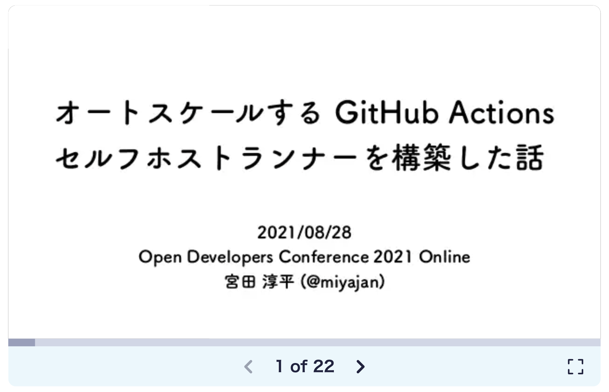

---
# try also 'default' to start simple
theme: default
# random image from a curated Unsplash collection by Anthony
# like them? see https://unsplash.com/collections/94734566/slidev
# background: https://source.unsplash.com/collection/94734566/1920x1080
# apply any windi css classes to the current slide
class: 'text-center'
# https://sli.dev/custom/highlighters.html
#highlighter: shiki
# show line numbers in code blocks
lineNumbers: false
# persist drawings in exports and build
drawings:
  persist: false
layout: cover
---

# `terraform plan` 結果の
# 検証を自動化するぞ！
## with Conftest

<br>

2021/11/2（火）自動化大好き LT 会 #5

平木場 風太 \<Futa Hirakoba\>

---

<div class="grid grid-cols-[7fr,2fr] gap-0">
<div>

# 自己紹介


## 平木場 風太 - Futa Hirakoba


<br>

- 🌋 **出身** - 鹿児島
- 🏢 **勤め先** - サイボウズ株式会社
- 🧑‍💻 **役割** - Engineering Productivity (生産性向上エンジニア)
- 🍣 **好きな食べ物** - 辛麺[^masumoto]

<br>

- 🛠 **GitHub** - [@korosuke613](https://github.com/korosuke613)
- 🐥 **Twitter** - [@shitimi_613](https://twitter.com/shitimi_613)

<br>

</div>

<div>


<br>


</div>

</div>

最近は AWS や Terraform を触ることが多いです。

他には Docker Desktop 一部有料化に伴う対応や CircleCI Server 更新（2.x -> 3.x）なんかもしてます。

[^masumoto]: 写真は桝元のトマト辛麺。

---

# Terraform とは？

- いわゆる Infrastructure as Code ツール
- コードでインフラ（AWS など）を構築する
- `terraform plan` で現在の状態と設定を比較して今後の操作を出力する

<br>

<div class="user_small">
plan の例（Launch Template の AMI ID を変更する場合）
</div>

```hcl
# ...aws_launch_template.runner will be updated in-place
~ resource "aws_launch_template" "runner" {
      id                                   = "lt-00925d96xxxxxxxxx"
    ~ image_id                             = "ami-0df8ce117xxxxxxxx" -> "ami-03b8979cfxxxxxxxx"
    ~ latest_version                       = 35 -> (known after apply)
      name                                 = "ghes-xxxx-action-runner"
      tags                                 = {
          "Environment" = "ghes-xxxx"
          "Name"        = "ghes-xxxx-action-runner"
      }
      # (9 unchanged attributes hidden)
      # (5 unchanged blocks hidden)
  }
```

今回はこの plan 結果を自動で検証したいという内容です。


---

# 背景

<div>

生産性向上チームはオートスケールする GitHub Actions Self-hosted Runner 環境を AWS で構築している[^self-hosted]。

</div>

<center>

</center>

[^self-hosted]: オートスケールする GitHub Actions セルフホストランナーを構築した話, https://www.slideshare.net/miyajan/github-actions-250042631

---

# オートスケールする GitHub Actions セルフホストランナー環境の特徴
- Terraform Module を用意して GitHub Organization ごとに環境を管理している
- そのため、**モジュールに変更を加えると大量のリソースが変更される**
- 例えば EC2 AutoScalingGroup の Launch Configuration で指定する AMI ID を変えるだけで大量の変更が出る
  - Org が 7 つの場合: `Plan: 7 to add, 21 to change, 7 to destroy.`
  - AMI を更新するたびに全ての変更を確認するのつらい 🥺

---

# こういった変更はある程度パターン化されている

- 操作ごとの変更の数
- 変更されるリソースの種類
- 変更されるリソースの名前
- etc..

<div class="user_big">

=> **plan 結果はある程度自動で検証できるのでは 🤔**

</div>

---

# plan 結果をテストする方法

<div>

いろいろなツールがある。

</div>

- HashiCorp Sentinel
  - HashiCorp 謹製
  - 調べてもあんま情報出てこない
- Conftest (Open Policy Agent)
  - Terraform に限らずあらゆる構造化された内容をテストできる
  - 割と情報出てくる
- Go (terraform-json)
  - Go の terraform-json モジュールで plan 内容を解析してテストできる

<br>

<div class="user_big">

=> **今回は Conftest を使ってみることとした**

</div>

<style>
.slidev-layout ul li li{
  font-size: 1rem
}
</style>

---

# Conftest[^conftest]

- さまざまな構造化された設定データをテストをするためのツール
- Open Policy Agent[^opa] の Rego 言語でポリシー（≒テストコード）を作成する
- JSON や YAML、HCL2、Dockerfile などに対応しており、Terraform 以外にも広く使える
- ポリシー自体のテストも可能

[^opa]: ポリシーエンジン。Conftest は内部的に Open Policy Agent を使っている。https://www.openpolicyagent.org/
[^conftest]: https://www.conftest.dev/

---

# ポリシー作成の流れ

1. 何をポリシーとしたいかを考える
4. plan 結果を json に出力
5. plan 結果を参考にポリシーを作成 & テスト


ポリシーが完成したら実際に plan 結果を検証する。問題なければ繰り返し使える！

---

# 1. 何をポリシーとしたいか考える

<div>

今回は AMI を更新する際の検証について考える。

```markdown
<!--（再掲）-->
- 例えば EC2 AutoScalingGroup の Launch Configuration で指定する AMI ID を変えるだけで大量の変更が出る
  - Org が 7 つの場合: `Plan: 7 to add, 21 to change, 7 to destroy.`
  - AMI を更新するたびに全ての変更を確認するのつらい 🥺
```

最低限以下が確認できていれば十分だと判断。

</div>

- 特定のリソースの種類であること
- 特定のリソース名であること
- 特定の操作の数が正しいこと
  - `create` が 7 つ
  - `update` が 21 つ
  - `delete` が 7 つ

<style>
.slidev-layout ul li li{
  font-size: 1.1rem
}
</style>

---

# 2. plan 結果を json に出力

<div>

plan 結果を conftest で扱うために json 形式で plan 結果を出力する。

</div>

```text
❯ terraform plan -out plan.out             
❯ terraform show -json plan.out > plan.json
```

<br>

- `-out` オプションで plan 結果をファイルに出力する
- `show` コマンドで `-out` で出力したファイルを人間が読める形式で標準出力する
- `-json` オプションで `show` コマンドの結果を json 形式で標準出力する


<style>
.slidev-layout ul li{
  font-size: 1.1rem
}
</style>

---

# plan.json（一部抜粋）

<div class="grid grid-cols-2 gap-4">
<div>


```json
  "resource_changes": [
    {
      "address": "module.foo.null_resource.aliased",
      "module_address": "module.foo",
      "mode": "managed",
      "type": "null_resource",
      "name": "aliased",
      "provider_name": "null.aliased",
      "change": { 
        "actions": [ "create" ],
        "before": null,
        "after": { "triggers": null },
        "after_unknown": { "id": true }
      }
    },
    ...
  ]
```
</div>
<div>

- `resource_changes`
  - リソースごとの変更内容
  - 変更されないリソースの情報も入る
- `actions`
  - リソースに対する操作
    - `create`
    - `update`
    - `delete`
    - `read`（data リソースを作成する場合）
    - `no-op`（何も変更がない場合）
- 詳しくは hashicorp/terraform-json[^terraform-json] を参照

[^terraform-json]: https://github.com/hashicorp/terraform-json

<style>
.slidev-layout ul li{
  font-size: 1.15rem
}
</style>


</div>

</div>

---

# 3. plan 結果を参考にポリシーを作成 & テスト

- Rego という言語を用いてポリシーを作成する
- 作成時は plan 結果を参考にしながら作るのが楽
- ポリシーのテストコードも書く

---

# 特定のリソースの種類であること

<div class="grid grid-cols-[4fr,3fr] gap-4 col-span-4">
<div>

```rego
deny[msg] {
	# 変更されるリソースのアドレスと種類、操作の種類を取得
	resource_address := input.resource_changes[_].address
	resource_type := input.resource_changes[_].type
  resource_action := input.resource_changes[_].change.actions[_]

  # actionがno-opでないことを確認
  resource_action != "no-op"

  # リソースの種類が許可されたものでないことを確認
  not allow_resource_type(resource_type)

	msg = sprintf(
    "Allow only resource types. address: `%v`, type: `%v`",
    [resource_address, resource_type]
  )
}
```

</div>

<div>

```rego 
# 許可するリソースの種類を定義
allow_resource_type(type) {
  type == "aws_lambda_function"
}

allow_resource_type(type){
  type == "aws_autoscaling_group"
}

allow_resource_type(type){
  type == "aws_launch_configuration"
}

allow_resource_type(type) {
  type == "aws_launch_template"
}
```

</div>

</div>

<br>

<div class="user_small">
拒否時のメッセージ
</div>

```text
❯ conftest test plan.json
FAIL - plan.json - main - Allow only resource types. address: `aws_instance.foo`, type: `aws_instance`
```

---

# 特定のリソース名であること

<div class="grid grid-cols-[4fr,3fr] gap-4 col-span-4">
<div>

```rego
deny[msg] {
	# 変更されるリソースのアドレスと名前、操作の種類を取得
	resource_address := input.resource_changes[_].address
	resource_name := input.resource_changes[_].name
	resource_action := input.resource_changes[_].change.actions[_]

	# actionがno-opでないことを確認
	resource_action != "no-op"

	# リソースの名前が許可されたものでないことを確認
	not allow_resource_name(resource_name)

	msg = sprintf(
    "Allow only resource names. address: `%v`, name: `%v`", 
    [resource_address, resource_name]
  )
}
```

</div>

<div>

```rego
# 許可するリソースの名前を定義
allow_resource_name(name) {
	name == "runner"
}

allow_resource_name(name) {
	name == "scale_up"
}

allow_resource_name(name) {
	# name に "register_offline_runner" 
  # が含まれていることを確認
	contains(name, "register_offline_runner")
}
```

</div>

</div>

<br>

<div class="user_small">
拒否時のメッセージ
</div>


```text
❯ conftest test plan.json
FAIL - plan.json - main - Allow only resource names. address: `aws_launch_configuration.foo`, name: `foo`
```

---

# 特定の操作の数が正しいこと

<div>

delete の場合

</div>

```rego
deny[msg]{
  # 操作 delete の数を取得
	delete_actions_num = count([action |
		action := input.resource_changes[_].change.actions[_]
		action == "delete"
	])

  # delete action の数が 7 であることを確認
	delete_actions_num != 7

	msg = sprintf("The number of delete actions is not correct. `%v`", [delete_actions_num])
}
```

<br>

<div class="user_small">
拒否時のメッセージ
</div>

```text
❯ conftest test plan.json
FAIL - plan.json - main - The number of delete actions is not correct. `2`
```

---

# ポリシー自体のテスト

<div class="user_small">
「特定の操作の数が正しいこと」に対するテスト（一部）
</div>

```rego
test_deny_number_of_actions {
  # ポリシーに引っかかる場合のテスト
	deny["The number of update actions is not correct. `1`"] with input as {"resource_changes": [
		{"change": {"actions": ["delete"]}},
		{"change": {"actions": ["update"]}},
	]}

  # ポリシーに引っかからない場合も確認する
  not deny["The number of update actions is not correct. `7`"] with input as {"resource_changes": [
		{"change": {"actions": ["delete"]}},
		{"change": {"actions": ["delete"]}},
		# ...（合計 7 つの `delete`）
	]}
}
```

<br>

```text
❯ conftest verify --report fails
data.main.test_deny_number_of_actions: PASS (985.769µs)
--------------------------------------------------------------------------------
PASS: 1/1
```

<div class="user_small_small">

`--report fails` をつけておくとテスト失敗時にスタックトレースが出てきて便利。

</div>


---
layout: fact
---

## ポリシーできた！！

<br>

## 実際に試してみる

---

# 実際の plan 結果を conftest で検証してみる

<div>

冒頭で紹介した EC2 で利用する AMI ID を変更する際の実際の plan 結果を conftest で検証してみる。

</div>

```bash
❯ terraform plan -out plan.out
...
❯ terraform show -json ./plan.out > plan.json

❯ conftest test plan.json
```

結果が返ってこない

<div class="user_small">

<br>

</div>

<v-click>

<div class="user_big">

... **15 分もかかった** 😇 [^spec]

[^spec]: CPU: 2.6GHz 6 コア Intel Core i7、メモリ: 32GB の MacBook Pro で実行

</div>

<div class="user_small">

<br>

</div>

</v-click>


<v-click>

調べたら json のサイズが **3.8MB** もあった...そりゃ終わらんわけだ

```bash
❯ ls -lh plan.json | awk '{print $5}'
3.8M
```

</v-click>


---

# plan 結果の json が大きくなる理由を考える

<div class="user_big">

json の全ての value 数を数えてみる[^count_value]と... 

</div>


```bash
❯ cat plan.json \
| jq '[leaf_paths as $path | {"key": $path | join("."), "value": getpath($path)}] | from_entries | length'
48462
```

<br>

<v-click>
<div class="user_big">

なんと **48,462** 個 😱

</div>

<br>

ファイルサイズが 3.8MB になるのも納得。

</v-click>

[^count_value]: Flatten nested JSON using jq, https://stackoverflow.com/questions/37540717/flatten-nested-json-using-jq/37555908#37555908

---

# plan 結果はリソースの変更だけじゃない？

<div>

plan 結果の json は `resource_changes` 以外にもさまざまな情報を持っている。

</div>

|key名|説明[^ref_key]|valueの数|
|---|---|---|
|format_version|json フォーマットのバージョン|1|
|terraform_version|Terraform のバージョン|1|
|variables|`variable` の情報|2|
|planned_values|plan 適用後のリソースの情報|10047|
|resource_changes|`resource` と `data` に関する変更 **（ただし `no-op` を含む）**|17192|
|resource_drift|Terraform 外の変更|0|
|output_changes|`output` に関する変更|15|
|prior_state|plan 前のリソースの情報|14711|
|configuration|provider や module の設定など|6493|

[^ref_key]: 右を参考にした -> tfjson package - github.com/hashicorp/terraform-json - pkg.go.dev, https://pkg.go.dev/github.com/hashicorp/terraform-json@v0.13.0#Plan

<style>
.slidev-layout td, .slidev-layout th {
    padding: 0.8rem;
    padding-top: 0.4rem;
    padding-bottom: 0.4rem;
}
</style>

---

# plan 結果の json を軽くする

<div>

1. `resource_changes` のみを取り出す
2. さらに `resource_changes` の中でも変更がある(`no-op` 以外)リソースのみを取り出す

</div>

```bash
❯ cat plan.json \
| jq .resource_changes \
| jq '{resource_changes: map(select( .change.actions != ["no-op"]))}' \
> plan_slim.json
```

`plan_slim.json` のサイズを調べる。

```bash
❯ cat plan_slim.json \
| jq '[leaf_paths as $path | {"key": $path | join("."), "value": getpath($path)}] | from_entries | length'
1868

❯ ls -lh plan_slim.json | awk '{print $5}'
361K
```

元が 3.8MB だったので、大体 1/10 に削減できた。
これで 15 分も待たずにすみそう。

---

# 再度検証してみる

<div class="user_small">
ポリシー一覧（再掲）

```markdown
- 特定のリソースの種類であること
- 特定のリソース名であること
- 特定の操作の数が正しいこと
  - `create` が 7 つ
  - `update` が 21 つ
  - `delete` が 7 つ
```

</div>

<br>

```bash
❯ conftest test plan_slim.json

5 tests, 5 passed, 0 warnings, 0 failures, 0 exceptions
```

今度は 1 秒もかからず実行できた。

これで AMI の更新が楽になるぞ！

---

# Conftest の導入によって期待できること

- plan 結果の検証コストを減らせる
- 人手によるミスを減らせる
- apply の自動化を比較的安全にできる

<br>

<div class="user_small">

※ 実は今日時点でまだリポジトリに導入できていません（そこまで持っていく時間が足りなかった）。

</div>

<style>
/* .slidev-layout ul li{
  font-size: 1rem
} */
.slidev-layout p{
  line-height: 2rem
}
</style>

---

# Conftest 使ってみての感想

- 🌞 慣れれば簡単にポリシーを書ける
- 🌞 ポリシーのテストも簡単に書ける
- 🌞 比較的メジャーなので検索すると事例を見つけやすい
- ☔️ 慣れるまでの学習コストは高い
- ☔️ ポリシーをガチガチにすると管理がめんどい[^policy_hard]
  - クリティカルな部分のみ検証する？
  - 何を確認して何を確認しないかのバランスがむずい
- ☁️ 読み込ませるファイルが大規模すぎると検証が終わらなくなる
  - 必要な部分のみ抽出などで対応は可能
- ☁️　一部の問題は Terraform の構成・運用を変えるなど別の対応を検討した方がいいかも
  - 変更リソースが多すぎる問題など

[^policy_hard]: テスト全般に言えそうだけど

<style>
.slidev-layout ul li li{
  font-size: 1rem
}
</style>

---

# 参考資料

<div>

Conftest を使う上で以下の資料を参考にさせていただきました。

</div>

- Terraform のレビューを Conftest で自動化する - Speaker Deck[^speakerdeck1]
- Terraform x OPA/Conftest の tips - Speaker Deck[^speakerdeck2]
- Conftest で OpenPolicyAgent/Rego を使い Terraform のコードにポリシーを適用してみる - febc 技術メモ[^blog1]

[^speakerdeck1]: https://speakerdeck.com/ryokbt/terraformfalserebiyuwoconftestdezi-dong-hua-suru
[^speakerdeck2]: https://speakerdeck.com/ryokbt/conftest-false-tips
[^blog1]: https://febc-yamamoto.hatenablog.jp/entry/2019/06/11/221017

---

# 余談: hashicorp/terraform-json モジュールを使うことで Go でも検証できる

- hashicorp/terraform-json[^terraform_json] で `terraform show -json` が型定義されている
- terraform-json を使うことで Go を使ってポリシー（テストコード）を書くことができる
- デバッグがしやすい
- Go が書ける人は学習コスト低い
  - もちろん IDE サポートも充実
  - OPA が書けるならそちらの方が書きやすいかも

色々試してみたコードは korosuke613/tfplantesting[^tfplantesting] で~~雑に~~公開しています。

[^terraform_json]: https://github.com/hashicorp/terraform-json
[^tfplantesting]: https://github.com/korosuke613/tfplantesting

---

# まとめ

- `terraform plan` 結果の検証を自動化するために Conftest を使ってみた
- 簡単なポリシーを書くだけで検証のコストと人手によるミスを減らせるのは嬉しい
  - apply 自動化も検討できる
- 読み込ませるファイルが大きすぎる場合は、必要な部分だけ抽出した方がいい
- Go の hashicorp/terraform-json モジュールを使って検証するのも良さそう

<br>

<div class="user_small">

ちなみに、このスライドは Slidev (https://sli.dev/) というツールを使って Markdown + HTML + CSS で作成しました。

</div>

